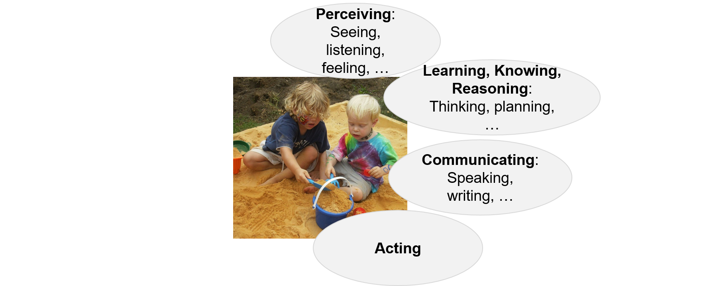
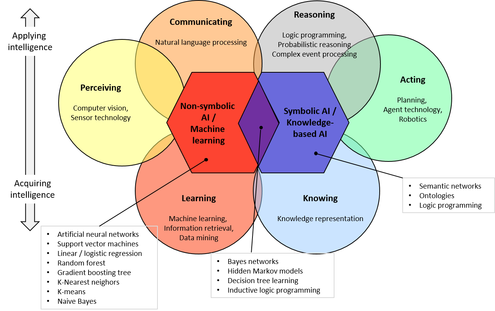

# Introduction

How relevant is *Artificial Intelligence*? 

When I wrote the first edition of this book in 2015, Artificial Intelligence (AI) was hardly noticeably in public.  For many people, AI was nothing more than a burst bubble of a 20th century hype.
However, even then AI was *relevant and ubiquitous* in IT applications of business and consumer markets. 

A few examples of AI in everyday use were and still are:

- Speech control for smart-phones, navigation systems in cars, etc.
- Face recognition in cameras
- Learning spam filters in e-mail clients
- AI in computer games
- Semantic Internet search, including question answering; See Fig. 1.1.

Commercial examples are:

- Business intelligence
- Sentiment analysis
- Robotics
- Industrial computer vision
- Self-driving cars, drones, rockets (military and commercial)

The public perception of AI has changed drastically in the last few years. AI has re-gained an enormous attention in public debate - like in the 1980s. Nobody questions the importance of AI any more; instead, many people raise exaggerated, unrealistic claims and fears - which is common in hype topics. 

I expect AI to continue to change our daily lives and labor markets in an enormous way, just like technology has changed the daily lives of generations since the 19th century with ever increasing speed. 

How are AI applications developed? 

While most AI publications, such as scientific papers and text books, focus on the theory behind AI solutions, little can be found on engineering AI applications. What kinds of AI libraries, frameworks and services already exist? Which ones should be chosen in which situation? How to integrate them into maintainable AI applications with a good user experience? How to meet functional and non-functional requirements, in particular high performance?

The focus of this book is to answer those kinds of questions for software developers and architects.

## Overview of this Book

The remainder of this chapter presents a definition of AI as well as a brief AI history. Chapters 2 and 3 present the main AI approaches: machine learning (non-symbolic) and knowledge representation (symbolic).  Chapter 4 gives guidelines for the architecture of AI applications. The remaining chapters focus on individual AI areas: (5) information retrieval, (6) natural language processing, and (7) computer vision. Chapter 8 concludes the book.

Inspired by one of my AI projects, I use application examples from the domain of art museums throughout the book. Additionally, I present real-world examples from other domains. 

At the end of each chapter I repeat the main themes in form of questions that you, the reader, can use as a *quick check*.

The appendix contains product tables as well as source code examples that can be used as starting point for your own developments. 

## What is AI?

[Encyclopaedia Britannica](https://www.britannica.com/technology/artificial-intelligence) defines AI as follows.

"Artificial intelligence (AI), the ability of a digital computer or computer-controlled robot to perform tasks commonly associated with intelligent beings."

Note that this definition does not claim or even postulate that AI applications *are* intelligent nor that AI is comparable ore even equivalent to human intelligence.

What are tasks commonly associated with intelligent beings?

- **Perceiving**: Seeing, listening, sensing, etc.
- **Learning, knowing, reasoning**: Thinking, understanding, planning etc.
- **Communicating**: Speaking, writing, etc.
- **Acting**

See Fig. 1.2.

%% (Image: Wikimedia)

The different areas of AI can be structured according to those behaviors. See the circles in the "landscape of AI" (inspired by an [AI Spektrum poster](https://www.sigs-datacom.de/order/poster/Landkarte-KI-Poster-AI-2018.php)) in Fig. 1.3.

- **Perceiving** covers the AI areas of *computer vision* and *sensor technology*;
- **Communicating** covers the area of *natural language processing (NLP)*;
- **Learning** covers *machine learning (ML), information retrieval (IR)* and *data mining*; 
- **Knowing** covers *knowledge representation*;
- **Reasoning** covers *logic programming, probabilistic reasoning*, and *complex event processing (CEP)*;
- **Acting** covers planning, agent technology, and robotics.

Please note, that various different namings and groupings of AI areas can be found in literature.

Two fundamentally different approaches to AI can be distinguished (depicted as hexagons in Fig. 1.3):

- **Knowledge based AI**: Knowledge is represented explicitly (with symbols) in a human-readable way, e.g., with knowledge graphs, semantic networks, or logic programming languages (see the boxes with technologies attached to the approaches in Fig. 1.3).
- **Machine learning**: Knowledge is implicit in form of numbers, e.g., as weights in  artificial neural networks, support vector machines, in linear / logistic regression etc.

Both approaches, symbolic and non-symbolic, have been around from the various beginnings of AI in the 1950s. In the first decades of AI research and practice, symbolic approaches were most prominent and showed the most convincing results. However, in the last century this has shifted and today, non-symbolic approaches - particularly machine learning - are most prominent. 

Both approaches have advantages and disadvantages. Non-symbolic approaches require little upfront knowledge, just (many) samples for training. They exhibit good behavior, e.g., in classifying situations, also with noisy data. However, the reasoning behind decisions cannot be explained to humans. In contrast, the reasoning behind symbolic approaches is explicit and can be retraced by humans. However, explicit knowledge engineering is required upfront and reasoning under uncertainty is challenging. 

Both approaches have been applied in all areas of AI, but symbolic approaches are commonly used for knowing, reasoning, and acting whereas non-symbolic approaches are commonly used perceiving, communicating, and learning. 

I expect hybrid AI approaches will gain importance in future. Hybrid approaches combine the advantages of machine learning and knowledge-based AI; I expect them to gain increasing importance. Hybrid approaches include Bayes networks, hidden Markov models, decision tree learning etc. 

## A Brief History of AI

The term "Artificial Intelligence" was coined at the *Dartmouth Workshop* in 1956. Members of this workshop were John McCarthy, Marvin Minsky, Claude Shannon, Allen Newell, Herbert Simon, and others. However, Alan Turing (1912 – 1954) with his fundamental work on computability and the so-called *Turing Test* for assessing intelligent behavior had already laid ground for AI decades before. 

The 1960s - 1980s saw unprecedented *AI hype*, triggered by enthusiastic promises of quick AI results. Examples of such promises are: 

“Within a generation the problem of creating 'artificial intelligence' will be substantially solved.” (Marvin Minsky, 1967) 

“Within 10 years computers won’t even keep us as pets.” (Marvin Minsky, 1970). 

or

“Machines will be capable of doing any work that a man can do.” (Herbert Simon, 1985) (Citations from (American Heritage, 2001)).

This hype resulted in massive funding of AI projects, particularly in the US.

The effect of those wildly exaggerated promises was the same as in all hype. When people started to notice that the most sophisticated AI applications failed to perform tasks that are easily accomplished by small children they threw the baby out with the bathwater. The disillusionment of the unrealizable expectations resulted in massive cuts in funding and a collapse of the AI market. The 1980s - 1990s have sometimes been called the *AI winter*. 

From then on, unnoticed and often not under the term AI, AI methods and technologies have matured enormously driven by major technology companies. For example, Google co-founder [Larry Page](http://bigdata-madesimple.com/12-famous-quotes-on-artificial-intelligence-by-google-founders) said in 2006: 

"We want to create the ultimate search engine that can understand anything. Some people could call that artificial intelligence" . 

This development of AI applications by major technology drivers lead to the situation today where AI is relevant and ubiquitous in everyday applications. Moreover, AI has become a hype topic, again. This is promoted by continuous media attention, science fiction movies, and bold statements by individuals in the AI community that are remarkably similar to the ones in the 1970s:

“Artificial intelligence will reach human levels by around 2029. Follow that out further to, say, 2045, we will have multiplied the intelligence, the human biological machine intelligence of our civilization a billion-fold.” ([Ray Kurzweil, 2005](https://www.brainyquote.com/quotes/ray_kurzweil_591137)) 

I personally cannot see the slightest evidence for such bold claims and regard them as pure science fiction. 
Such exaggerated claims create much media attention but may eventually lead to another AI winter. A most profound response to such claims has been written by [Rodney Brooks in 2017](http://rodneybrooks.com/the-seven-deadly-sins-of-predicting-the-future-of-ai/) which I recommend reading.

## Impacts of AI on Society

Software applications and in particular AI applications may have massive impacts on society. I believe that software engineers must be aware of those implications and act responsibly.

Automation technology has always had enormous impact on the labor market. We can see this development particularly since the industrial revolution in the 19th century. With the advent of information technology in the 20th century, the speed of innovation has accelerated.
AI technology is a continuation of this highly dynamic process, with ever increasing innovation speed. Like in earlier technology shifts, groups of jobs will become obsolete and new jobs will emerge. 

There are numerous predictions about the implications on AI on the labor market. Some predict a replacement rate of human labor by robots for certain business sectors of up to [99%](https://futurism.com/will-artificial-intelligence-take-job-experts-weigh). Some predict that  fears of massive displacement of workers are [unfounded in the longer term](https://ec.europa.eu/epsc/sites/epsc/files/ai-report_online-version.pdf).  

To quote Mark Twain (or Niels Bohr maybe others), ["It’s Difficult to Make Predictions, Especially About the Future"](https://quoteinvestigator.com/2013/10/20/no-predict/) ;-). I personally assume that the ever increasing automation technology will, in fact, decrease the need for human labor since we cannot (and should not) increase consumption forever. In this case it will be necessary to come to a societal agreement of how to distribute the wealth generated by machines. Some discuss a [basic income](https://en.wikipedia.org/wiki/Basic_income) as one model.

Also, as a society, we must come to an agreement, which decisions we may leave to machines and which ones we must not. Alan Bundy pointedly and correctly states in an [CACM viewpoint](https://cacm.acm.org/magazines/2017/2/212436-smart-machines-are-not-a-threat-to-humanity/): "Smart machines are not a threat to humanity. Worrying about machines that are too smart distracts us from the real and present threat from machines that are too dumb". *Bias in machine learning* is an issue which has come to public attention recently. Since machine learning depends on data, the quality of data severely affects the quality of decision being made. But data can be biased due to the creators or origins of data - and thus, decisions based on machine learning can be biased. 

More and more decisions are delegated to machines although, of course, no piece of software is perfect. This may be fine for self-driving cars, at least as soon as they drive safer than average humans (which I expect in the foreseeable future). But it may be dangerous in areas where decisions by machines may have far-reaching impacts that no human can foresee. One of those areas may be high-frequency trading where machines autonomously make selling and buying decisions, but the impact on the global financial market is unclear. Even more critical are autonomous weapons that are programmed to detect alleged attacks automatically and to start a counter-strike without human intervention.  
An [open letter from AI and robotics researchers on autonomous weapons](https://futureoflife.org/open-letter-autonomous-weapons/) in which this issue is discussed was signed by more than 30,000 people.

Data-intensive applications like machine learning may use an enormous amount of computing power and, thus energy. Thus, positive societal effects of AI may be alleviated by a large carbon footprint. *Green AI* is the field which tries to reduce negative effects of AI on the environment. 

Computer scientists developing AI applications must be aware of their impact and act responsibly. Current keywords in the debate are responsible AI, ethical AI, human-centered AI or explainable AI. We will cover aspects of this in the book.

## Prominent AI Projects

Some AI projects have become milestones in AI history due to their public visibility. I shortly mention just three examples.

In 1997, *IBM Deep Blue* beat the chess world champion Garry Kasparov. This was a milestone since chess is considered one of the most complex board games.

See Fig. 1.4.  

%% Image: Wikimedia, Creative Commons License

However, when people examined the computational algorithms used  in the Deep Blue Application, people quickly realized the difference between the IBM approach and the way human chess players act intelligently. For people who believed in machines being  intelligent like humans, this was a disillusionment. For  practitioners this was no disillusionment at all but an important milestone in the development of applications which exhibit behavior of human intelligence.

In 2011, IBM succeeded with another important AI project: *IBM Watson*. While Deep Blue targeted a most specific ability, namely playing chess, IBM Watson was able to answer natural language questions about general knowledge.  The media highlight of this project was beating the human champions at the popular US quiz show Jeopardy! This was remarkable since not only questions about history and current events, the sciences, the arts, popular culture, literature, and languages needed to be answered but also play on words as well as execution speed and strategy needed to be considered. 

See Fig. 1.5.

%% "Watson Jeopardy" by Source. Licensed under Fair use via Wikipedia - https://en.wikipedia.org/wiki/File:Watson_Jeopardy.jpg#/media/File:Watson_Jeopardy.jpg

Go is a complex board game that requires intuition, creative and strategic thinking. It has long been considered a difficult challenge in AI and is considerably more difficult to solve than chess. In 2015, AlphaGo, a computer Go program developed by Google DeepMind, played a five-game Go match with the 18-time world champion [Lee Sedol](https://en.wikipedia.org/wiki/AlphaGo_versus_Lee_Sedol). The received  high media attention. AlphaGo won all but the fourth game. This was considered another breakthrough in AI. 

See Fig. 1.6.

%% https://commons.wikimedia.org/wiki/File:Lee_Se-Dol.jpg
%% https://commons.wikimedia.org/wiki/File:Lee_Sedol_(B)_vs_AlphaGo_(W)_-_Game_4.jpg

To conclude, AI applications have made enormous progress in the last two decades - applications that were unthinkable in the late 20th century. All those applications exhibit behavior of human intelligence in certain situations (playing games, answering questions, driving cars, etc.) without necessarily  imitating human intelligence as such. Looking inside the implementation of such applications may be disappointing to people hoping to gain insights in the very nature of human intelligence. They are IT applications and follow engineering practices of IT applications. And they may be useful in every-day's life. 

%% REMARK: maybe remove hints about believers in hard AI

The following chapters give insights into engineering such AI applications. 

## Further Reading

There are numerous publications on AI, scientific papers and text books. I present only a very short selection.

Stuart Russell's and Peter Norvig's book: "Artificial Intelligence: A Modern Approach" (Russell and Norvig, 2013) is the standard textbook on AI. It gives detailed insights in AI mechanisms and the theories behind them - issues which I do not focus on in this book. It may be used as an excellent source for further reading when you need to know more about those issues.

Marc Watson has written a number of books on practical aspects of AI: "Practical Artificial Intelligence Programming with Java" (Watson, 2013), "Practical Semantic Web and Linked Data Applications, Java, Scala, Clojure, and JRuby Edition" (Watson, 2010), "Practical Semantic Web and Linked Data Applications, Common Lisp Edition" (Watson, 2011). While they are some of the relatively few books dealing with the development aspects of AI applications, the focus is still somewhat different from the focus of this book. Watson introduces concrete frameworks and tools in concrete programming languages. In contrast, I rather give an overview of the tools available in form of services maps and product maps, together with hints as to which tools to use in which context and how to integrate them. Insofar, also Watson's book may be used for further reading in case you have decided on specific languages and tools covered by him. 

Also, there are a number of recommendable online courses on AI - with a similar focus as Russell and Norvig's standard text book (2013). Examples are:

- Udacity: [Intro to Artificial Intelligence](https://www.udacity.com/course/cs271)  
- Coursera: [Introduction to Artificial Intelligence](https://www.coursera.org/learn/introduction-to-ai)
- edX: [Introduction to Artificial Intelligence](https://www.edx.org/course/introduction-to-artificial-intelligence-ai-3) 

## Quick Check

X> The quick check shall help you assessing whether you have understood the main topics of this chapter. Answer the following questions.

1. What does the term "Artificial Intelligence" mean?
2. What are main areas of AI?
3. Sketch the history of AI
4. In what sense is AI today relevant and ubiquitous?
5. What are potential impacts of AI applications on society?
6. Name a few prominent AI projects
