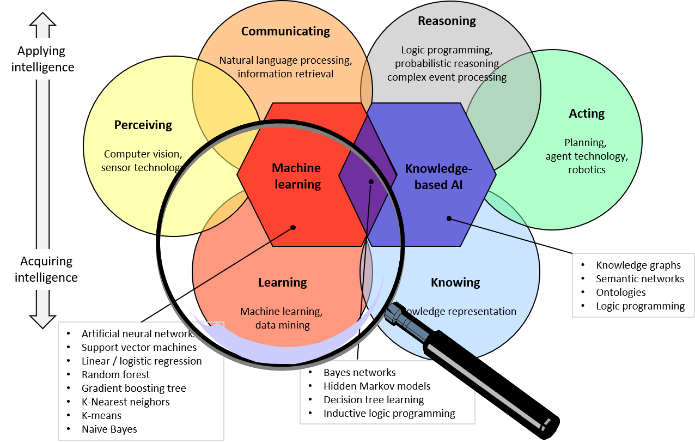
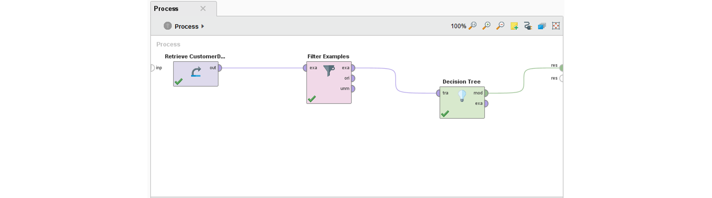
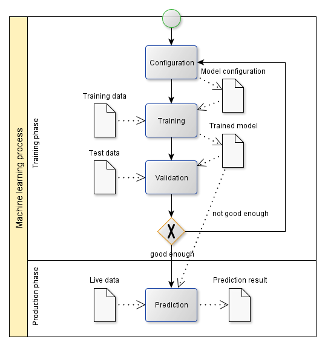
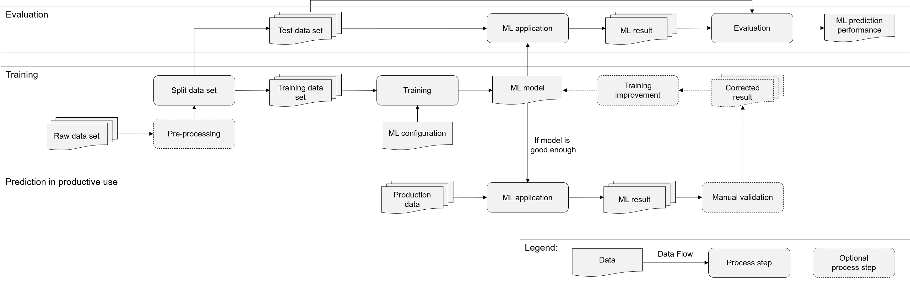
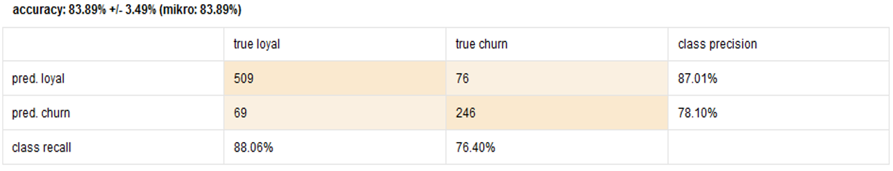
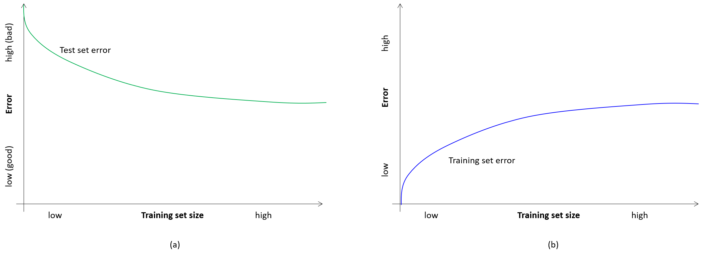
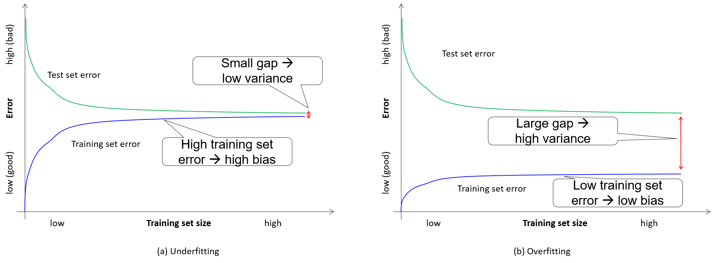
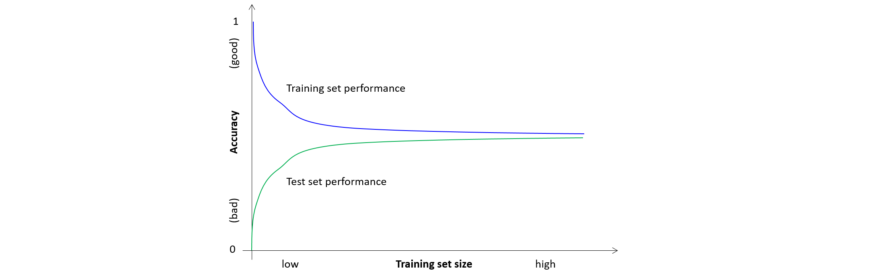
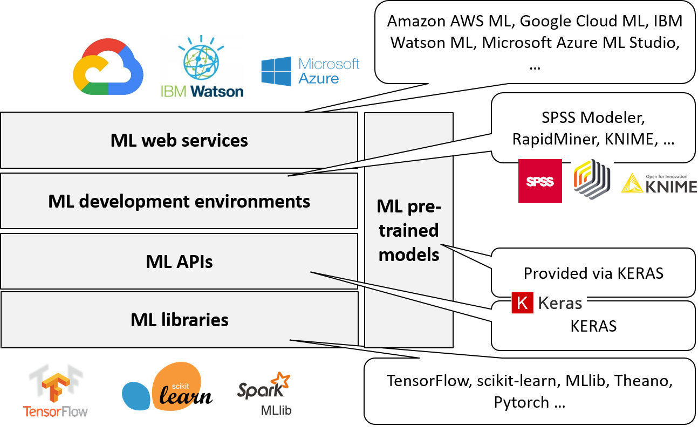

# Machine Learning

*Machine learning (ML)* is currently the most prominent AI area, representing non-symbolic AI. Fig. 2.1. shows ML in the AI landscape. 



What does ML mean?

*ML allows for making decisions or predictions based on models which have been generated automatically ("learned") from sample data.* 

The models are generated automatically in a *learning phase* (a.k.a. *training phase*). Explicitly programming instructions for decisions or predictions, as in classic programming, is not necessary in a machine learning setting. Rather machine learning algorithms process data to learn patterns within them.

When to use ML?

You should use ML in problem domains where it is not possible or feasible to explicitly program a solution, e.g., if there is no known algorithm or explicit rules to solve the problem (e.g., identifying faces in images) or if the behavior depends on too many factors (e.g., spam filtering).

Never use ML when there is an explicit algorithm or explicit rules for solving a problem, e.g., in business applications where company regulations or legal requirements need to be implemented (taxation laws etc.).

## ML Applications

ML approaches are used in numerous applications in daily use. Here are a few examples.

#### Spam Filtering

Spam filters based on machine learning are used in state-of-the-art email clients. The task is to classify incoming emails as spam or not spam. See Fig. 2.1.


The ML spam filter is trained with manually classified samples: spam emails and non-spam emails. After the training phase, the spam filter automatically classifies emails in spam / non-spam. The user may correct ML decisions. Those corrections are used as new training samples that improve the correctness of future classifications. 

#### Stock Market Analysis and Prediction

Consider the task of predicting the development of shares on the stock market in order to recommend sales and purchases. 
See Fig. 2.2.


The prediction model is continuously trained with the history of share values. It is used for predicting the development of shares based on the current share values. The predictions can then be used to create recommendations. 

#### Fraud Detection

Consider the task of detecting fraud in financial transactions, e.g., suspicious credit card payments. 
See Fig. 2.3.


The overall process is similar to spam classification. The ML application  is trained with manually classified samples and then used to automatically identify fraud. Human clerks validate whether, in fact, there is a case of fraud or not. Manual corrections of the automatic classification results are used to further train the ML application. In contrast to email spam classification, one sample does not necessarily consist of a single item but possibly of a series of transactions.  

#### Recommender Systems

In recommender systems, the task is to recommend suitable products to customers on the basis of their previous purchasing behavior ("Customers who bought this product were also interested in those products..."). 
See Fig. 2.4.


The ML recommender system is trained with the purchasing behavior of a large number of customers and associated customer groups. Then, based on a concrete order of a customer, related products are recommended.  

## ML Areas and Tasks

Machine learning is a wide area. There are numerous groupings and names for ML subareas and tasks in literature. Fig. 2.5 shows a simple way of categorizing machine learning.


Three areas of machine learning can be distinguished: *supervised learning, unsupervised learning*, and *reinforcement learning*. With supervised learning, one can perform the tasks *classification* and *regression*; with unsupervised learning one can perform the tasks *clustering, feature selection / extraction*, and *topic modeling*. 

### Supervised Learning

*Supervised learning* assumes a (human) supervisor or trainer who trains the ML application with samples. 

- *Setting*: Sample inputs and desired outputs as specified by the supervisor
- *Goal*: A model that maps new (unknown) inputs to correct outputs

Consider, e.g., the task of *classification*.

- *Setting*: A set of sample input data records (training data set) are given which are classified into a number of pre-defined classes
- *Goal*: A model that correctly classifies new input records.
- *Examples*: 
  - Spam filtering. Input: Email meta-data and content; Classes: "spam" and "not spam"
  - Fraud detection. Input: financial transactions;  Classes: "fraud" and "not fraud"

Now consider the task of *regression*.

- *Setting*: A set of sample input data records are given with continuous (not discrete) output values, e.g., floating point numbers
- *Goal*: A model that predicts output values for new inputs as closely as possible
- *Example*: Stock value prediction. 
  - Input: History of values of a share
  - Output: Predicted values in the future

### Unsupervised Learning

*Unsupervised learning* aims at detecting correlations in (large) data sets that are hard to detect by humans. There is no human supervisor who defines what correct classifications are. A related term is *data mining*. 

- *Setting*: A set of data records are given
- *Goal*: Find meaningful structures within the data

Consider, e.g., the task of *clustering*. 

- *Setting*: A set of input records are given
- *Goal*: Identify clusters, i.e. groups of similar records, where the similarity metric is initially unknown
- *Example* customer segregation: Groups of customers shall be identified that exhibit similar purchasing behavior. Those customer groups can then be targeted individually. 

Now consider the tasks of *feature selection* and *feature extraction*.

- *Setting*: A set of input data records with attributes ("features") are given
- *Goal of feature selection*: Find a subset of the original attributes that are equally well suited for a classification / regression / clustering task. The idea is to automatically distinguish meaningful attributes from attributes that can be omitted without losing information when performing a certain ML task. 
- *Goal of feature extraction*: Like in feature selection, the goal is to identify features that are meaningful for a certain ML task. While in feature selection, a subset of the original feature set is to be selected, in feature extraction a new set of features is to be constructed from the original feature set. As a result, various original features may be combined into one.
- *Example*: customer segregation; what features of a customer record are meaningful for customer segregation (e.g., number of sales) and which ones are not (e.g., name).

Finally, consider the task of *topic modeling*.

- *Setting*: A set of text documents are given.
- *Goal*: Find topics that occur in several documents and classify the documents accordingly.
- *Example*: Automatic extraction of a meaningful vocabulary for a specific field from a set of articles in this field.

### Reinforcement Learning

*Reinforcement learning* is the form of learning which is most similar to the way humans learn. 

- *Setting*:  An agent interacts with a dynamic environment in which it must reach a goal
- *Goal*: Improving the agent's behavior
- *Example*: A chess-playing bot attempts the goal of winning chess games. Reinforcement learning can be applied when having a chess-playing bot playing many games against itself (or against other chess playing bots or humans). While playing, the effects of decisions are used to optimize parameters for decision taking. 

In the development of AI applications, various ML tasks are often combined. For example, unsupervised learning is often applied before supervised learning. Via unsupervised learning, e.g., feature extraction, the input data is pre-processed. Usually this is done in cycles of automatic ML processes followed by manual quality assurance and adaptation processes. Once a set of meaningful features are identified, then supervised learning can be applied successfully.

## ML Approaches

Over the many years of AI research, many different ML approaches have been developed and optimized. In the next sections, I will briefly introduce a few prominent ones.

### Decision Tree Learning

*Decision trees* can be used for supervised learning: for classification as well as for regression. 
A decision tree is usually a tree in which internal nodes represent tests on  attributes values of a data set; Branches represent the possible outcomes of the tests; Leaf nodes represent classes in a classification setting resp. numerical values in a regression setting.

See Fig. 2.6 for a simple example from the [Decision tree learning page in Wikipedia](https://en.wikipedia.org/wiki/Decision_tree_learning). 


This example decision tree shows the survival of passengers on the Titanic, depending on their sex, age and the number of spouses or siblings aboard (sibsp). The figures under the leaves show the probability of survival and the percentage of observations in the leaf.

In the training phase, a decision tree can be automatically generated from a set of sample data. Then, the decision tree can be used for classifying new data records simply by applying the tests from the root node to a leaf node.

The main advantage of decision trees is that they are easy to understand and interpret. People are able to understand decision tree models after a brief explanation and domain experts can validate generated decision trees. 
However, in complex scenarios where values are uncertain or many attributes are correlated, decision trees tend to become overly complex and cannot easily be validated by humans any more.

### Artificial Neural Networks

*Artificial neural networks (ANN)* are inspired by nature. In the human brain and nervous system, neurons receive signals through synapses located on the dendrites. When the signals received are strong enough (surpass a certain threshold), then the neuron is activated and emits an electronic signal - it "fires". This signal might be sent to another synapse, and might activate other neurons.

And where does learning come into play? If an input of a neuron is repeatedly causing the neuron to fire, the synapse changes chemically, reducing its resistance. This adaptation has an effect on the neuron's activation behavior.

%% Electrical Stimulations are transmitted from each neuron to the neurons connected to it. This is, in simple terms, the basic mechanism of processing and transmitting data in humans and animals. Repeated stimulations cause chemical affects in the neuron resulting in different transmitting behavior. And this is, again in simple terms, the basic mechanism of learning in humans and animals.

See Fig. 2.7. 


*Artificial neurons* simulate neurons in nature, however in a highly abstracted way.
Artificial neurons consist of inputs (like synapses), which are multiplied by weights
(strength of the respective signals), and then computed by a mathematical function. A simple example is the weighted sum of all inputs. This function determines the activation of the artificial neuron. Another function computes the output of the artificial neuron, sometimes dependent on a certain threshold. 

See Fig. 2.8.


Finally, artificial neural networks (ANN) combine artificial neurons in order to process information. They consist of an input layer, an output layer, and possibly a number of intermediate layers of neurons. 

See Fig. 2.9 for a simple example.


For example, an artificial neural network could be used for recognizing characters from an image (OCR: Optical Character Recognition). In a simple setting where each image depicts exactly one character, each pixel of the image could be associated with one input neuron of the neural network; Each possible character (a-z, A-Z) could be associated with an output neuron.

In the *training phase*, manually classified images are fed to the neural network, one by another. The pixels of the images are connected to the input neurons and the manually identified characters to the output neurons. During the training phase, the weights and thresholds of the artificial neurons are adapted so that the input neurons optimally fit to the respective output neurons.

Then, in the *prediction phase*, the trained artificial network can be used to automatically classify new images, i.e., recognize the character on the image.

Fig. 2.10 shows an [ANN playground](http://playground.tensorflow.org) with the state-of-the-art ML tool Tensorflow. You can experiment with varying numbers of layers, neurons, etc. and get a feeling on how ANN behave on various problems. 


Artificial neural networks are popular since they are relatively easy to use and do not require a deep background in statistics.  They can handle large amounts of data, implicitly detecting complex relationships between attributes. 

An important disadvantage is that artificial neural networks behave as black-box systems. Users cannot explain how learning from input data was actually performed and, hence, cannot explain classifications made by the artificial neural network.

*Support Vector Machines* are a popular alternative to ANNs and share their advantages and disadvantages. 

### Deep Learning

Deep learning is a popular architecture of ANNs with a cascade of several layers. Each layer performs a specific tasks and each successive layer uses the output from the previous layer as input. Examples for individual tasks may be feature extraction (unsupervised ML), and classification (supervised ML). 
Deep learning is currently the most common approach for image recognition and voice recognition tasks. The first layers in the cascade perform low-level, pixel-oriented tasks including feature selection; later layers perform increasingly complex tasks like high-level recognition. See Fig. 2.11 for an illustration. 

{width=75%}


In Chapter 7 we present deep learning for computer vision more in detail. 

### Transfer Learning

*Transfer learning* is a technique of re-using pre-trained deep neural networks, adding and training additional layers for specific tasks. This approach makes sense since training large ANNs may use an enormous amount of computing power and require a very large number of training data. For example, for classifying specific dog races, you can re-use a pre-trained ANN model like [ResNet](https://keras.io/applications/#resnet) and add layers for classifying the specific races. Then, you need to train just the added layers with specific training data. 

In Chapter 7 we present transfer learning for computer vision more in detail.

%% TODO ### Support Vector Machines

### Bayesian Networks

A *Bayesian network* is a directed acyclic graph (DAG) with random variables as nodes and their conditional dependencies as edges. 

For example, a Bayesian network could represent the probabilistic relationships between diseases and symptoms. Given symptoms, the network can be used for diagnostic purposes, computing the probabilities of the presence of various diseases. See Fig. 2.12.


In the example from Goodmann and Tenenbaum (2016), the disease "cold" may lead to symptoms like "cough" and "fever", whereas a lung disease may lead to symptoms like "shortness of breath", "chest pain", and "cough". Those dependencies are modeled in the Bayesian network as edges. Additionally, the probabilities of each individual situation (random variable) as well as the conditional probabilities (e.g., probability of fever in case of a cold) are denoted. Also the relationships between causes and diseases (e.g., smoking may cause lung diseases) can be modeled.

Defining the random variables (here: "causes", "diseases", "symptoms") and their dependencies is a manual task to be performed by experts, e.g., medical doctors. The probabilities may be derived from medical statistics.

After modeling the Bayesian network, it can then be used to compute the probability of certain diseases, given the patient's symptoms. The computation is based on Bayes' theorem on conditional probabilities.

Bayesian networks have the advantage over artificial neural networks and support vector machines that the reasoning behind a recommendation can be explained (Explainable AI). This, of course, is possible only in domains where conditions and dependencies are known and can be modeled explicitly. 

### Overview of ML Approaches

There are many more ML approaches than the ones which I briefly introduced above. *Inductive logic programming*, for example, is one of the early approaches. It allows learning logic rules from examples, e.g., learning the rule *parent(p1, p2) and female(p2) -> daughter(p2, p1)* from facts about a large number of people, containing the predicates  "parent", "female" and "daughter".

A major disadvantage of such ML approaches purely based on logic is that the sample data must be 100% correct. One incorrect data record or a rare special case would invalidate correct rules, learned otherwise.

Since in many application scenarios, training data is prone to errors, noise, or other data quality problems, most ML approaches used today are probabilistic ones. They simply ignore rare exceptions as noise. Artificial neural networks, support vector machines and Bayes networks are prominent examples of probabilistic methods. Even decision trees can deal with probabilities. 

There is not *the* single best ML approach. Some approaches allow for explaining the ML results, like Bayesian networks and decision tree learning, others do not. Some approaches take into account many hidden, implicit dependencies between attributes of the data without the need of explicit modeling, like artificial neural networks and support vector machines.
Selecting the right ML approach for a specific use case requires experience and often a great deal of experimenting and testing. 

Fig. 2.13 can help making such a decision by classifying prominent ML approaches to the main ML tasks.


To get further guidance in selecting a suitable ML approach for a specific tasks, various players in the ML area have provided so-called "ML cheat sheets" which are helpful when selecting a suitable ML approach for a problem. See a selection:

- [Microsoft](https://docs.microsoft.com/de-de/azure/machine-learning/media/algorithm-cheat-sheet/machine-learning-algorithm-cheat-sheet.svg)
- [SAS](http://www.7wdata.be/wp-content/uploads/2017/04/CheatSheet.png)
- [Becoming Human](https://becominghuman.ai/cheat-sheets-for-ai-neural-networks-machine-learning-deep-learning-big-data-678c51b4b463)
- [Peekaboo](http://peekaboo-vision.blogspot.com/2013/01/machine-learning-cheat-sheet-for-scikit.html)
- [The R Trader](http://www.thertrader.com/wp-content/uploads/2018/03/Picture3.jpg)

## Example: Classifying Customers using  Decision Tree Learning

### Using an ML IDE

I will show a simple classification example with decision trees. I will use the free Basic Edition of [RapidMiner Studio](https://rapidminer.com/products/studio/), an integrated development environment for machine learning. In this example, a customer rating is to be performed. See Fig. 2.14  for a subset of the data set, taken from a RapidMiner tutorial.


Customers are specified by a number of attributes, e.g., "gender", "age", "payment method" and "last transaction". Those are the *input attributes* for machine learning.

The goal is to classify customers as "loyal" or "churn" in order to address them individually, e.g., via special offers. "Churn" is the *output attribute* which is to be predicted by the ML application. The value "churn" indicates the expected loss  of a customer.
Some of the customers are already classified (e.g., rows Nos. 1-3), others are not yet classified (e.g., row No. 4).
A decision tree shall be generated from the customers already classified in order to predict the classification of the new ones. This is done by configuring a ML process. See Fig. 2.15.



The simple ML process consists of three steps, identified by boxes that are connected. The connections represent data flow. The first process step is the retrieval of the customer data. The next step is to filter those customer records that are already classified. From those records, a decision tree is being generated and returned as a result.

Fig. 2.16  shows the decision tree generated from the customer records.


The decision tree generated can be inspected by humans. The tree indicates that male customers have the tendency to be loyal. For female customers of a certain age group (> 89.5), this is also true. For other age groups, loyalty depends on last transaction and payment method.

Now, this decision tree may be applied to the customers not yet classified. The result is shown in Fig. 2.17.


Each customer who was not previously classified (labeled with "?") is now classified either "loyal" or "churn", together with a confidence, e.g., 0.798. 

Can we really trust the classification by the decision tree? I discuss validating the ML result in the following section.

### Using a ML Library

The following code example shows Python code using the libraries [pandas ](https://pandas.pydata.org)and [scikit-learn](https://scikit-learn.org) to solve the same problem. 

```py
    # Load training data
    train_data = read_csv('data/train.csv')  

    # Separate features from target
    features = ['Gender', 'Age', 'PaymentMethod', 'LastTransaction']  
    target = 'Churn'  
    X = train_data[features]  
    y = train_data[target]

    # Configure model
    model = DecisionTreeClassifier()

    # Train model
    model.fit(X, y)

    # Validate model
    scores = cross_val_score(model, X, y)  

    # Use model
    predictions = model.predict(X_prod)
```

`read_csv` reads data from a CSV file into a pandas `DataFrame`. The feature matrix `X` and target vector `y` are assigned by selecting columns of this `DataFrame`. The model type is configured by instantiating the `DecisionTreeClassifier` class. The model is trained using the `fit` method. Cross validation can be performed using the function `cross_val_score` (the result needs to be printed or inspected). Finally, the trained model can be used using the `predict` method.

## ML Methodology

### The ML Process and Data Flow

The process for implementing a supervised ML application consists of two major phases: the training phase and the production phase. See Fig. 2.18 for a simplified overview as [BPMN diagram](https://www.omg.org/spec/BPMN). 



In the training phase, an ML model is configured with some ML approach. A training data set is used to generate an ML model according to the configuration. But can we really trust this model? Is it capable of making good predictions when used in production? To find out, the model's prediction performance is evaluated, i.e., how accurately the model actually predicts. The evaluation is done on a test data set. If the model is good enough, then it can be used for predictions in productive use. However, usually the first model is not nearly good enough for productive use. Then, the ML configuration needs to be adopted, e.g., a different ML approach chosen or parameterised differently, and the training / evaluation cycle starts again - until the model is finally good enough.

Fig. 2.19 zooms into the ML process and gives an overview of the data flow in supervised ML.



In the training phase, the raw data set may be pre-processed, e.g., by normalizing certain values. The input data set is in tabular form. Each row is a training sample. Columns are input attributes (so-called "features") and the expected output (so-called "labels"). The input data set is then split into a training data set and a test data set. 
The training process step uses the training data set and the ML configuration in order to generate the ML model. 

%% Note: We use term test data set instead of validation data set ; refer to subtle difference and confusion; see https://machinelearningmastery.com/difference-test-validation-datasets/

In the evaluation phase, this ML model is applied to the test data set, using the input attributes only. The ML result is compared with the expected output (evaluation) and the prediction performance is measured.

If the model is not yet good enough, then the ML approach needs to be adjusted. For example, pre-processing can be fine-tuned, the ML approach can be changed (e.g., from decision tree to ANN), the parameters of the ML-approach (so-called "hyperparameters") may be adjusted, e.g., the number of layers and neurons in an ANN or the maximum depth of a decision tree. Then, training and evaluation is re-iterated.

If the model is good enough, i.e., the prediction performance is adequate, then the previously trained ML can be used productively. For this, the model is used to perform the ML application on production data. The computed result can be used in the AI application, e.g., displayed in a user interface. In case the users perform a manual validation of the computed results, corrected results may be fed back for training improvement.

### Prediction Performance Measures

Can we really trust the results of an ML application? How confident are we that results are correct? Before using an ML application in production it is important to get a feeling of how good its predictions actually are. 

#### Confusion Matrix

A *confusion matrix* is the basis for measuring the prediction performance of ML applications for classification. The name indicates that it allows to realize if the ML application is confusing two classes, i.e. commonly mislabeling one as another. See Fig. 2.20.


%% using https://en.wikipedia.org/wiki/F1_score#/media/File:Precisionrecall.svg

The rows relate to the values predicted by the ML application, for a binary classification positive (1) and negative (0). The columns relate the actual values, i.e., what should have been predicted. The cells of the matrix contain 4 numbers:

- *True positives (TP)*: correctly predicted positive (1)
- *True negatives (TN)*: correctly predicted negative (0)
- *False positive (FP)*: predicted positive (1), but actually negative (0)
- *False negative (FN)*: predicted negative (0), but actually positive (1)

Consider the example of an ML application which predicts cancerous tumors of patients based on images. There are two outcomes of the classification:

- Malignant: cancer predicted
- Benign: no cancer predicted

See Fig. 2.21 for an exemplary confusion matrix for cancer prediction. 


In this example, out of 100 predictions, 91 were correct (TP = 1, TN = 90) and 9 were incorrect (FP=1, FN = 8). Is this a good prediction performance? In the following section we compare various prediction performance measures. 

#### Accuracy

*Accuracy* is a simple, intuitive and frequently used prediction performance measure. It simply puts the number of correct predictions in relation to all predictions. It is defined as follows.

{$$} 
Accuracy = \frac{\left| correctPredictions \right|} {\left| allPredictions \right|}
{/$$}

For binary classifications, accuracy can be computed as follows.

{$$} 
Accuracy = \frac{TP + TN} {TP + TN + FP + FN} 
{/$$}

Accuracy is a percentage, i.e. the value is always between 0 and 1. The higher the value the better. Whether an accuracy of 75% is already sufficient or, say, 99.9% is required depends entirely on the application use case. It is important to specify the required accuracy (or other performance measure depending on the use case) before implementing the ML application.  This enables you to decide after the evaluation, whether or not the prediction performance is good enough to use the application in production. 

In the cancer prediction example above, the accuracy can be computed as follows.

{$$} 
Accuracy = \frac{TP + TN} {TP + TN + FP + FN} = \frac{1 + 90} {1 + 90 + 1 + 8} = 0.91
{/$$}

An accuracy of 91% looks like a decent prediction performance, does it not? However, let us have a closer look. In the example, 8 out of 9 malignant tumors were wrongly diagnosed as benign. If doctors had trusted the ML classification, those patients would not have undergone treatment and may have died because their cancer had not been detected. This is a catastrophe!

How can it be that such a fatal misclassification rate results in such a high accuracy value? The reason is that the data set is *imbalanced*: 91% of the sample cases are benign and only 9% are malignant - and we are interested in the minority class malignant.

#### Precision, Recall and F measure

The prediction performance measures Precision, Recall and F measure are better suited for imbalanced data sets than accuracy is.

*Precision*, a.k.a. *Positive predictive value (PPV)*, measures how precise the result is when the ML application predicts the class of interest, e.g., malignant. It is defined as the ratio of true positives to all positively predicted samples. 

{$$} 
Precision = \frac{TP} {TP + FP} 
{/$$}

*Recall*, a.k.a. *true positive rate (TPR), sensitivity, power*, or *probability of detection*, is the probability that a positive sample will be correctly classified. It is defined as the ratio of true positives to all actually positive samples.

{$$} 
Recall = \frac{TP} {TP + FN} 
{/$$}

Both, precision and recall are percentages, i.e., values between 0 and 1. The higher the value the better. In the cancer classification example above, the following values for precision and recall can be computed.

{$$} 
Precision = \frac{TP} {TP + FP} = \frac{1} {1 + 1} = 0.5
{/$$}

When the ML application predicts a malignant tumor, it is correct in 50% of the cases. 

{$$} 
Recall = \frac{TP} {TP + FN} = \frac{1} {1 + 8} = 0.11
{/$$}

The ML application correctly identifies only 11% of all malignant tumors, and misses out on the other 89%.

Precision and recall are mutually conflicting measures. Optimizing just one measure will impair the other. For example, it is possible to ensure a recall of 100% by simply implementing a trivial predictor that predicts malignant in all cases. Theoretically, you do not miss out on any actually malignant case, but such a predictor is obviously not useful at all. 

Therefore, precision and recall must be balanced. The *F measure*, a.k.a *F1 score*, is defined as the harmonic mean of both measures.

{$$} 
F = \frac{2}{\frac{1}{precision} + \frac{1}{recall}} = 2 \cdot \frac{precision \cdot recall}{precision + recall}
{/$$}

Like precision and recall, F measure is a value between 0 and 1 - the higher the better. 
In the cancer classification example above, the F measure can be computed as follows. 

{$$} 
F = 2 \cdot \frac{precision \cdot recall}{precision + recall} = 2 \cdot \frac{0.5 \cdot 0.11}{0.5 + 0.11} = 0.18
{/$$}

Clearly, the low F measure of 18% much better represents the catastrophic prediction performance of the ML application than the high accuracy value of 91%, both based on the same confusion matrix.

#### Which prediction performance measure to choose for classification tasks?

Selecting a suitable prediction performance measure and required value for a concrete classification use case is a difficult task. As a rule of thumb, accuracy as a simple and easy-to-understand measure is usually a good choice when dealing with balanced datasets. 

As the example above indicates, accuracy should never be used with heavily unbalanced datasets. In those cases consider using F measure. However, also F measure may have flaws in certain application scenarios. Notice that F measure just focuses on one class of interest and does not take true negatives into account at all. For the cancer prediction example this may be adequate since the use case is about treating cancer and not healthy people. In other application scenarios this might not be appropriate at all. 

There are many other prediction performance measures, all with advantages and disadvantages. Another popular prediction performance measure is AUC (Area Under the receiver operating characteristic Curve). Other measures are Cohen's Kappa, Bookman Informedness, logarithmic loss, specificity, prevalence, positive/negative likelihood ratio, positive/negative predictive value, and more. For definitions see the [Wikipedia page Confusion Matrix](https://en.wikipedia.org/wiki/Confusion_matrix). 

#### Prediction performance measures for regression: MAE, MSE and RMSE

Confusion matrices and the prediction performance measures introduced above relate to classification tasks where a prediction either matches the actual class or not. 
In regression tasks, where numeric values are predicted, the question is how close the predicted values are to the actual values. See Fig. 2.22.


The most commonly used prediction performance measures for regression tasks are the mean absolute error (MAE) and the rooted mean squared error (RMSE). 

The *mean absolute error (MAE)* is defined as the mean of the absolute values of the differences between predicted values {$$}\hat{f_i}{/$$} and actual values {$$}y_i{/$$}.

{$$} 
MAE =  \frac{1}{n} \sum_{i=1}^n \left| \hat{f_i} - y_i \right|
{/$$}

The MAE is a value greater or equal zero - the lower the better. The measuring unit of the MSE is the one of the values of the regression task. E.g., if house prices in USD are measured, then the measuring unit of the MAE is USD. It tells you the average regression error. 

The *rooted mean squared error (RMSE)* is defined as the rooted mean of all squares of differences between predicted and actual values. 

{$$} 
RMSE =  \sqrt{\frac{1}{n} \sum_{i=1}^n (\hat{f_i} - y_i)^2}
{/$$}

Like MAE, the RMSE is a value greater or equal zero and its measuring unit is the one of the values of the regression task. So, both are similar. 
Since the errors are squared before they are averaged, the RMSE gives a relatively high weight to large errors. Therefore, the RMSE is preferred if large errors are particularly undesirable. Note that RMSE values are greater than or equal to MAE values.

Often, also the *mean squared error (MSE)* is used. It simply omits the square root in the formula for RMSE. MSE values are not as easily interpreted as MAE or RMSE values since they are squares. In the house price prediction example above, the measuring unit of the MSE is USD{$$}^2{/$$}.

%% See https://medium.com/human-in-a-machine-world/mae-and-rmse-which-metric-is-better-e60ac3bde13d

### k-fold Cross-Validation

It is important that the training set used to train an ML model is disjoint from the test set used to evaluate the model. See the process step "split data set" in Fig. 2.19. But be aware that the way the data set is split has an effect on the training as well as on the evaluation. Imagine if in the cancer classification example, by chance, all samples of class "benign" end up in the training set and all samples of the class "malignant" end up in the test set. Then the training step will not result in a reasonable ML model and the evaluation step will not meaningfully evaluate it.

It is a good idea to randomly shuffle the input data set before splitting it into training and test set. But still there is some element of chance in this procedure. *k-fold cross-validation* is a method for largely removing this element of chance. See Fig. 2.23.


The general procedure is as follows.

1. Shuffle the dataset randomly.
2. Split the dataset into k groups
3. For each group, i.e., k times do:
   4. Take the group as the test set
   5. Take all remaining k-1 groups together as the training set
   6. Train a new model with the training set
   7. Evaluate this model with the test set and compute the prediction performance
   8. Store the prediction performance and continue with the loop
4. Return the average of the k computed prediction performances as the result.

Many ML libraries and toolkits contain easy-to-use components for k-fold cross validation. k can be set as a parameter. A typical value is k=10.

Take as an example the RapidMiner process for customer rating introduced above. RapidMiner offers a validation process which performs k-fold cross-validation. This can be used to evaluate the accuracy of the decision tree for the customer rating example above. See Fig. 2.24.


The validation process consists of two sub-processes. The first sub-process on the left hand side represents the training phase. Input is the training data set. Output of the decision tree module is the ML model, i.e., the decision tree. 

The second sub-process on the right hand side represents the evaluation phase. Input to the model application is the decision tree as well as the test data set. The result of the validation process is the confusion matrix and the average accuracy. See Fig. 2.25.

{width=75%}


The result of cross-validation is displayed as a confusion matrix, showing the number of true positives, true negatives, false positives and false negatives. For each class ("loyal" and "churn"), the precision and recall values are displayed. Additionally, the total accuracy is shown which is 83.89%.

### Bias and Variance - Overfitting and Underfitting

A central point in the ML process as depicted in Figures 2.18 and 2.19 is optimizing the ML configuration if the ML model is not yet good enough. But how to do this in a meaningful way? To acquire an understanding of the problems at hand we introduce the concepts of bias and variance / overfitting and underfitting for regression tasks. Please note that those concepts equally apply to classification tasks. 

An ML model can be seen as a generalization of the training data. In supervised ML, we assume that there is a real function *f* with the features as input and the target as output. However, *f* is unknown. I *f* was known, then there would be no need for machine learning at all. The ML model we get from training  we call {$$}\hat{f}{/$$}. 

{$$}\hat{f}{/$$} should be as close as possible to *f*. In practice, it is impossible that {$$}\hat{f} = f{/$$}. This is due to missing data, noise, etc. Those factors lead in any case to some error, which is sometimes called *irreducible error*. Take the cancer prediction example. The image data is just an extremely small subset of all possible information about a patient and the image data itself is subject to all sorts of noise due to the physics of the camera, image processing, storage, etc. 

So, the goal is to find a function {$$}\hat{f}{/$$} which is close enough to *f*. 
To illustrate this, see Figures 2.26 and 2.27. 


Fig. 2.26 shows sample data points for a simple regression task with just one input (x axis) and one output (y axis). The question is: which function {$$}\hat{f}{/$$} best fits the sample data points?

Let us simply look for a polynomial function that fits the data points as closely as possible. The question now is: of which degree should the polynomial be? 
 0 (constant), 1 (linear), 2 (quadratic) or any higher degree? 
Fig. 2.27 shows three different options for {$$}\hat{f}{/$$}. 


Fig. (a) shows a linear approximation (degree = 1),  Fig. (b) a quadratic approximation (degree = 2), and Fig (c) a polynomial with a degree much higher than 3. 

Which one is best? 

If we simply look at the regression error with respect to the training data, e.g. using the MAE measure, then (c) is the best since the polynomial nearly meets every data point of the training data. But we can assume that the data contains some noise and the real (unknown) function f is not as twisty. 

Without knowing the application domain we cannot really make an informed decision. However, by visually inspecting the data points there is a clear indication that the polynomial (a) (degree = 1) is too simple and the polynomial (c) (degree >> 3) is too complex. It looks like the quadratic polynomial (b) (degree = 2) best approximates the real function *f* and should be used as {$$}\hat{f}{/$$}.

*Bias* is the error (e.g., measured by MAE or RMSE) between the ML model {$$}\hat{f}{/$$} and the data points in the training data set. In Fig. 2.27, (a) has the highest bias and (c) the lowest bias, since the complex polynomial (c) fits  the data points much more closely than the simple polynomial (a).

*Variance* indicates how much the ML model {$$}\hat{f}{/$$} changes if the training data is changed, e.g., by taking a different training set in k-fold cross validation. In the example, the twisty polynomial (c) will look very different if the training data points change, whereas the simple polynomial (a) will not change much if some other noisy data points are used for training.

Bias and variance are mutually conflicting and should both be avoided. 
If an ML model is too simple then bias is high and variance is low. We will get bad prediction performance measures on a test data set. We call this *underfitting*. 

On the other hand, if an ML model is too complex then variance is high and bias is low. We also will get bad prediction performance measures on a test set. Measuring prediction performance on the training set would reveal good results since the ML model learns noise in the data - but the prediction performance on the training set is not relevant. We call this *overfitting*. 

Underfitting is as bad as overfitting. The art of machine learning is finding the *appropriate* model complexity - neither too simple nor too complex. See Fig. 2.28 (adopted from [Dataquest](https://www.dataquest.io/blog/learning-curves-machine-learning)).


The total error of an ML model (red curve) stems from errors from bias (blue curve) and variance (green curve). Both in underfitting scenarios (low model complexity, high bias, low variance) and in overfitting scenarios (high model complexity, low bias, high variance), the total error is high. However, the total error is minimized in scenarios where bias and variance are balanced. 

%% https://towardsdatascience.com/understanding-the-bias-variance-tradeoff-165e6942b229

## Automated Machine Learning

In the simple example shown in Fig. 2.27, it is possible to guess the appropriate model complexity by visually inspecting the data points. In realistic ML scenarios with dozens, sometimes thousands of features, this is impossible. 
How to optimize an ML configuration in practice if the prediction performance is not yet good enough?

As said before, the ML approach can be changed (e.g., from decision tree to ANN) or the hyperparameters may be adjusted, e.g., the number of layers and neurons in an ANN or the maximum depth of a decision tree.
Optimizing the ML configuration is often a question of *experience* (see, e.g., the ML cheat sheets mentioned above) as well as trial and error. 

The trial and error approach is obviously not satisfying. 
To make ML also accessible for people with lesser ML skills, the field of *automated machine learning (AutoML)* emerged. AutoML is an active field of research and there are numerous AutoML solutions available, both commercial and open source. 

AutoML regards the steps for configuring ML (pre-processing, model selection, hyperparameter tuning, etc.) as an optimization task. In  the multidimensional search space, the configuration is chosen with the best prediction performance. 

See Fig. 2.29 for the AutoModel feature in RapidMiner. 


Here, the customer classification example from Section 2.4 is used. 9 different ML approaches are tried out, including deep learning, decision tree, and support vector machine. For all approaches, different hyperparameters are tried out and the best prediction performances are displayed. With an accuracy of 85%, decision tree turns out to be the best approach. The decision tree approach also exhibits the best runtime performance (76 ms for training and 76 ms for scoring 1000 samples).

However, since training complex ML models may consume a considerable amount of computing power, optimizing the ML configuration will be even more costly. 
In the next section we present a method for optimizing ML configurations in a more informed way. 

### Learning Curve Analysis

#### Learning Curves

A general rule of thumb in machine learning is: the more training samples the better. Therefore, you will always use all training data available to train the best model.

In a *learning curve analysis*, however, you deliberately omit larger parts of the training data. Why would you do this? In order to get a feeling for the progression of the ML prediction performance with more and more training data. See Fig. 2.30 for a schematic diagram of a *learning curve* for a regression task (adopted from [Dataquest](https://www.dataquest.io/blog/learning-curves-machine-learning)).



On the x axis of the learning curve, the number of training samples is charted, e.g., N=1, 10, 50, 100, 500, 1000, etc. On the y axis, the respective ML prediction performance is shown, e.g., the MSE. For a regression task, a high value is bad and a low value is good.
As outlined above, what you are really interested in is optimizing the ML prediction performance on a test data set. This is shown in Fig. 2.30 (a). The more training data is used, the better the ML model and, consequently, the better the prediction performance. The curve is falling with an asymptotic approximation to some optimum.

Fig. 2.30 (b) shows the learning curve, however showing the prediction performance on the training data set instead of the test data set. The curve is constantly rising with an asymptotic approximation to some value. This is because the effect of overfitting is diminishing with an increasing number of training samples.
Why would you look at the training set when you are actually interested in optimizing the prediction performance on the test set? This is because interpreting the progression of both curves as well as the relationship between the curves may gives you hints how to optimize the ML configuration in a meaningful way. 

#### Interpreting Learning Curves

Take a look at the learning curves for training and test set in Fig. 2.31 (a).



Both curves have nearly converged. It is obvious that adding more training data with the same ML configuration will not have a significant effect on the prediction performance.
If you are happy with the prediction performance achieved, i.e., the model is good enough, then you can use it in production.

If, however, the error of the test set is too high, then ML configuration needs to be adapted. The high error indicates a high bias. The fact that adding more training data does not much change the prediction performance indicates a low variance. High bias and low variance together indicates that we are in an underfitting situation. Therefore, we need to takes measures for increasing the model complexity.

Assume that after increasing the model complexity, we get learning curves as shown in Fig. 2.31 (b). You can make two observations: (1) the training set error is converging to a much lower (better) value than before. (2) The test set error is already lower (better) than before, but has not converged yet. This shows that increasing the model complexity has already had a positive effect and adding more training data will additionally increase the prediction performance. 

#### Increasing and Decreasing Model complexity

When the learning curve analysis has revealed that you are in an underfitting or overfitting situation, which measures can be taken to increase respectively decrease model complexity? You have to adjust the hyperparameters in your ML configuration. For example, you can add or remove features, have more or less layers in an ANN, have a higher or lower maximum tree size in a decision tree etc. See Fig. 2.32 for selected measures for increasing and decreasing model complexity.


#### Learning Curve Analysis for Classification Tasks

The learning curve examples above relate to regression tasks. For classification tasks, learning curve analysis is the same approach. The only difference is the prediction performance measure, e.g., accuracy or F1 score instead of MAE or RMSE. Here, high values are good and low values are bad. Therefore, both learning curves are reversed. See Fig. 2.33.



## Services Maps and Product Maps

Services maps and product maps are diagrams that I present for each AI area in the respective chapter of this book. What are those maps and what can they be used for?

A *services map* depicts groups of functionality that AI products offer. For machine learning you may, e.g., use an ML library for programming ML applications or an ML development environment for graphically orchestrating ML applications. So, "ML library" and "ML development environment" are services for machine learning.

Different tools and tool suites (commercial and open source) offer different services that often overlap. A *product map* maps the services  to  specific products. For example, TensorFlow is an ML library.
In fact, the product map depicts a table with tools as rows and services as columns.  
For each product map, such a table can be found in the appendix of this book.

### Use of Services Maps and Product Maps

You may use services maps and product maps for selecting suitable products for an AI application development project. I recommend the following steps. See Fig. 2.34 for a method for selecting AI products.


1. *Identify relevant services*: For a concrete project, mark the services which are relevant. For example, in an application domain where there are pre-trained models available, they may be relevant.
2. *Identify product candidates*: Consult the product map and retrieve products that cover the relevant services. Those are potential product candidates. 
3. *Select product(s)*: Now select a product or a set of products (best-of-breed approach). This step, of course, requires a lot of expertise. In many organizations there are best practices for product evaluation processes. Usually, evaluation criteria are first defined and then the product candidates are evaluated against those criteria. If there are too many candidates, then a shortlist is prepared first. 
4. *Integrate product(s)*: Integrate the selected product(s) into your AI application.

Note: The integration of different products can be expensive. If there is a tool suite which matches all requirements, favor it over a best-of-breed solution. 
On the other hand, try to avoid vendor lock-in. Use products with open, standardized interfaces which can be replaced later if needed.

### ML Services Map

Fig. 2.35 gives an overview of service categories of ML products.

{width=75%}


*ML libraries* provide algorithms for  classification, regression, clustering, feature selection / extraction, topic modeling, etc. using different approaches, e.g.,  decision tree learning, artificial neural networks, Bayesian networks, inductive logic programming, support vector machines, hidden Markov chains, etc. They are implemented in a certain programming language, e.g., Python, Java or C/C++, and can be used in AI applications that are implemented in a compatible programming language.

*ML APIs* provide an ML programming interface to various ML libraries, e.g., Keras running on top of TensorFlow, CNTK, or Theano. 

*ML Development Environments*  allow experimenting with different ML approaches, testing the performance, and configuring solutions. Some of them have visual programming features to configure ML processing steps. They usually allow exporting solutions that can then be included in an AI applications as libraries.

*ML web services* provide similar functionality as ML development environments, but need not be installed locally. Instead, they can be used via the Web. This implies the necessity for uploading the ML data sets to some cloud storage.

Finally, *ML pre-trained models* can be used in ML libraries, APIs, development environments and web services to perform transfer learning. 

### ML Product Map

Fig. 2.36  shows an overview of ML products, each assigned to the respective service category.



Examples for ML libraries are 
[TensorFlow](https://www.tensorflow.org/), 
[scikit-learn](http://scikit-learn.org/), 
[MLlib](http://spark.apache.org/mllib/), 
[CNTK](https://docs.microsoft.com/en-us/cognitive-toolkit/), and 
[Theano](http://deeplearning.net/software/theano/). 
[Keras](https://keras.io/) is an example for an ML API.
Examples for ML development environments are 
[SPSS Modeler](http://www-01.ibm.com/software/analytics/spss/products/modeler/), 
[RapidMiner](https://rapidminer.com/), and
[WEKA](http://www.cs.waikato.ac.nz/ml/weka/). 
Examples for ML web services are 
[Amazon AWS ML](https://aws.amazon.com/de/machine-learning/), 
[Google Cloud ML](https://cloud.google.com/products/ai/), 
[IBM Watson ML](https://www.ibm.com/cloud/machine-learning), and
[Microsoft Azure ML](https://azure.microsoft.com/de-de/services/machine-learning/).
[Keras](https://keras.io/) also bundles ML pre-trained models like [ResNet](https://keras.io/applications/#resnet).

## Engineering ML Applications

### Methodology

Integrating an ML component in an AI application requires some experience. To summarize, I recommend using the following methodological steps as a guideline. See Fig. 2.37.


1. *Analyze use case*: As in engineering any IT application, the first step is to carefully analyze the use case, i.e., the stakeholders, the goals of the application to be implemented and the users' requirements.
2. *Identify ML tasks*: Based on the user requirements, the relevant ML tasks  should be identified, e.g., classification, regression, topic mining, etc.
3. *Analyze data carefully*: As in all data-intensive tasks, it is most important to intensively work with the data sets at hand. It is essential to understand the meaning of the data entities and their attributes in order to develop suitable ML applications. Statistics and unsupervised ML may be used to better understand the data.
4. *Select ML approach and product(s)*: Which of the various ML approaches are appropriate for solving the task: decision trees, artificial neural networks, support vector machines, Bayesian networks, ...? Which products are best suited? See above the method for selecting a product for a certain application use case based on the services map and product map.
5. *Implement iteratively*: 
   1. Often, the raw training data needs to be pre-processed, e.g., unnecessary attributes need to be removed (e.g., via feature selection), attributes combined (e.g., via feature extraction), values normalized, data records with quality problems removed, etc. See also Section 4.3 for a description on semantic ETL.
   2. Then, the pre-processed data set is used for training the ML model.
   3. Before using the ML model in production it should be validated in order to measure the expected prediction performance.
   4. If the prediction performance of the ML model is not sufficient, then pre-processing should be considered or the ML configuration should be adapted. Incrementally, training and validation is performed again. This iterative process comes to an end when a sufficient accuracy is reached.
6. *Use*: Finally, the ML application may be used productively. If, during productive use, a human validation of the results is planned, then the manually corrected results may be used for re-training the ML model.

### Caveats: Biased ML

ML applications may exhibit a lack of robustness (see e.g. Baeza-Yates, 2018 and Mueller-Birn, 2019). Firstly, training data can only reflect a subset of situations in which the ML application is used in practice. Secondly, training data is historical and does not necessarily reflect current circumstances. Additionally, there are various forms of biases influencing ML applications. See Fig. 2.38.


In the sections above we discussed *algorithmic bias*, e.g. using too simple or too complex models leading to underfitting or overfitting. However, there are many other sources of bias in the life cycle of an ML application.

Most problematic is *data bias* since ML applications are data-driven. 
Increasingly, there are examples of data bias in ML applications reported in media (also see O'Neil, 2016, Mueller-Birn, 2019). People with an Afro-American background in the US were systematically disadvantaged by software for predictive police work and legal risk assessment in court. Software for assigning students to schools in the US discriminated against children from low-income families. Research has shown that the use of facial recognition software in public places leads to systematic misjudgments. So, discrimination in the past is perpetuated in the future. 

Closely related to data bias is *activity bias*, particularly if the data for training ML applications is based on crowd-sourced web data. Only a very small percentage of web users generate the vast majority of content, including deliberate misinformation a.k.a. "fake news". Data used for training ML applications is often called "ground truth" but it is important to note that this does not necessarily reflect the truth.

Also closely related to data bias is *sampling bias*. Many medical applications, e.g., rely on data from western, educated, industrialized, rich and democratic societies (WEIRD). WEIRD societies represent as much as 80 % of study participants but only 12 % of the world's population, i.e., they are not representative of humans as a species.

*Algorithmic bias* we discussed in detail in the sections above, including means of detecting and handling. Also relevant is *interaction bias*, induced by the user interface (UI) of the ML application and the way users interact with it. 
The way in which ML predictions are presented in a UI and how well they are explained influences how users understand them. People frequently believe that AI applications exhibit human-like intelligence. They assume that good performance in one context assures reliability in another, which is not necessarily the case - depending how the application is trained.

Bias begets bias. This feedback effect is called *second order bias* and may lead to a vicious cycle. In some ML applications, user feedback is directly fed back to training. In other situations the use of ML applications influences opinion which leads to new crowd-sourced data which indirectly influences ML applications. 

How do deal with bias when developing ML applications?

First of all it is important to be aware of the problem.
Data bias is outside the sphere of influence of engineers of ML applications. However, data sampling usually is. Discussing and evaluating data bias with domain experts is a first step. As shown in the sections above, there are methods for dealing with algorithmic bias. However, rarely discussed in literature is the role of the UI in presenting predictions of an ML application. Explaining the prediction criteria and indicating the confidence in predictions will help humans to better deal with recommendations generated by a machine. 

## Quick Check

X> Answer the following questions.

1. What is ML?
2. When to use ML / when not to use ML?
3. Name applications of ML.
4. Explain the following ML areas: supervised learning, unsupervised learning, reinforcement learning.
5. Explain the following ML tasks: classification, regression, clustering, feature selection / extraction, topic modeling
6. Explain the following ML approaches: decision tree learning, Artificial Neural Networks, Bayes networks, deep learning. Name other approaches.
7. Explain the process for supervised ML. How to use training data and test data?
8. Explain the measures accuracy, precision, recall, F1 score, MAE, RSME and MSE
9. Explain k-fold cross-validation
10. What is bias and variance?
11. Explain overfitting and underfitting
12. What are learning curves? How to interpret them?
13. How to increase / decrease model complexity?
14. How does learning curve analysis work for classification (instead of regression)?
15. Explain the concepts of services maps and product maps. How can they be used for selecting products in a project?
16. Explain the main services of ML
17. Name prominent products for each ML service
18. How to proceed in engineering an ML application (methodology)?
19. What are sources of bias in ML applications and how to deal with them?

X> Assignments

[Kaggle](https://www.kaggle.com) is a prominent provider for ML competitions. Data sets are often provided by companies who also pay a price for the best submission. Submissions are ranked according to the prediction performance achieved.

1. Participate in the Kaggle classification competition [Titanic: Machine Learning from Disaster](https://www.kaggle.com/c/titanic/). You will have to register at Kaggle to participate in the competition. You find the data (train.csv, test.csv, and as a submission example gender-submission.csv) as well as a description of the fields and the goal of the competition on the website. 
   You can use any ML tool you like, e.g., RapidMiner. If you want to program your solution in Python you may follow a [tutorial](https://www.kaggle.com/sashr07/kaggle-titanic-tutorial). Submit your solution to Kaggle and compare yourself with other committers.

2. Participate in the Kaggle regression competition [Housing Prices Competition for Kaggle Learn Users](https://www.kaggle.com/c/home-data-for-ml-course/overview) and proceed as in the first assignment. If you like to program your solution in Python, you may follow the [tutorial](https://www.kaggle.com/dansbecker/basic-data-exploration). 
   
   ```
   
   ```
