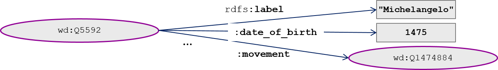
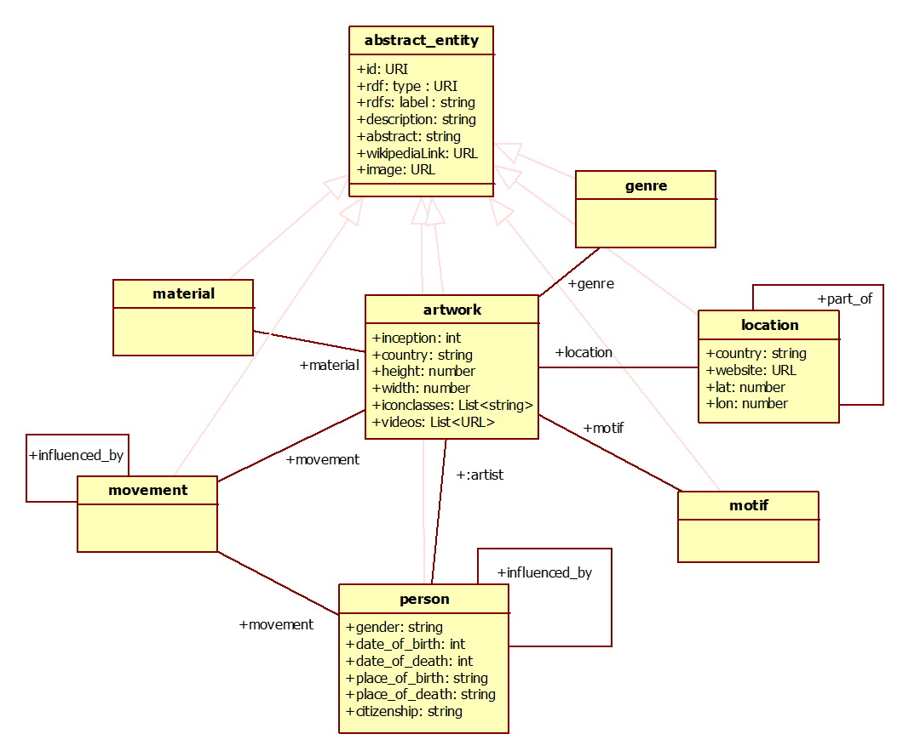
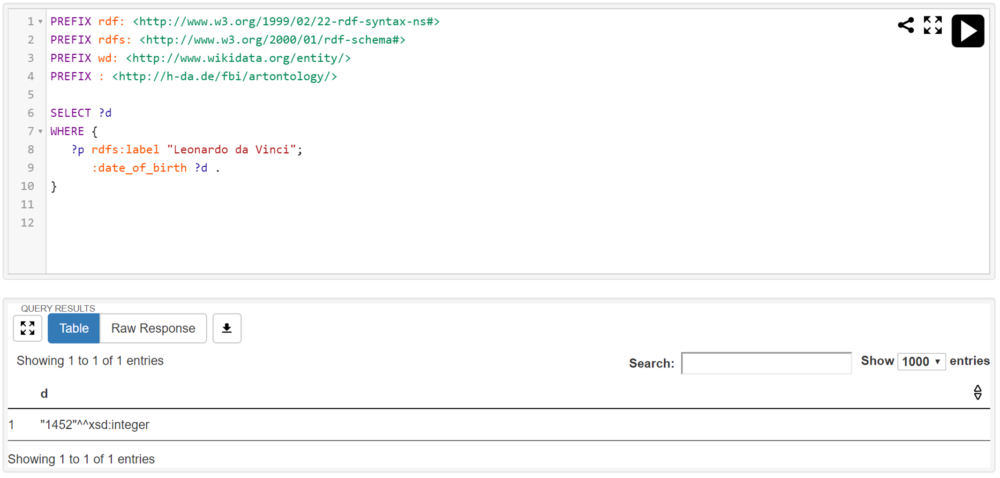
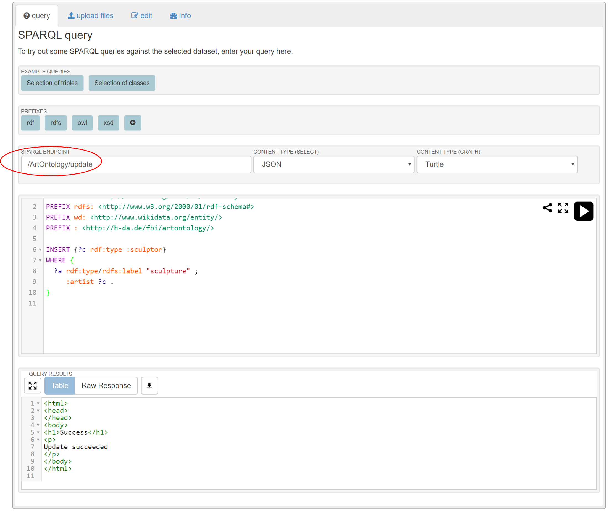

# Knowledge Representation

AI applications are based on knowledge. Therefore, a central question to all AI applications is how to represent the knowledge relevant for the application domain. 

Fig. 3.1. shows *knowledge representation* in the AI landscape. 

Knowledge representation is part of symbolic AI and deals with the abilities of knowing and reasoning.

Inspired by one of my own projects, the [digital collection](https://sammlung.staedelmuseum.de) of one of the leading arts museums in Germany, I will use arts as the sample application domain for this chapter and the remainder of the book.

See Fig. 3.2.

%% (Image source: Wikimedia)

Relevant questions for knowledge representation are:

- How to *represent knowledge*, e.g., "Michelangelo is a Renaissance artist"
- How to *reason over knowledge*, e.g., "Someone who has created paintings is an artist"
- How to *answer questions*, e.g., "Which Renaissance artists lived in Italy?"

## Ontology

In this book, I use the term "ontology" for represented knowledge with the following definition.

An *ontology* is the representation of knowledge of a particular application domain, i.e., a *representation of the relevant concepts and their relationships*.  

The term "ontology" was originally coined in philosophy and is now also used in Computer Science. See, e.g., (Busse et al., 2015).
Let us look at some specific examples of knowledge about creative arts (Fig. 3.3).

Those pieces of knowledge are represented informally as English sentences. Parts of those sentences are marked with different colors. The terms "artist", "painting", "sculpture", and "artistic movement" are marked red (solid lines). They represent concept types a.k.a *classes*. The terms with dashed red lines are concept instances a.k.a. *individuals*: "Michelangelo" is an artist, "Creation of Adam" is a painting, "David" is a sculpture, and "Renaissance" is an artistic movement. Marked in blue are *relationships*: Michelangelo "created" David as well as Creation of Adam and he "belonged to" the High Renaissance movement. Finally, marked in green are general *rules*: Every individual who has created a painting is a painter; every individual belonging to the class painter also belongs to the class artist. 

See Fig. 3.4.

An ontology consists of *facts* and an ontology *schema*. Facts are based on the schema. Facts are individuals (concept instances, e.g., Michelangelo) and concrete relationships between those individuals (e.g., Michelangelo created David; dashed lines in the figure). The schema specifies the type level (solid lines in the figure). Classes are the concept types for individuals (e.g., artist for Michelangelo). Relationship types, e.g., "created" define the kinds of relationships that can be specified between individuals. Finally, *rules* are part of an ontology schema. 

An ontology of some form is in the center of many AI applications.
Extending the ontology, i.e., adding new concepts, means extending the AI application. 

%% TODO: Explain vocabulary / taxonomy / ontology - what's the difference?

### Ontology reasoning

An ontology is more powerful than a traditional relational database. In addition to the knowledge that is stated explicitly, knowledge may be derived via *reasoning*.

Consider the following explicitly stated facts and rules:

-	Michelangelo is a person.
-	Michelangelo has created the painting „Creation of Adam“.
-	Every person that has created a painting is a painter.

From this explicitly stated knowledge, the following fact may be derived via reasoning:

-	Michelangelo is a painter.

X> I leave it to the reader to find an explanation why the reasoning result is, in fact, correct. Take a while to think about it. What is the intuitive, common sense, explanation? Can you also formulate the explanation more formally? How would a computer program (a reasoning engine) have to be constructed in order to derive the new fact automatically?

Implementing a reasoning engine is beyond the scope of this book.  This book focuses on engineering AI applications using off-the-shelf components like a reasoning engine (Much like a book on engineering JavaEE applications will not explain how the Java compiler is implemented). For further reading refer, e.g., to (Russell and Norvig, 2013).

### Ontology Querying

Knowledge representation is no end in itself but a means to an end: answering relevant questions of the application domain. Therefore, ontology engines include a query interface that allow to formulate queries and retrieve results.

Consider the following questions and answers regarding the facts specified above:

- Q1: Who has painted "Creation of Adam"? A1: Michelangelo
- Q2: Has Michelangelo painted "Creation of Adam"? A2: Yes
- Q3: Is Michelangelo a painter? A3: Yes
- Q4: Which painters exist? A4: Michelangelo (and more painters, according to the facts specified)

The four questions are of different nature.

Q1 (Who has painted "Creation of Adam"?) can be answered by matching an explicitly stated fact (Michelangelo painted „Creation of Adam“) and returning the matching individual ("Michelangelo").

Q2 (Has Michelangelo painted "Creation of Adam"?) is similar but expects a Boolean answer (here: Yes).

Q3 (Is Michelangelo a painter?) also expects a Boolean answer but cannot be answered by simply matching explicitly stated facts. Instead, ontology reasoning is required to derive the answer: Michelangelo is a person and painted „Creation of Adam“; every person who has created a painting is a painter => Michelangelo is a painter. Hence, the answer is yes.

Q4 (Which painters exist?) also involves reasoning but expects a set of individuals as an answer. In case the ontology only contained the facts mentioned above then the result would, indeed, be just {Michelangelo}. If, however, paintings by Raphael, Leonardo da Vinci, etc. were listed then the set would contain those artists as well.

### Open versus Closed World Assumption

Q4 (Which painters exist?) leads to an interesting question: How to ensure that the ontology is complete, i.e., actually contains all painters?

In an ontology for our solar system it is relatively easy to list all planets (even though the definition of what is a planet may change over time: Pluto is, today, considered a dwarf planet only). In contrast, for the Art Ontology it is next to impossible to list all painters that ever lived. Many of them are not known anymore. And who should decide who was a "real" painter and who just scribbled a few sketches?

Other critical questions are counting questions (How many painters exist?) and negated questions (Which painters have not created a sculpture?).  The answers to those questions may be wrong if the ontology is incomplete -- even if all facts in the ontology are, indeed, correct.

Therefore, the correct interpretation of ontology query results depends on assumptions that we make on the completeness of the ontology[^fn-uncertainty]. 

[^fn-uncertainty]: The situation is, of course, further complicated if we even cannot assume that the specified facts are correct.  There are various approaches for dealing with uncertainty (see (Russell and Norvig, 2013)). In practice, it is advisable to try to avoid this situation by quality assurance measures if at all possible.

In the *Closed World Assumption (CWA)* it is assumed that the ontology is complete. This is a comfortable situation and makes the interpretation of query results easy. Assume e.g., that  the Art Ontology is restricted to one particular museum and is complete (closed world assumption). In this case, the answer to Q4 (Which painters exist?) may be "There are exactly the painters X,Y,Z for which we currently have paintings in our museum"; the counting query (How many painters are there?) may be answered "There are exactly n painters currently exhibiting in our museum"; the answer to the negated query (Which painters have not created a sculpture?) can be answered as "For painters X,Y,Z we have currently no sculpture in our exhibition".

In the *Open World Assumption (OWA)* it is assumed that the ontology is not complete and new  findings may be added as facts at any time. This does not mean that questions about enumerations, counting, and negations cannot be asked at all. However, the results must be interpreted differently than in the CWA. For example, the result to Q4 (Which painters exist?) can be interpreted as "painters that we know of ..." instead of "all painters ..."; The result of the counting question (How many painters are there?) can be interpreted as "there are at least n painters that we know of"; the answer to the negated question (Which painters have not created a sculpture?) may be interpreted as "for painters X,Y,Z there is currently no sculpture known". 

The distinction between OWA and CWA is not technical - it is a matter of business application logic! It is about interpreting the results of an ontology query adequately. When developing an AI application it is essential to figure out under which assumption the ontology has been constructed in order to interpret results adequately.   

## Knowledge Representation Approaches

In the last sections, I introduced ontologies, ontology reasoning and querying informally. In order to use knowledge in an AI application one needs concrete formalisms and implementations of such formalisms. In this section, I briefly mention important knowledge representation formalisms. They have been developed over the years in AI research and they are, today, more or less used in practice. For more details see (Russell and Norvig, 2013). 

### Predicate Logic

*Predicate logic* is a mathematical formalism which is the foundation of many knowledge representation formalisms. 
Facts and rules are specified in form of predicates, quantifiers and Boolean operations. In the following example, `painted(p, x)` and `painter(p)` are predicates; The universal quantifier ("for all", denoted as an inverted letter "A") and the existential quantifier ("there exists", denoted as a rotated letter "E") are used; As a Boolean operation, the implication ("if ... then", denoted as an arrow) is used.

See Fig. 3.5.

Interpretation: Michelangelo painted "Creation of Adam"; Every person who painted something is a painter.

### Frames

*Frames* is a knowledge representation mechanism which influenced early object-orientation and, hence, is familiar to most software engineers today. 

See Fig. 3.6 for an example.

Interpretation: Michelangelo is a Person, born 1475 in Italy. "Creation of Adam" is a painting by Michelangelo.
In frame systems, rules and reasoning can be implemented algorithmically in form of if-needed / if-added actions.

### Semantic Nets

*Semantic nets* have been popular because of their intuitive graphical representation.
In Fig. 3.7, individuals are represented as oval shapes, and relationships as arrows. 

Interpretation: Michelangelo was born in Italy and created the painting "Creation of Adam".

### Rules

In rule-based languages, knowledge is expressed in form of facts and rules.
In the following example (Fig. 3.8), `is_a` and `painted` are predicates, `?p` and `?x` are variables, `person` and `painter` are classes, and `->` denotes an implication.
The two conditions on the left side of the implication are implicitly conjunctive, i.e.,  connected by the Boolean AND operator.

	(?p is_a person)
	(?p painted ?x)
	->
	(?p is_a painter)

Fig. 3.8: Rules

Interpretation: If ?p is a person who painted something then ?p is a painter.

### General-Purpose Data Stores

General-purpose data stores are rarely mentioned in AI literature but commonly used in AI applications in practice. Examples are relational databases and NoSQL databases including object databases, graph databases, key-value stores, search indexes and document stores. 

I have co-edited a book on Corporate Semantic Web (Ege et al., 2015) in which 18 AI applications are presented which are in corporate use. More than half of the applications use general-purpose data stores for representing application knowledge. 
The architects of those applications made this decision due to performance reasons, ease of use, and for better integration into the corporate IT application landscape.

## Semantic Web Standards

In the following sections I introduce RDF and SPARQL as sample languages and technologies for knowledge representation. Those languages have been standardized by the World Wide Web Consortium (W3C) as part of the [Semantic Web initiative](http://www.w3.org/2001/sw/) and have gained some use in practice. I use those languages for examples in this book. However, neither the W3C standards nor other knowledge representation mechanisms and technologies can be considered as *the* de facto standard in today's AI applications. 

### Resource Description Framework (RDF)

[RDF](http://www.w3.org/RDF/) stands for Resource Description Framework. RDF as well as the languages [RDFS](https://www.w3.org/2001/sw/wiki/RDFS) and [OWL](https://www.w3.org/2001/sw/wiki/OWL) built on top of RDF are based on predicate logic and semantic nets. 

I will explain RDF briefly. For a good, practice-oriented introduction see (Allemang and Hendler, 2011).

#### Resources and URIs

An *RDF resource* represents anything which is relevant in an application domain, e.g., the individual "Michelangelo", the class "Painter", the relationship type "created", etc.

In RDF, every resource is identified by a *Uniform Resource Identifier* ([URI](http://www.w3.org/TR/webarch/#identification)).

Example: Wikidata's entry for Michelangelo

    <https://www.wikidata.org/entity/Q5592>

#### RDF Namespaces

*Qualified names* introduce namespaces to URIs in order to reduce typing effort, to increase readability, and to avoid name clashes.
With the definition of a prefix

    @prefix wd: <http://www.wikidata.org/entity/> .

the URI above can briefly be specified as:

	wd:Q5592

A default namespace can be specified as follows:

	@prefix : <http://www.wikidata.org/entity/> .

Then, the URI above can be specified without prefix at all: 

	:Q5592

Note that the URI does not need to be a cryptic ID but can also be a symbolic name, e.g.

	:Michelangelo

#### RDF Triples

The main construct for specifying facts in RDF is a *triple* consisting of *subject, predicate*, and *object*. Subject and predicate must be RDF resources. The object may be an RDF resource but may also be a literal value in form of an [XML data type](http://www.w3.org/TR/webarch/#formats). 

Examples:

	wd:Q5592 rdfs:label "Michelangelo" .
    wd:Q5592 rdf:type :person .
	wd:Q5592 :date_of_birth 1475 .
	wd:Q5592 :movement wd:Q1474884 .

The namespaces for this and the following examples are:

	@prefix rdf: <http://www.w3.org/1999/02/22-rdf-syntax-ns#> .
	@prefix rdfs: <http://www.w3.org/2000/01/rdf-schema#> .
	@prefix owl: <http://www.w3.org/2002/07/owl#> .
	@prefix wd: <http://www.wikidata.org/entity/> .
	@prefix : <http://h-da.de/fbi/artontology/> .

In the first example triple, the subject is `wd:Q5592`, the predicate  is `rdfs:label` and the object is `"Michelangelo"`. Every triple must be terminated by a period.

Fig. 3.9 shows the example triples displayed as a semantic net.

{width=75%}

The triples may be read as: Michelangelo is a person who was born 1475 and belongs to the artistic movement of Renaissance (wd:Q1474884). 

To avoid repeating the subject `dbpedia:Michelangelo` three times, an abbreviated notation may be used. The subject is stated only once and the triples with the same subject are combined via semicolons. A period terminates the group of triples.

The following example is semantically identical to the three triples above.   

    wd:Q5592 rdfs:label "Michelangelo" ;
    	rdf:type :person ;
		:date_of_birth 1475 ;
		:movement wd:Q1474884 .

#### Classes

Classes represent concept types and are defined by RDF triples with  `rdf:type` as predicate and `rdfs:Class` as object.

Example:

    :person rdf:type rdfs:Class .

Meaning: Person is a class.

You can also use `a` as an abbreviation for `rdf:type`. So, the triple above can be written as

    :person a rdfs:Class .
	
Individuals, i.e. concept instances, are specified by RDF triples with `rdf:type` as predicate and the class as object.

Example:

    wd:Q5592 a :person .

Meaning: Michelangelo is a person.

#### Properties

A relationship type is defined as an RDF property.

Example:

    :date_of_birth a rdf:Property .

Meaning: `date_of_birth` is a property (relationship type).

An RDF property can be used as a predicate in an RDF triple.

    wd:Q5592 :date_of_birth 1475 .

Meaning: Michelangelo's  date of birth is in 1475.

#### RDF and Object-Orientation

Classes and properties of RDF (and RDFS / OWL built on top of RDF) have some of similarities to classes and associations in object-oriented design and programming. However, there are also fundamental differences. In object-orientation, every instance belongs to exactly one class. In RDF, there is no need for specifying a class and an `rdf:type` relationship. Zero, one, but also several `rdf:type` relationships may be specified.
Furthermore, there is no type checking for subjects, predicates and objects.

For details see, e.g. (Allemang and Hendler, 2011).

#### Other Serialization Syntaxes

The RDF syntax introduced above is called [Turtle](http://www.w3.org/TR/2014/REC-turtle-20140225/). It shall be noted that other RDF serialization syntaxes exist: [N-Triples](http://www.w3.org/TR/2014/REC-n-triples-20140225/) and [RDF/XML](http://www.w3.org/TR/2014/REC-rdf-syntax-grammar-20140225/). 

### Linked Data

[Linked Data](http://linkeddata.org/) is an initiative to create, interlink, and share ontologies for a wide range of application areas. Linked data is based on the W3C Semantic Web technologies introduced above. A large number of most comprehensive ontologies has been created and are publicly available -- see the [Linked Open Data Cloud](https://lod-cloud.net) in Fig. 3.10.

Prominent linked data ontologies are [WikiData](https://www.wikidata.org), [DBpedia](http://wiki.dbpedia.org/), and [YAGO](http://www.mpi-inf.mpg.de/departments/databases-and-information-systems/research/yago-naga/yago//). 

[Schema.org](https://schema.org) is an open initiative originally initiated by the major search engine providers  Google, Microsoft, Yahoo and Yandex. It is based on RDF and provides a vocabulary for semantically specifying things talked about on web pages, including persons, organizations, locations, products, events, etc. Providers of websites can enrich their human-readable content by machine-readable semantic markup.
Google introduced the term *knowledge graph* as Google's collection of such data which is used for semantic features of the search engine, e.g., the Google info boxes.
Meanwhile, the term knowledge graph is also used for other large-scale ontologies with a focus on facts, including the Facebook graph and the Microsoft Office graph. Wikidata, DBpedia and YAGO can also be regarded as knowledge graphs in this sense.
 
Projects like [OpenStreetMap](https://www.openstreetmap.org/) and [GeoNames](http://www.geonames.org/) use different technology but also follow the idea of linked data. 

Linked data is important: Due to the community editing and network effect, the coverage of topics is enormous. However, not every large linked data set is a suitable ontology for a concrete AI application. In section "Tips and Tricks" I give hints on ontology selection and creation.  

### Example: Art Ontology

In this book, I use an Art Ontology in RDF as an example. The Art Ontology is a custom subset of Wikidata. Wikidata itself is a crowd-sourced community effort to provide the information for Wikipedia's info boxes and one of the most comprehensive publicly available knowledge graph.

Wikidata provides a crawling API for extracting custom ontologies for AI applications. The art ontology crawler has been developed in one of my research projects (Humm 2020). The crawler code is open source under [GitHub](https://github.com/hochschule-darmstadt/openartbrowser/blob/master/scripts/data_extraction/art_ontology_crawler.py). 
  
The Art Ontology consists of ca. 1.9 million RDF triples, representing

-	ca. 180,000 artworks (paintings, drawings and sculptures), e.g., Mona Lisa
-	27,000 motifs, e.g., mountains
-	20,000 artists, e.g., Leonardo da Vinci
-	7,300 locations, e.g., Louvre Museum
-	720 materials, e.g., oil paint
-	320 genres, e.g., portrait
-	270 artistic movements, e.g., Renaissance.

#### Ontology Schema

Fig. 3.11 shows the Art Ontology schema as [UML](http://www.uml.org/) class diagram. Please note that RDF does not provide means for specifying required attributes of classes and their datatypes as well as associations between classes. However, the Art Ontology crawler ensures that this schema is met and AI applications using the Art Ontology can rely on it.

{width=75%}

The Art Ontology schema consists of 7 classes. `artwork` is the central class with associations to the other classes: `person`, `movement`, `material`, `genre`, `location`, and `motif`, connecting artworks with their creators, the depicted motifs, the location where the artwork is exhibited, the material, the artistic movement and the genre of the artwork. All classes share common attributes which are denoted in the superclass `abstract_entity`: `id`, `label`, `description`, `abstract`, `image`, and `wikipedidaURL`. Some classes have additional attributes, e.g., `gender`, `date_of_birth`, `date_of_death`, `place_of_birth`, `place_of_death` and `citizenship` for class `person`.

This is a subset of the entries for Mona Lisa (Q12418).

	wd:Q12418 a :artwork;
	    rdfs:label "Mona Lisa" ;
	    :description "oil painting by Leonardo da Vinci" ;
	    :image <https://upload.wikimedia.org/wikipedia/commons/e/ec/Mona_Lisa%2C_by_Leonardo_da_Vinci%2C_from_C2RMF_retouched.jpg> ;
	    :artist wd:Q762 ;
	    :location wd:Q19675 ;
	    :genre wd:Q134307 ;
	    :movement wd:Q1474884 ;
	    :inception 1503 ;
	    :country "France" ;
	    :height 77 ;
	    :width 53 .

The label of the painting is "Mona Lisa", the artist is Leonardo da Vinci (Q762), the location is the Louvre Museum in Paris (Q19675), the genre is portrait (Q134307), the artistic movement is High Renaissance (Q1474884), the year of inception is 1503, and the size of the painting is 77x53 cm. 

#### Ontology Editor

[Protégé](http://protege.stanford.edu/) is an open source ontology editor.  Fig. 3.12 shows as an example, the entry of Mona Lisa in the Art Ontology in Protégé. 

## Querying Ontologies

[SPARQL](http://www.w3.org/TR/sparql11-query/) is the query language for RDF and is also standardized by the W3C. 

### SPARQL Namespaces

SPARQL also supports namespaces but with slightly different a syntax than RDF.
See, e.g., some relevant namespaces. The keyword `PREFIX` is used to define a namespace prefix which is separated by a colon from the full namespace. 

	PREFIX rdf: <http://www.w3.org/1999/02/22-rdf-syntax-ns#>
	PREFIX rdfs: <http://www.w3.org/2000/01/rdf-schema#>
	PREFIX wd: <http://www.wikidata.org/entity/>
	PREFIX : <http://h-da.de/fbi/artontology/>

### Simple SPARQL Queries

SPARQL uses the keywords `SELECT` and `WHERE` similar to [SQL](http://www.iso.org/iso/home/store/catalogue_ics/catalogue_detail_ics.htm?csnumber=53681). The query conditions are expressed as RDF triples in which variables can be used. Variables start with a question mark.

See e.g. the following SPARQL query resembling the question "When was Leonardo da Vinci born?"

	SELECT ?d
	WHERE { 
	   ?p rdfs:label "Leonardo da Vinci";
	      :date_of_birth ?d .
	}

In this query, the variable for holding the date of birth is `?d`.  
The query consists of two triples -- as you can see, the abbreviated RDF Notation linking several triples with the same subject via a semicolon can be used in SPARQL, too.
Each triple poses a restriction on the query -- implicitly AND connected. We query for some entry `?p` with label `"Leonardo da Vinci"` and some `date_of_bith` entry `?d`. If such a combination can be found in the ontology the it is returned as the query result.

Fig. 3.13 shows this query and its result executed in the SPARQL server [Apache Jena Fuseki](https://jena.apache.org/documentation/fuseki2/) after loading the Art Ontology. 

{width=75%}

X> Since the Art Ontology is an extract of Wikidata, you can execute a similar query at the [Wikidata query service](https://query.wikidata.org)  (See Fig. 3.14). Since Wikidata uses cryptic IDs for all properties (e.g., `wdt:P569` for `date_of_birth`, there is a query helper suggesting parts of the query to be completed.  Try it yourself! 

{width=75%}

Assume we are interested in artists who were born in Paris.

	SELECT  ?l
	WHERE { 
	   ?p a :person ;
       :place_of_birth "Paris" ;
	   rdfs:label ?l .

This query consists of 3 triples. We query for instances of class `person` with `place_of_birth "Paris"` and return their labels. 
Executed on the Art Ontology, this query will result in 690 artists, including Édouard Manet, Claude Monet, and Jacques Rousseau. 

### Multiple Query Result Variables

When you are interested in multi-value query results, then multiple result variables may be specified in the `SELECT` clause of a SPARQL query. 

The following query, e.g., lists artist with their corresponding place of birth.

	SELECT  ?l ?b
	WHERE { 
	   ?p a :person ;
	      rdfs:label ?l ;
	      :place_of_birth ?b .
	} 

The query result is a set of pairs `?l`, `?b`. See Fig. 3.15.

{width=75%}

If all used variables shall be returned then `SELECT *` 
may be used as in SQL. 

### Distinct Query Results

As in SQL, `SELECT DISTINCT` avoids duplicates in the result set. 

The following query lists countries of artworks in the Art Ontology.

	SELECT DISTINCT  ?c
	WHERE { 
	   ?p a :artwork ;
	      :country ?c .
	} 

### Path Expressions

Path expressions are a convenient abbreviation for expressing traversals in RDF graphs. Consider the following query for artworks by Paris-born artists.

	SELECT  ?n ?l
	WHERE { 
	   ?a a :artwork ;
	      rdfs:label ?l ;
	      :creator/:place_of_birth "Paris" ;
	      :creator/rdfs:label ?n .
	}

The two conditions that the artwork `?a` has a `creator` and this creator has as `place_of_birth "Paris"` can be conveniently expressed as 

	?a :creator/:place_of_birth "Paris" .

Note that path expressions a just convenience. The same condition could have been expressed by 2 triples:

	?a :creator ?p .
	?p :place_of_birth "Paris" .

### Transitive Closures

SPARQL provides a powerful construct to query transitive closures. 
Consider the question to find artists that have been influenced by Paul Cézanne, directly or indirectly. 

First consider the following SPARQL query.

	SELECT *
	WHERE { 
	  ?p a :person;
	     :influenced_by/rdfs:label "Paul Cézanne" .
	}

It will return all persons which, according to the facts in the Art Ontology, have directly been influenced by Paul Cézanne: 4 artists, including Pablo Picasso, and Vincent van Gogh.

If we are additionally interested in artists who were influenced by those 4, including the ones influenced by them and so forth (1..n times the `influenced_by` relationship), then the query condition has to be modified as follows.

	?p :influenced_by+/rdfs:label "Paul Cézanne"

The plus sign in `influenced_by+` denotes a transitive closure (1..n). 
This will result in 15 artists, including Pablo Picasso and Vincent van Gogh as before, but also Salvador Dalí, Paul Klee, Wassily Kandinsky, Franz Marc, and others.

If you want to additionally include Paul Cézanne in the result set (0..n: reflexive and transitive closure), then you have to use a star sign as in `influenced_by*`. 

### Advanced Features 

There are numerous advanced SPARQL features which are important for practical use but which I will not go into details in this book:

- `ASK` queries: for checking  a condition (Boolean result)
- `FILTER`: for expressing additional conditions, e.g., on datatypes
- `OPTIONAL`: for specifying optional values
- `EXISTS` / `NOT EXISTS`: for defining negation queries
- `GROUP BY`, `HAVING`: for aggregations
- `ORDER BY`: for sorting query results
- Subqueries: for nesting queries

For those and other features refer to the [SPARQL specification](http://www.w3.org/TR/sparql11-query/).

## Rule-based Reasoning

### Overview

*Reasoning* is a major AI technique to derive new knowledge from existing facts in an ontology.
An intuitive and, hence, popular way of specifying reasoning behavior is via *rules*. Rules are of the form "IF condition(s) THEN conclusion(s)". 
Rule-based reasoning has a long history in AI. In particular, the [Prolog](https://en.wikipedia.org/wiki/Prolog) programming language (PROgramming in LOgic) was, apart from Lisp, the most popular AI programming language in the 1980s. 

Two approaches to rule-based reasoning can be distinguished: *forward chaining* and *backward chaining*. In forward chaining, the reasoning engine starts with the facts and applies all specified rules in order to find all possible conclusions. Queries on this extended ontology will include the logic specified in the rules.
Backward chaining operates inversely. Starting from a particular query, those rules are applied which are necessary for answering the query. 
Backward chaining is sometimes called *goal-directed* reasoning whereas forward chaining is called *data-driven* reasoning. 

Which approach is better? This, of course, depends on the application use case, in particular the the types of queries asked  and the branching rate of rules. Some technologies provide one strategy only (e.g., Prolog provides backward chaining), others combine forward and backward chaining (e.g., [Drools Expert](https://www.drools.org)).

For the Semantic Web, there are various approaches for rule-based reasoning, more or less adopted in practice. 
[SWRL (Semantic Web Rule Language)](https://www.w3.org/Submission/SWRL) is a W3C Member Submission since 2004 but not a W2C standard and not widely adopted in practice. 
[OWL](https://www.w3.org/TR/2012/REC-owl2-overview-20121211) reasoning is based on set theory. In contrast to rule-based approaches, reasoning logic is specified via set operations like restrictions, intersections, complements, and unions. 
Some RDF triple store implementations like Apache Jena provide their own rule language like [Jena rules](https://jena.apache.org/documentation/inference). Jena rules provide forward and backward chaining. [GraphDB](http://graphdb.ontotext.com/documentation/standard/reasoning.html) provides proprietary rules with forward chaining. 

[SPARQL Update](https://www.w3.org/TR/sparql11-update) provides means for updating ontologies based on existing facts. This mechanism may be used for forward chaining rule-based reasoning. Since SPARQL update statements are an intuitive extension of SPARQL queries and standardized by the W3C, I will present them in the following section. 

### SPARQL Update

Assume you want to query the Art Ontology for artists who are painters as well as sculptors. However, in the Art Ontology schema there is no direct representation of the concepts painter and sculptor. 
But you may infer this information from the Art Ontology with the following rules:

1. A person who created a painting is considered a painter.
1. A person who created a drawing is considered a painter.
1. A person who created a sculpture is considered a sculptor.

Those rules can easily been expressed using  SPARQL INSERT statements. 

	INSERT {?c a :painter}
	WHERE { 	  
	  ?a a/rdfs:label "painting" ;
	     :artist ?c .
	} 
	
	
	INSERT {?c a :painter}
	WHERE { 	  
	  ?a a/rdfs:label "drawing" ;
	     :artist ?c .
	} 
	
	
	INSERT {?c a :sculptor}
	WHERE {   
	  ?a a/rdfs:label "sculpture" ;
	     :artist ?c .
	} 

SPARQL INSERT statements allow providing RDF triples after the `INSERT` keyword, containing SPARQL variables that are matched according to the conditions specified in the `WHERE` part. The `WHERE` part can contain everything that can be specified in SPARQL queries. In the example above, it is assumed that the Art Ontology contains the Wikidata type information, e.g., `wd:Q3305213` (painting), `wd:Q93184` (drawing) or `wd:Q860861` (sculpture) for artworks. The `WHERE` conditions are straight forward, using  path expressions.

When experimenting with SPARQL INSERT statements in the Fuseki web app,  make sure that the SPARQL endpoint is set to `update`. See Fig. 3.16.

After  execution of the update operation, a success message is returned.

After executing the 3 `INSERT` statements specified above, the query for artists who are both, painters and sculptors can be easily and intuitively be specified and executed as shown in Fig. 3.17. 

In this SPARQL query, both RDF abbreviation notations are used: using a semicolon for chaining several predicates for the same subject and using a comma for chaining several objects for the same predicate. 

When you wish to inspect the RDF triples generated, you may use a SPARQL `CONSTRUCT` query instead of an `INSERT` statement. See Fig. 3.18.

Please note that the SPARQL endpoint is set to query, as for other SPARQL queries.

## Knowledge Representation Services and Product Maps

### Knowledge Representation Services Map

Fig. 3.19 shows the services map for knowledge representation.

- A *knowledge base* allows the storage and retrieval of ontologies, i.e. knowledge structures of all kinds. It is usually the core of an AI application.
- *Query engine* and *reasoning engine (a.k.a. reasoner)* usually come with a knowledge base product. But since they can often be plugged in and replaced, I have added them as separate services.
- Since AI applications are often implemented in a general-purpose programming language like Python, an Application Programmers' Interface (*API*) is needed to access to the knowledge base and its reasoners. 
- A *Knowledge Editor* allows editing ontologies. Ontologies may be imported / exported between knowledge editor (development time) and knowledge base (run-time). Standard formats like RDF may be used for importing / exporting.
- *Knowledge resources* include off-the-shelf ontologies like, e.g., Wikidata, that may be used in an AI application.
- *Data Integration / Semantic Enrichment* are services that allow integrating various knowledge resources or subsets thereof. For example, the Art Ontology described above is a custom subset of Wikidata.
- *Integrated environments* are tool suites that bundle various development-time and run-time knowledge representation services.

### Knowledge Representation Product Map

Fig. 3.20 shows the knowledge representation product map.

Virtuoso, GraphDB, rdf4J, Apache Jena are bundles that include knowledge base, reasoning / query engines and  Java APIs. Pellet, FaCT++, and HermiT are reasoning engines that may be plugged into other products. Protégé and Topbraid Composer are knowledge editors; Topbraid Suite, PoolParty and Semafora are integrated environments that include knowledge editors and runtime-components. Examples for knowledge resources are WikiData, DBpedia, YAGO, CYC and GND.  

More products and details can be found in the appendix.

## Tips and Tricks

### Ontology - Make or Buy?

Make or buy? This is common a question in the technology selection phase of an IT project. It also applies to the ontology in an AI application project.

As outlined in the section on Linked Data, there are thousands of ontologies available, many with a public license, with thousands or even hundreds of thousands of facts each. An area with particularly well-established public ontologies are life sciences; See, e.g., [The OBO Foundry](http://www.obofoundry.org/) with ontologies for symptoms, diseases, medications, clinical procedures, genes / proteins, etc. etc. 
There are even *ontology search engines*, e.g., [BARTOC](http://bartoc.org) .

Surprisingly however, when being confronted with concrete requirements for an AI application, it turns out that rarely an off-the-shelf ontology is sufficient. In none of my previous projects in various areas (medicine, manufacturing industry, tourism, libraries, creative arts, and software engineering) I could simply take and use an off-the-shelf ontology without adaptation. Other practitioners have made similar experiences (Ege et al., 2015), (Hoppe et al. 2018).

I think Bowker and Star (1999) give a good explanation for this dilemma. They write: "Classifications that appear natural, eloquent, and homogeneous within a given human context appear forced and heterogeneous outside of that context". Different use cases require different structuring of the same knowledge.

Also, the quality of some public ontologies is mediocre. For example, in Wikidata the class wife is in a transitive `rdfs:subClassOf` relationship with class animal (accessed 2019-04-03). 
A wife being regarded as an animal?! How can such an embarrassing misconception happen? 
This is because in Wikidata, the following relationship chain is modeled: wife is subclass of woman, is subclass of female, is subclass of Homo sapiens, is subclass of omnivore, is subclass of animal. Each individual `subClassOf` relationship could be considered reasonable; as a relationship chain it is just embarrassing.

When implementing the scripts for extracting the Art Ontology from Wikidata, we put quite some effort in data cleansing measures, e.g., eliminating birth and death dates that are not valid, birth and death places that are no locations, artist's movements that are no artistic movements etc.

Wikidata is still a suitable source for the Art Ontology example in this book and for web apps like [openArtBrowser](https://openartbrowser.org). However, in a project for one of the leading German Arts museums ([Staedel digital collection](https://sammlung.staedelmuseum.de)), the use of general-purpose knowledge graphs like Wikidata was out of question due to their quality deficiencies. 

Of course, it is generally advisable to favor an off-the-shelf ontology over a custom-made one. 
Advantages are:

-  Less costs for creating and maintaining the ontology
-  Potentially higher quality due to contribution and use by many communities (as mentioned above, this is not always the case)

However, developing a custom ontology for a specific use case, e.g., within a corporation is not as expensive as one might think. Experience from practice shows that an experienced team can model about 1,000 concepts within a week (Hoppe, 2015).

 

%% TODO Tipps & Trick  for the development of new ontologies

### Pre-Processing Off-the-Shelf Ontologies

When analyzing off-the-shelf ontologies for a concrete application use case, the ontologies' scope, structure and quality should be taken into account. Sometimes one or several ontologies can be identified that are quite suitable but do not fit perfectly. In this case a pre-processing step, much like the *ETL (Extraction, Transformation, Loading)* step in Data Warehouses, is recommendable. Ontology pre-processing may include the following activities:

1. Transforming technical data formats, e.g., from tabular format CSV to RDF
1. Transforming ontology schemas, e.g., from `wd:Q3305213` to `:artwork`
1. Quality enhancement, e.g., omitting birth dates that are not valid
1. Integrating multiple ontologies, e.g., removing duplicates

Pre-processing may be supported by services of type "Data Integration / Semantic Enrichment" in the Services Map. From my point of view, this important step is not discussed enough in the AI literature. See also the chapter on AI Application Architecture.

One final remark regarding selecting off-the-shelf ontologies: do not worry too much about technical formats. Converters between XML, CSV, XLS, RDF, database dumps, etc. are available open source or can easily be developed.  

### Deciding on Technology

There are numerous mature products for knowledge representation available -- commercial and open source. So, when it comes to selecting knowledge representation technologies and products, there is no make versus buy decision to be taken -- just like you would not implement your own database management system for a business information system.

In the Section 2.6 I recommend a general method for selecting suitable products.
Here I give some tips and tricks regarding selecting knowledge representation products:

Check carefully what is *really* needed in your application use case. In many practical use case scenarios, much less is required than what traditional AI frameworks offer. In AI literature, there is much discussion about the expressive power of the OWL full  standard compared to OWL light and other standards. In most of my projects, none of the OWL reasoning facilities were required at all. For many application use case scenarios, reasoning over hierarchies  is enough (e.g., an artist who lived in Florence also lived in Italy since Florence is in Italy). 

On the other hand, *high performance* requirements are common in real-world applications. However, traditional AI knowledge representation products exhibit poor performance due to their sophisticated reasoning facilities. Therefore, high-performance solutions like RDBMS and NOSQL data stores including search index solutions are recommended. Requirements like, e.g., reasoning over hierarchies can often easily be implemented using clever indexing strategies. Those solutions also deliver additional services like, e.g., full-text search which are not provided by classic AI knowledge representation products.

So, my recommendation is to not unnecessarily narrow the product candidates to traditional AI and Semantic Web technology when implementing AI applications. 

## Quick Check

X> Answer the following questions.

1. What is the purpose of knowledge representation?
1. Give examples for classes, individuals, relationships, and rules.
1. What is an ontology?
1. Name different knowledge representation approaches.
1. What does reasoning mean? Give an example. How does it work?
1. Explain the open world assumption and closed world assumption. What are the differences? What are implications of the assumption made?
1. What is a resource in RDF? How are namespaces used? What is an RDF triple?
1. How are classes declared in RDF? How are individuals (instances) assigned to classes?
1. How are properties declared in RDF? How are properties used?
1. Which serialization syntaxes exist for RDF?
1. What is linked data? Give examples of off-the-shelf ontologies.
1. How are simple queries structured in SPARQL?
1. How is the result set of SPARQL queries structured?
1. What advanced features does SPARQL offer?
2. How can rules be implemented with SPARQL?
1. Name knowledge representation services (services map).
1. Name a few products that implement those services (product map).
1. How to select ontologies for a concrete application use cases?
1. How to integrate various off-the-shelf ontologies?
1. How to  select knowledge representation products for a concrete AI application project?

