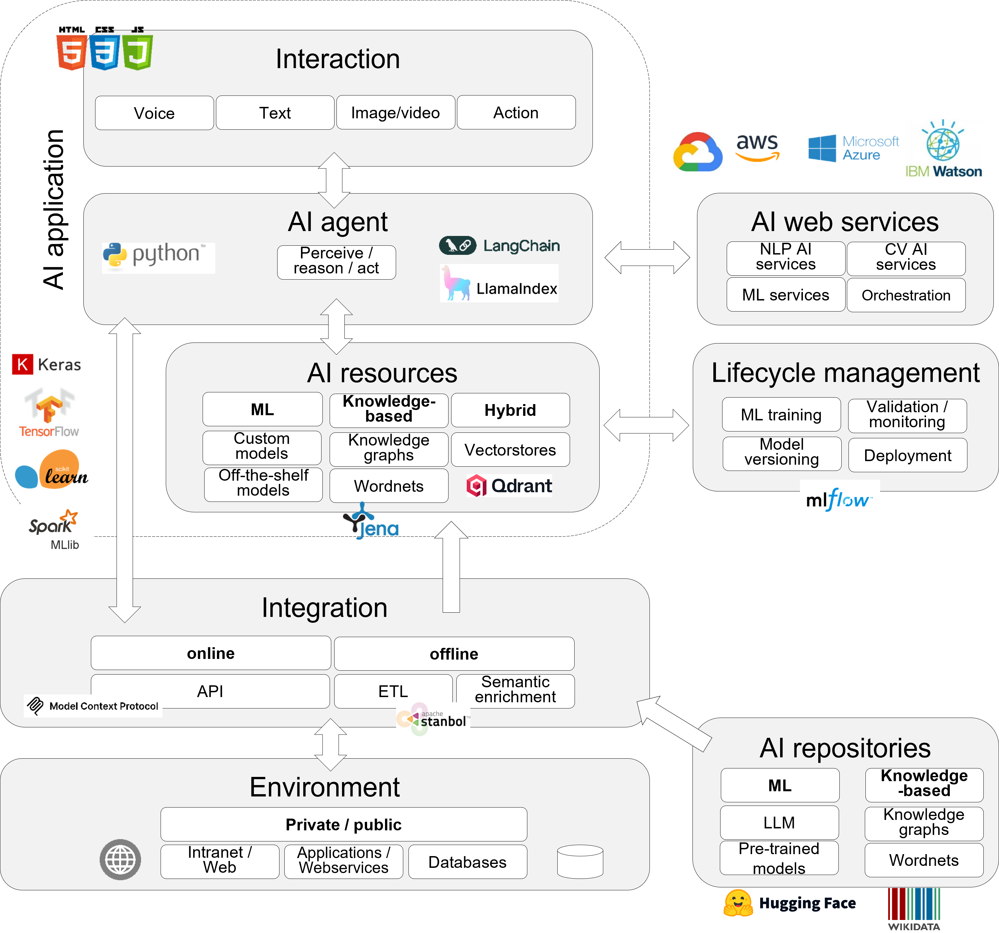
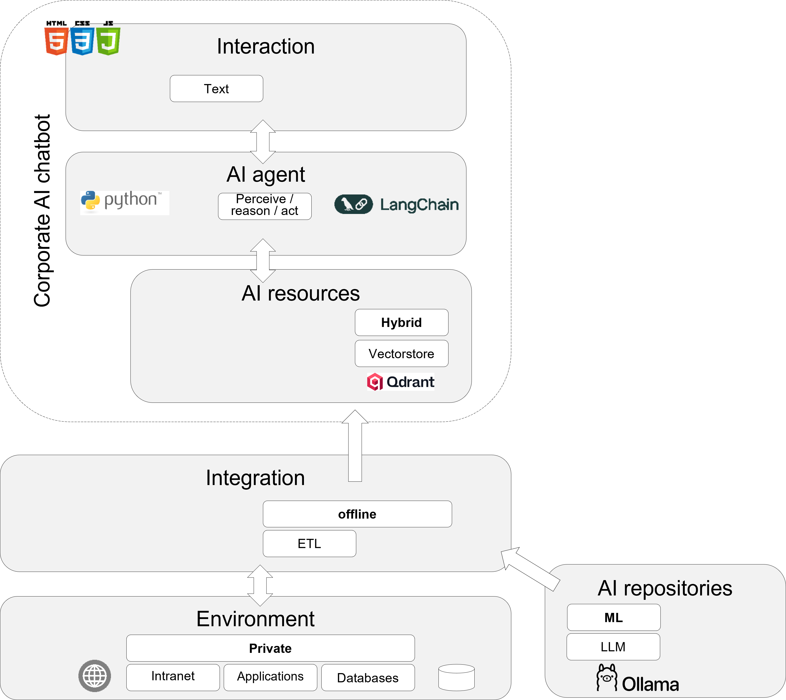
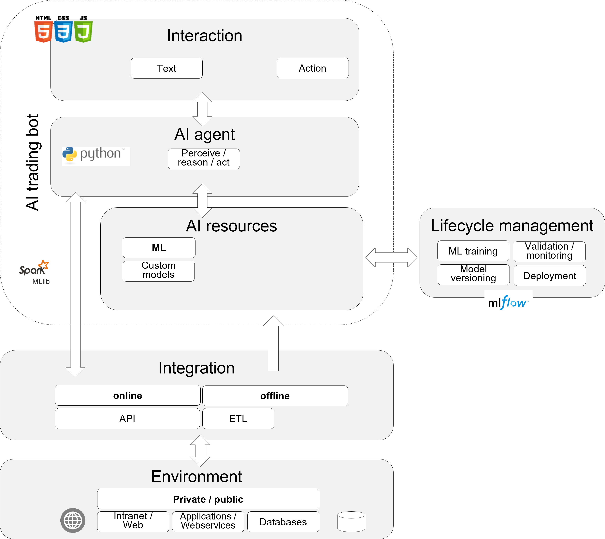
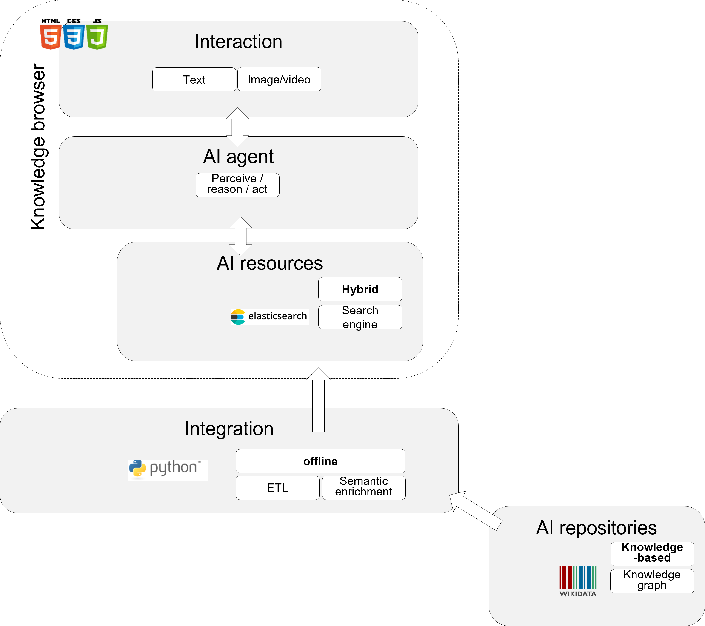
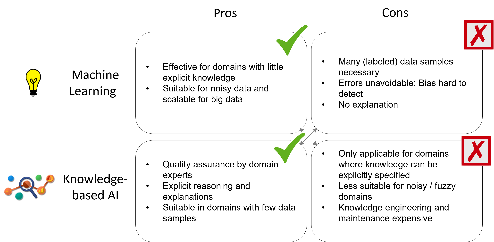
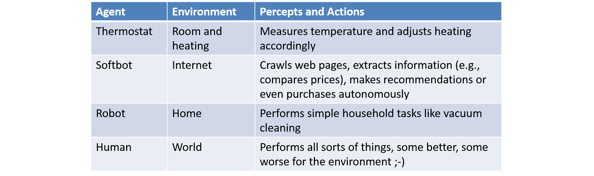
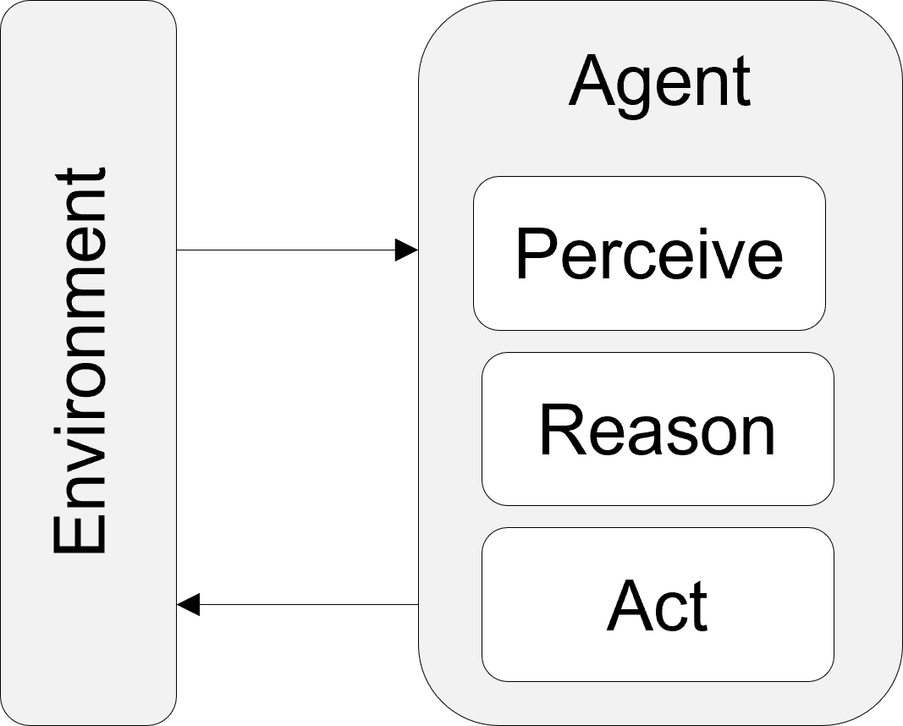
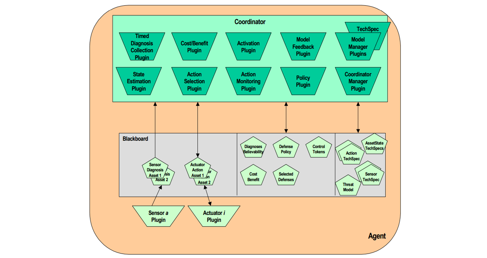
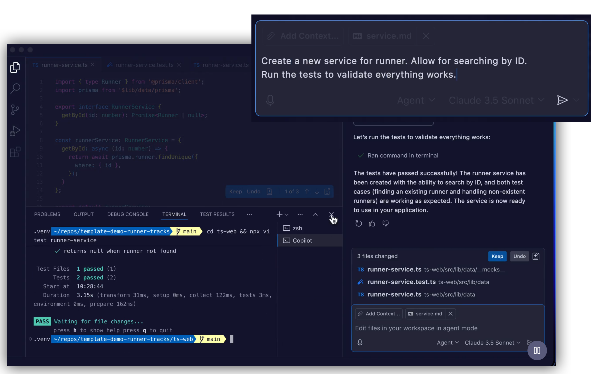
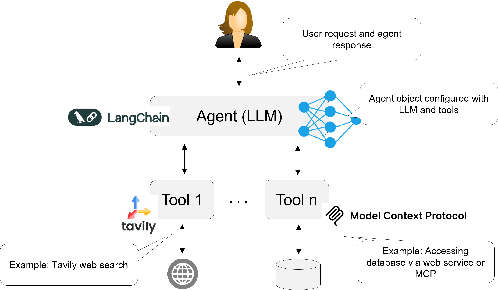

# AI Application Architecture

What characterizes an AI application?  Is it the use of a particular technology like LLMs, ML libraries, a rule engine or an agent framework? 
Or is it maybe a particular architectural choice like a blackboard architecture?

In my opinion, it is not the implementation characteristics that are relevant for characterizing an AI application.
It is mainly the application use case that is relevant:
AI applications exhibit behavior of human intelligence - whatever is under the hood. 

AI applications are IT applications, no matter which technology is used. Traditional software engineering principles and techniques apply, including separation of concerns, information hiding, layering, component-orientation, etc. Common issues like user experience, performance, security, maintainability, and cost-effectiveness are important. Additionally, a sound development methodology is important. When following an agile development approach, this includes e.g., early releases and prototypes, regular user feedback and quality assurance, etc.

To rephrase: *AI applications are IT applications and therefore classic software engineering principles apply*. 

%% This book focuses on engineering AI applications of high quality in an effective, cost-efficient way. 

## AI Reference Architecture

A *reference architecture* is a blueprint for concrete application architectures. In a reference architecture, the benefits of many concrete application architectures are distilled. The architect in a development project may use a reference architecture as a starting point for developing the concrete application architecture. 

Fig. 4.1 shows a reference architecture for AI applications. 

The reference architecture is structured as a *layered architecture* similar to the classic three-layer-architecture of business information systems. 

The *interaction layer* implements the (graphical) user interface which, in the case of a web apps or mobile apps, may be implemented with state-of-the-art UI frameworks based on HTML/CSS/JavaScript. The user interaction can be multi-modal based on voice, text, images or videos. In an embedded AI system like a mobile robot, physical actions may also be performed. 

A commonly used metaphor for the application logic in an AI system is that of an *AI agent*. Python is the de-facto standard programming language for AI applications, but  other state-of-the-art programming languages like Java, C# and C++ are also in use. 
The traditional AI programming languages of the 1980s, Lisp and Prolog, only play a niche role in today's AI application development. But they had a major influence on the design of modern dynamic programming languages like Python.
Often, the agent logic (the controller of the AI application) is hard-coded in the programming languages. If more flexibility is required, agent frameworks can be used, e.g., LangChain and LlamaIndex for LLM-based AI agents (see below for details).

AI applications typically base their intelligent behavior on AI resources like ML models or knowledge graphs as well as hybrid resources like vectorstores. ML models may be custom models trained for the purpose of the AI application. Libraries like Keras, TensorFlow, Scikit-learn and Spark may be used. In enterprises, often ML *lifecycle management* systems (e.g., mlflow) are used that manage ML training, model versioning, validation and monitoring as well as model deployment.

Often, off-the-shelf ML models are used, e.g., LLMs, usually fetched from *AI repositories* like huggingface. They provide all kinds of pre-trained ML models. Also, off-the-shelf knowledge graphs like WikiData or Word Nets can be obtained from public sites.

The *integration* layer allows integrating external sources into the AI application. Integrating pre-trained models like LLMs into an AI application is simple and usually a single line of code in a framework like langchain or llamaindex. However, integrating external AI resources may also be more complex. For this, the ETL (extract, transform, load) architectural pattern known from data warehouses and business intelligence may be employed. For example, off-the-shelf knowledge graphs like WikiData may be queried, filtered, and integrated. Semantic enrichment is a step of combining various knowledge resources. ETL is an offline step for providing AI resources for the AI application which accesses them online efficiently.

Other data may needs to be integrated in an offline step, e.g., private data from company databases or applications which are needed for training application-specific ML models. Additionally, such ML training data may be semantically enriched by information from off-the-shelf ontologies, e.g., for medical concepts.

In addition to offline integration of data sources, AI agents may access the environment online, i.e. at the time of a user interaction. E.g., a user request may invoke a web search first, then the results may be used for accessing web services, e.g., for making reservations online. 

In addition to using AI resources locally, AI applications may access *AI web services* from cloud providers like Google, Amazon, Microsoft or IBM. They include AI services for NLP (e.g., speech-to-text, text-to-speech, chatbots), CV (e.g., image or video generation), ML (e.g., training and deployment of large ML models) and orchestration (e.g., workflows or agents).

In a concrete AI application, each of those layers may be developed differently. Also, depending on the application use case, individual layers may be missing entirely. In the following sections I will show a few examples.

## AI Sample Architectures

### Corporate AI Chatbot

Consider the example of a corporate AI chatbot which allows employees to ask questions about corporate data like company rules, forms, best practices, colleagues, customers, and products. See Fig. 4.2 for an application architecture based on the AI reference architecture. 

The interaction component is a simple text-based graphical user interface (GUI) similar to ChatGPT, based on some HTML/CSS/JS framework. 
The AI agent is implemented with LangChain and follows the RAG (Retrieval-Augmented Generation) architectural pattern (for details see Chapter NLP). Company data and documents are extracted from the corporate Intranet, databases and applications using ETL and are indexed in a vectorstore (Qdrant). An LLM like LLama is loaded via Ollama and integrated in LangChain.

### AI Trading Bot

Consider the example of an AI trading bot, e.g., for a manufacturing company dynamically buying energy from an energy exchange. See Fig. 4.3 for an application architecture.

the AI agent is based on a custom ML model which is trained offline and optimized for company purposes. The training data is extracted from historical data of the energy exchange as well as from the corporate ERP (enterprise resource planning) system. The ML models are corporate assets and are managed with lifecycle management using mlflow. This includes permanent monitoring, re-training and deployment when needed.
The life trading bot consistently checks online manufacturing orders (in the ERP system) and prices on the energy exchange. Via APIs to the energy exchange trading system, energy is purchased dynamically. Via a GUI, trading activities are reported and can be monitored by staff. 

### Knowledge Browser

Consider the example of a knowledge browser like openartbrowser for the domain of creative arts. See Fig. 4.4 for an architecture diagram.

openartbrowser is based on information on WikiData. Information about artworks, artists, artistic movements, museums etc. are extracted from Wikidata in a regular batch process. Data is filtered, quality assured and semantically enriched using custom Python code. The data is loaded into a ElasticSearch server for high-performance access by the web application implemented with a HTML/CSS/JS based framework.

The data integration aspect is, in my opinion, not treated enough in AI literature. 
Let us have a more detailed look into the individual steps of the ETL process:

1. *Extraction* of WikiData items via the SPARQL endpoint. 
2. *Filtering* irrelevant data and data of insufficient quality; e.g., selecting  only paintings, sculptures and the respective artists from Wikidata; selecting  English descriptions only  and filtering attributes with wrong datatypes.
3. *Technical format transformation*: transforming from the source formats to the target format
4. *Data schema transformation*: transforming from the data schemas of the source format to a target data schema, e.g., renaming `wd:Q3305213` to `:artwork`
5. *Semantic enrichment*: heuristically integrating semantic information from various data sources, e.g., linking Youtube videos with artists and artistic movements
6. *Performance tuning*: optimizing the data storage according to the application use cases, e.g., normalizing data and indexing for high-performance access
7. *Loading*: storing data in the target knowledge base, e.g., ElasticSearch.

## Hybrid AI

In Chapter 1, I introduced the main families of AI approaches: machine learning (non-symbolic AI) and knowledge-based AI (symbolic AI). Hybrid approaches combine both. I expect hybrid AI as an important future direction of AI research and practice for solving most complex tasks.

Before we delve into hybrid approaches, I would first like to examine the characteristics of the two main families of AI methods.

**Machine learning (ML) methods** require data—usually large and extensive datasets—to function well. In supervised learning, this data must be annotated by human experts (labeling), for example, in predicting diseases like cancer from medical images, where the information indicates whether an image shows a tumor or not. After configuring ML methods (model selection, hyperparameter tuning), the machine generates an ML model (training phase), which condenses the characteristics of the data into a mathematical model. However, this model is typically not understandable to human experts. The ML model can then be embedded into AI applications, such as predicting the presence of a tumor in new medical images.

**Knowledge-based AI methods** are fundamentally different. They do not require training data. Instead, human experts model relationships within a domain—such as medicine—using a formalism like an ontology language (knowledge engineering). This formalized knowledge can be inspected and quality-assured by humans—unlike the ML model. But just like the ML model, it can be embedded into AI applications, for example, to support doctors in diagnosing diseases.

When comparing the advantages and disadvantages of ML and knowledge-based AI, they are complementary (see Fig. 4.5).

A disadvantage of knowledge-based AI is that knowledge engineering can be a time-consuming and costly process. It is also only applicable in domains where knowledge can be explicitly specified. For image processing, for example, this is not feasible. Furthermore, knowledge-based methods are not robust against noisy data, which is common with sensors.

This is precisely where ML excels. ML models can be trained without explicit knowledge and are robust against noise and scalable to extremely large datasets, as demonstrated by LLMs.

However, one of the key weaknesses of ML methods is that they are inherently error-prone—you can only estimate the probability of error using metrics. Most ML methods are not inherently explainable, and biases are difficult to detect. Additionally, annotating large datasets can be expensive, and large amounts of data are usually required for good results.

These are exactly the strengths of knowledge-based AI: it is inherently explainable and can be quality-assured by experts. Moreover, it can be applied in domains where only limited data is available.

In summary, the strengths and weaknesses of ML and knowledge-based AI are complementary. Combining both approaches offers the opportunity to leverage their strengths and mitigate their weaknesses. This is precisely the goal of hybrid AI: the combination of ML and knowledge-based AI.

We distinguish four types of hybrid AI usage:

1. **ML for knowledge-based AI**: Using ML to enhance knowledge-based AI, e.g., ML-based text analysis to build knowledge graphs.

2. **Knowledge-based AI for ML**: Using knowledge-based AI to improve ML, e.g., semantic enrichment of training data using knowledge graphs.

3. **Inherently hybrid AI methods**: AI methods that combine ML with symbolic representations, e.g., Bayesian networks, graph neural networks, or conceptual clustering.

4. **Combined use of ML and knowledge-based AI**: Equal, integrated use of both approaches within an application, e.g., in autonomous driving—knowledge-based AI for formalizing traffic regulations and ML for traffic recognition.

The AI reference architecture include ML-based AI applications, knowledge-based AI applications and hybrid AI applications. 

## Agents

In many AI publications, e.g., (Russell and Norvig, 2021), *agents* are described as a metaphor for the central component of an AI application which exhibits intelligent behavior.

Fig. 4.6 by Russell and Norvig (1995) illustrates the concept of an agent.

An agent interacts with an environment and via sensors it perceives the environment. 
The agent logic then reasons over its perceptions and its internal expert knowledge and plans respective actions. Via actuators  it executes those actions. The executed actions may, in turn, have an effect on the environment which is perceived, again, by the agent.

Fig. 4.7 shows examples of agents, from simple to complex.

Agent systems follow the perceive / reason / act cycle. See Fig. 4.8

*Perceive* means the acquisition and interpretation of information from the environment (e.g., user input). *Reason* means analyzing the goal, evaluating alternatives, and deciding for actions to be taken. *Act* means evaluating the selected action.

### Knowledge-Based Agent Frameworks

*Agent frameworks* provide a base architecture and offer services for developing the agent logic of an AI application. 
A number of traditional knowledge-based agent frameworks implement a plug-in architecture where framework components and custom components can be integrated. Some frameworks specify domain-specific languages (DSL) for the agent logic. Usually, APIs for integrating code in different programming languages are provided. 

See, e.g., the architecture of [Cougaar](http://www.cougaar.world) in Fig. 4.9.

In Cougaar, coordinator components like a Cost/Benefit Plugin provide the agent logic. The *blackboard* component is a shared repository for storing information on current problems, suggestions for solving the problems as well as (partial) solutions. 
Sensors and actuator components may be plugged in. Sensors regularly update  information on the blackboard.

### LLM-Based Agent Frameworks

While knowledge-based agent frameworks gain little attention at the moment, modern LLM-based agent frameworks are booming. They allow developing flexible agents configured by natural language system prompts. 
To get an impression about using an LLM-based agent, I introduce GitHub Copilot in the next section. Afterwards I show how such AI applications are developed using an LLM-based agent framework, here LangChain. 

#### Application example: GitHub Copilot

Have you ever used an agentic coding framework like GitHub Copilot? This is not only a great way to use AI for improving programmer's productivity but it is also a perfect example of an agent application. See Fig. 4.10 for a screenshot from https://github.com/features/copilot .

The agent system analyzes the code of a project allows writing natural requests to be performed, e.g."Create a new service fro runner. Allow for searching by ID. Run the tests to validate everything works." The respective code including tests is generated and the tests are executed successfully. The programmer can inspect the code and decide on keeping or undoing the changes. 

#### Example: LangChain Agent Framework

LangChain provides the concepts of agents and tools. Agents implement the control logic and invoke tools. Tool implement the actions to be taken. See Fig. 4.11

The user of an AI agent system sends a request in natural language, e.g., via a chatbot. The agent object is configured with an LLM and a set of tools. It interprets the user request and selects tools to be invoked. This step is called *reasoning*. The first step could be performing a web search with content from the user request using TavilySearch. More tools could be connected that implement specific behaviour. The agent is passing respective parameters. Via the Model Context Protocol (MCP), APIs can also be accessed dynamically where the agent performs a mapping between the user request and the service offered by a web service. 

The code examples from this section are taken from the LangChain agent tutorial https://python.langchain.com/docs/tutorials/agents . The following code snippet shows how an agent is created.

    # Import relevant functionality
    from langchain.chat_models import init_chat_model
    from langchain_tavily import TavilySearch
    from langgraph.checkpoint.memory import MemorySaver
    from langgraph.prebuilt import create_react_agent

    # Create the agent
    memory = MemorySaver()
    model = init_chat_model("anthropic:claude-3-5-sonnet-latest")
    search = TavilySearch(max_results=2)
    tools = [search]
    agent_executor = create_react_agent(model, tools, checkpointer=memory)

A concrete LLM (claude-3-5-sonnet-latest) is configured as model and TavilySearch as the only tool. Per default, agents are stateless. MemorySaver allows accessing previous agent actions into the decisions. The agent is configured with the model, the tool and MemorySaver.

The next code snippet shows how to use the agent.

    # Use the agent
    config = {"configurable": {"thread_id": "abc123"}}

    input_message = {
        "role": "user",
        "content": "What's the weather in SF?",
    }
    for step in agent_executor.stream(
        {"messages": [input_message]}, config, stream_mode="values"
    ):
        step["messages"][-1].pretty_print()

Assume that the user question is "What's the weather in SF?" This string is passed as content to the agent. The resulting answer is streamed. The output is as follows. 

    ================================ Human Message =================================

    What's the weather in SF?
    ================================== Ai Message ==================================

    [{'text': 'Let me search for current weather information in San Francisco.', 'type': 'text'}, {'id': 'toolu_011kSdheoJp8THURoLmeLtZo', 'input': {'query': 'current weather San Francisco CA'}, 'name': 'tavily_search', 'type': 'tool_use'}]
    Tool Calls:
    tavily_search (toolu_011kSdheoJp8THURoLmeLtZo)
    Call ID: toolu_011kSdheoJp8THURoLmeLtZo
    Args:
        query: current weather San Francisco CA
    ================================= Tool Message =================================
    Name: tavily_search

    {"query": "current weather San Francisco CA", "follow_up_questions": null, "answer": null, "images": [], "results": [{"title": "Weather in San Francisco, CA", "url": "https://www.weatherapi.com/", "content": "{'location': {'name': 'San Francisco', 'region': 'California', 'country': 'United States of America', 'lat': 37.775, 'lon': -122.4183, 'tz_id': 'America/Los_Angeles', 'localtime_epoch': 1750168606, 'localtime': '2025-06-17 06:56'}, 'current': {'last_updated_epoch': 1750167900, 'last_updated': '2025-06-17 06:45', 'temp_c': 11.7, 'temp_f': 53.1, 'is_day': 1, 'condition': {'text': 'Fog', 'icon': '//cdn.weatherapi.com/weather/64x64/day/248.png', 'code': 1135}, 'wind_mph': 4.0, 'wind_kph': 6.5, 'wind_degree': 215, 'wind_dir': 'SW', 'pressure_mb': 1017.0, 'pressure_in': 30.02, 'precip_mm': 0.0, 'precip_in': 0.0, 'humidity': 86, 'cloud': 0, 'feelslike_c': 11.3, 'feelslike_f': 52.4, 'windchill_c': 8.7, 'windchill_f': 47.7, 'heatindex_c': 9.8, 'heatindex_f': 49.7, 'dewpoint_c': 9.6, 'dewpoint_f': 49.2, 'vis_km': 16.0, 'vis_miles': 9.0, 'uv': 0.0, 'gust_mph': 6.3, 'gust_kph': 10.2}}", "score": 0.944705, "raw_content": null}, {"title": "Weather in San Francisco in June 2025", "url": "https://world-weather.info/forecast/usa/san_francisco/june-2025/", "content": "Detailed ⚡ San Francisco Weather Forecast for June 2025 - day/night 🌡️ temperatures, precipitations - World-Weather.info. Add the current city. Search. Weather; Archive; Weather Widget °F. World; United States; California; Weather in San Francisco; ... 17 +64° +54° 18 +61° +54° 19", "score": 0.86441374, "raw_content": null}], "response_time": 2.34}
    ================================== Ai Message ==================================

    Based on the search results, here's the current weather in San Francisco:
    - Temperature: 53.1°F (11.7°C)
    - Condition: Foggy
    - Wind: 4.0 mph from the Southwest
    - Humidity: 86%
    - Visibility: 9 miles

    This is quite typical weather for San Francisco, with the characteristic fog that the city is known for. Would you like to know anything else about the weather or San Francisco in general?

This example shows out-of-the-box tools like TravisSearch. You can also build custom tools, e.g., accessing local databases or web services. This can easily be done by using the @tool decorator for Python functions. Via natural language descriptions you can customize the behavior of the agent and its tools. 

When agents use other agents as tools, we speak of multi-agent systems. Framework like LangChain allow building complex networks of interacting agents.

### Comparison of Knowledge-based and LLM-based Agent Frameworks

LLM-based agent frameworks are a hype topic today. But do they really perform reasoning?
LLMs generate text by predicting the most probable next token given a context. This is statistical pattern matching, not symbolic logic. They don’t have a formal model of logic or truth.
Insofar it is debated in the AI community whether you can really call this reasoning.
However, since they have been trained with millions of examples of reasoning, argumentation, and problem-solving they behave extremely well and they seem to reason. One could say they simulate reasoning. 
The great advantage of LLM-based agents are their flexibility, fuzzy reasoning and natural language configuration.
However, they suffer from the disadvantages of all ML-based AI approaches: they are error-prone and are not explainable. 
Additionally, LLM reasoning is slow, taking seconds instead of milliseconds for reasoning steps. 
This is where the traditional knowledge-based agent systems have their strengths. They act deterministically and the reasoning can be traced. Also, they tend to be faster than LLM-based agents. 
So, again, the sweet spot is the combination of both approaches, hybrid agent systems. I expect them to become more popular in the future. 

## Methodology for Developing Agentic AI Applications

Agentic AI systems differ from traditional software in that they exhibit autonomy, goal-directed behavior, and the ability to interact with tools, data, and other agents. Furthermore, the high degree of flexibility makes testing and quality assurance difficult.  Engineering such systems requires a blend of software architecture, prompt design, and reasoning orchestration, as well as quality management. The following methodology outlines a practical, iterative approach:

**1. Define the Agent’s Role and Scope**

Start by specifying the agent’s purpose:
- What task(s) should it perform?
- What tools, data sources, or APIs will it need?
- What constraints or ethical boundaries must it respect?

This step anchors the agent in a clear operational context.

**2. Design the Agent Architecture**

Choose an appropriate framework. Is an LLM-based framework like LangChain appropriate or should a knowledge-based framework based on specified rules be chosen? 
Design the architecture including core components, interaction model and state management. 
Use modular design to allow for future extensibility.

**3. Implement Agent Application**

Agents rely on external tools to act meaningfully. Define:
- RESTful APIs, databases, search engines, or file systems
- Tool schemas and input/output formats
- Error handling and fallback strategies

Tools should be composable and testable in isolation.

Implement the agent logic. 
When using a knowledge-based approach, design the rule base in a modular manner. Large rule bases can be difficult to test.
When using a LLM-based approach, Craft prompts that guide the agent’s behavior. 
Use few-shot examples, role instructions, and tool-calling syntax
Test for robustness across edge cases and ambiguous inputs
Prompt engineering is iterative and central to agent reliability.

**4. Evaluate and Improve Incrementally**
Thoroughly evaluate the agent applications using pre-defined scenarios. Similar to unit testing, re-evalute those scenarios when making changes to the agent's logic.
Include Human-in-the-loop feedback
Embed mechanisms for Performance monitoring (accuracy, latency, tool usage).
Evaluation should be domain-specific and aligned with user expectations.
Continuously improve the agent system incrementally. 

**5. Deploy and Monitor**
Package the agent for deployment:
- Choose between cloud, edge, or hybrid hosting
- Secure tool access and user data
- Monitor for drift, misuse, or unexpected behavior

Use observability tools to track agent decisions and outcomes.

This methodology emphasizes modularity, transparency, and iterative refinement, aligning agentic AI development with engineering best practices. By treating agents as composable systems rather than monolithic models, developers can build robust, explainable, and adaptive AI applications.

## Quick Check

X> Answer the following questions.

1. What characterizes an AI application? 
1. What are the main components of the AI reference architecture?
2. Give examples of AI application architectures derived from the reference architecture
3. What is hybrid AI? What are the advantages and disadvantages?
4. What are agents? Which services do knowledge-based agent frameworks offer? Which services do LLM-based agent-frameworks offer?
5. How to engineer agentic AI systems (methodology)?
