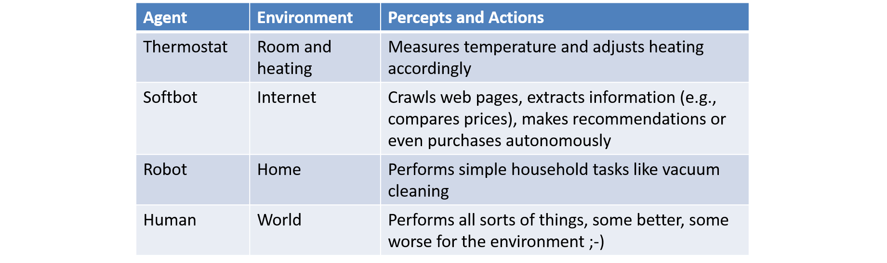

# AI Application Architecture

What characterizes an AI application?  Is it the use of a particular technology like a rule engine or an agent framework? 
Or is it maybe a particular architectural choice like a blackboard architecture?

In my opinion, it is not the implementation characteristics that are relevant for characterizing an AI application.
It is mainly the application use case that is relevant:
AI applications exhibit behavior of human intelligence - whatever is under the hood. 

Although there are cases for rule engines, reasoners, agent frameworks, and blackboard architectures, many AI application in practice are, from an architectural point of view, similar to classic business information systems. Traditional software engineering principles and techniques apply, including separation of concerns, information hiding, layering, component-orientation, etc. Common issues like performance, security, maintainability, cost-effectiveness are important. And, equally, a sound development methodology is important. When following an agile development approach, this includes e.g., early releases and prototypes, regular user feedback and quality assurance, etc.

To rephrase: *AI applications are computer applications and therefore classic software engineering principles apply*. 

%% This book focuses on engineering AI applications of high quality in an effective, cost-efficient way. 

## AI Reference Architecture

A *reference architecture* is a blueprint for concrete application architectures. In a reference architecture, the benefits of many concrete application architectures are distilled. The architect in a development project may use a reference architecture as a starting point for developing the concrete application architecture. 

Fig. 4.1 shows a reference architecture for AI applications. 

{width=90%}

The reference architecture is structured as a *layered architecture* similar to the classic three-layer-architecture of business information systems. 

The *presentation layer* implements the (graphical) user interface which, in the case of a web apps or mobile apps, may be implemented with state-of-the-art UI technology like HTML/CSS and JavaScript. The UI layer communicates with the application logic layer via an application programmer's interface (API), e.g., using REST (representational state transfer).

The *application logic layer* implements the intelligence of the AI application, e.g., in form of intelligent agents. 
The AI application logic is usually implemented in a general-purpose programming language. Within the last years, Python is evolving as the primary AI programming language (as Lisp and Prolog were in the 1980s). But object-oriented languages like Java, C# and C++ are also in common use. 
Often, powerful libraries and frameworks for AI tasks like machine learning, language processing, image processing, etc. are utilized. Examples are Keras, TensorFlow, Scikit-learn and Spark. 

Instead of including AI libraries, 3rd party AI web services can be used. Major vendors like Google, Amazon, Microsoft, and IBM offer AI suites with web services for machine learning, language processing, image processing etc.

The underlying data of the AI application is stored in a *knowledge base* which is accessed by the application logic layer via an API. As outlined in the chapter on knowledge representation, technologies with reasoning engines (like, e.g., Apache Jena) may be used. However, also classic storage technologies like RDBMS or NoSQL databases are often used.  

Finally, data may be loaded into the knowledge base from various sources, e.g., ontologies, databases, web pages, documents etc. Those data may be *integrated and semantically enriched* (see the chapter on knowledge representation).

In a concrete AI application, each of those layers may be developed differently. Also, depending on the application use case, individual layers may be missing entirely. For example, in applications where knowledge items are created by the users, the data integration layer is not needed. In an application where the reasoning capabilities of the knowledge base are sufficient, an explicit application logic layer may be omitted. In an embedded AI application, e.g, a robot, a graphical user interface is not needed.  

## Application Example: Virtual Museum Guide

Let us consider a concrete application scenario: a *virtual museum guide*. The task of the virtual museum guide is to guide users through a virtual museum - much like a human museum guide who guides visitors though the physical museum. 

The degree of intelligence of this virtual museum guide may vary a lot. 
In the simplest form, the guide may offer the users displays of paintings along with descriptive text. 
The paintings may simply be presented in a fixed order which has been curated by a human. 

In the most complex form, the virtual museum guide tells stories about the paintings, answers natural-language questions of the users (possibly via speech input and output), and adapts the selected paintings and stories to the users' background. For example, children will be told different stories than adults.

While one would probably not consider the simple virtual museum guide as intelligent, the complex one definitely exhibits behavior of human intelligence: understanding, speaking, telling stories, answering questions, etc.

Fig. 4.2 shows a potential architecture of a virtual museum guide application. 

{width=75%}

In this architecture, the virtual museum guide GUI is implemented with HTML5 / CSS and JavaScript including  state-of-the-art libraries. The application logic of the virtual museum guide is implemented in Java including libraries like Eclipse rdf4j. Sub-components are:

- Arts model: for representing artworks and their content
- User model: for representing the current user and his / her background
- Story generation: for generating stories about artworks suitable for the current user
- Natural language processing (NLP): for generating voice output and analyzing voice input

The knowledge base is implemented using Eclipse RDF4J (API and knowledge base including reasoner and SPARQL query engine). The Art Ontology is loaded into RDF4J at system start. In an offline step, it is extracted beforehand via Python scripts from Wikidata.

## Data Integration / Semantic Enrichment

The data integration aspect is, in my opinion, not treated enough in AI literature. 
The knowledge in AI applications often stems from various data sources (see the chapter on knowledge representation). This is similar in the field of Business Intelligence (BI) where the process of integrating data from various sources into a data warehouse (DWH) is often called *ETL (Extraction, Transformation, Loading)*. 

ETL can be seen as an architectural pattern where business information systems (data sources) are separated form business intelligence systems. ETL is a pipeline for extracting, transforming, and loading data in a format highly optimized for its use (analytic application).

The ETL architectural pattern also is suitable for the data integration of AI applications. Since in AI applications, data is often semantically enriched, I use the term *Semantic ETL*.

Semantic ETL consists of the following steps.

1. *Extraction* of data from source systems: These could be files, websites, databases, SPARQL endpoints, etc., e.g., the DBpedia SPARQL endpoint. 
2. *Filtering* irrelevant data and data of insufficient quality; e.g., selecting  only paintings, sculptures and the respective artists from Wikidata; selecting  English descriptions only  and filtering attributes with wrong datatypes.
3. *Technical format transformation*: transforming from the source formats to the target format, e.g., from JSON to RDF
4. *Data schema transformation*: transforming from the data schemas of the source format to a target data schema, e.g., renaming `wd:Q3305213` to `:artwork`
5. *Semantic enrichment*: heuristically integrating semantic information from various data sources, e.g., Michelangelo's birth and death date from GND, his influences from YAGO, and his paintings from Wikidata
6. *Performance tuning*: optimizing the data storage according to the application use cases, e.g., normalizing data and indexing for high-performance access
7. *Loading*: storing data in the target knowledge base, e.g., rdf4j.

## Application Logic /  Agents

In many AI publications, e.g., (Russell and Norvig, 2013), *agents* are described as a metaphor for the central component of an AI application which exhibits intelligent behavior.

Fig. 4.3 by Russell and Norvig (1995) illustrates the concept of an agent.

An agent interacts with an environment and via sensors it perceives the environment. 
The agent logic then reasons over its perceptions and its internal expert knowledge and plans respective actions. Via actuators  it executes those actions. The executed actions may, in turn, have an effect on the environment which is perceived, again, by the agent.

Fig. 4.4 shows examples of agents, from simple to complex.

Is it appropriate to call the virtual museum guide an agent?
In its simple form (pre-defined guides) one might intuitively say "no".
In its complex form (story telling) the answer surely is "yes". 

In my opinion, however, this question is not too relevant.  Much more relevant is the question whether the agent metaphor is beneficial for designing the virtual museum guide application. And this question may well be answered with "yes". 
Thinking of the virtual museum guide as an agent may lead to an architecture where perceptions are separated from actions and where the agent establishes a model of all past perceptions that is used for planning the next actions. And the separation of those concerns may well be a good architectural decision. 

%%
%%

### Agent Frameworks

*Agent frameworks* provide a base architecture and offer services for developing the agent logic of an AI application. 
A number of agent frameworks implement a plug-in architecture where framework components and custom components can be integrated. Some frameworks specify domain-specific languages (DSL) for the agent logic. Usually, APIs for integrating code in different programming languages are provided. 

See, e.g., the architecture of [Cougaar](http://www.cougaar.world) in Fig. 4.5.

In Cougaar, coordinator components like a Cost/Benefit Plugin provide the agent logic. The blackboard component is a shared repository for storing information on current problems, suggestions for solving the problems as well as (partial) solutions. 
Sensors and actuator components may be plugged in. Sensors regularly update  information on the blackboard.

Other agent frameworks are 
[JaCaMo](http://jacamo.sourceforge.net),
[JADE](http://jade.tilab.com),
[JIAC](http://www.jiac.de/agent-frameworks),
[AgentFactory](https://sourceforge.net/projects/agentfactory), and the
[Jadex BDI Agent System](http://sourceforge.net/projects/jadex/).
For details see the appendix.

### When to use an Agent Framework?

In my opinion, the metaphor of an agent is useful when designing an AI application. 
The separation of sensors from actuators as well as the separation of a model of the application domain and the environment from the agent logic is good architectural practice.
However, the use of an agent framework is not always recommended. This is because every framework involves a learning curve and adds new  technological dependencies to the project. 

If the agent logic is sufficiently complex and the services provided by the framework are suitable for the application use case then the costs for introducing an agent framework may well be justified.
However, if this is not the case, a traditional component-based software architecture is adequate. The architectural recommendations following the agent metaphor can still be implemented to some degree. 

## Presentation

The (graphical) user interface of an AI application is not AI-specific. As in all IT applications, it is of essential importance for the user's experience of the application. See the comprehensive literature for developing user-centric applications.  

## Programming Languages

Within the last years, Python is being established as the major AI programming language. This development has been supported by major players publishing their AI libraries and frameworks in Python, e.g., Google TensorFlow.
Also, there are still numerous AI libraries available in traditional object-oriented programming languages like Java, C#, and C++. The traditional AI programming languages of the 1980, Lisp and Prolog, only play a niche role in today's AI application development. But they have a major influence on the design of modern dynamic programming languages like Python, R, Julia and others.

For making a sound programming language decision in an AI application development project, one should consider various aspects:

- Which technology stack offers the best resources (runtime platform, libraries, developers' tools, etc.)?
- Are there enough developers familiar with the technology?
- Where is the best support (User groups etc.)

To conclude: for developing AI applications, all software engineering principles for the development of large-scale, complex IT systems apply. 

## Quick Check

X> Answer the following questions.

1. What characterizes an AI application? 
1. What are the main components of the AI reference architecture?
1. Could you speak of an AI application  if none of these technologies are used: reasoning engine, machine learning framework, agent framework?
1. What is an agent? Give examples.
1. Which services do agent frameworks offer?
1. In which situations is the use of an agent framework recommended? In which not?
2. Which programming language should be used for developing an AI application?

	
