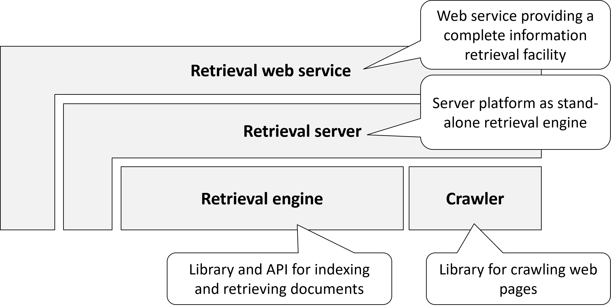
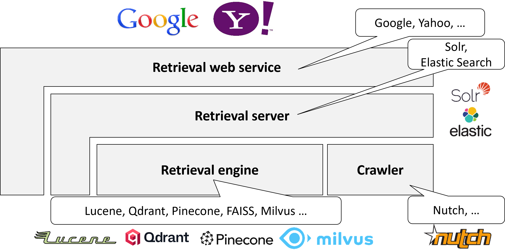
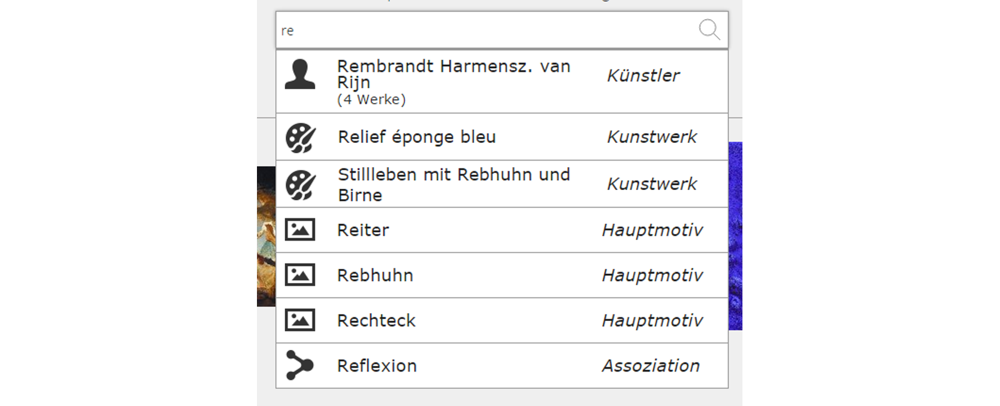

# Information Retrieval

*Information retrieval (IR)* allows retrieving relevant documents matching an information need. 
Fig. 5.1 shows IR in the AI  landscape. 

Together with natural language processing, it can be assigned to the ability "communicating". 

Information Retrieval can be described by its input/output behavior as follows.

- *Input*: an information need, e.g., specified via a search text
- *Output*: a set of relevant documents from a (potentially very large) collection that satisfy the information need, e.g., text documents, images, audio files, videos, etc.

The basis for performing information retrieval is indexed metadata of those documents. 

The most prominent examples of information retrieval systems are *web search engines* like [Google](https://www.google.com), [Yahoo!](https://www.yahoo.com/), and [Yandex](https://www.yandex.com/). 

Information retrieval may be considered a simple form of AI. Sometimes it is considered a subarea of natural language processing. In fact, the term "information retrieval" is even overstated insofar as simply data (documents) are retrieved -- not information. Therefore, a more suitable term would be "document retrieval". 

However, information retrieval is of enormous end-user value. Web search engines are the major facilitators of the World Wide Web. Also, in many applications, the integration of an information retrieval component may considerably increase the user experience. Examples are full-text search, similarity search and semantic autosuggest features. Furthermore, there are mature open source libraries for information retrieval that can easily be included in applications. 

Because of those reasons, I decided to dedicate a chapter of this book to information retrieval. Every AI application developer should be familiar with information retrieval. 

## Information Retrieval Services Map

Fig. 5.2 shows the information retrieval services map. 

{width=75%}

The basic way of employing information retrieval in an application is to include a *retrieval engine* as a library. It provides two essential APIs: one for *indexing* documents as an offline step; one for *retrieving* documents online on an information request. 
Two kinds of retrieval engines can be distinguished: traditionally, *full-text search engines* are used to match search terms with documents. Recently, *vectorstores* have become popular which allow similarity-based retrieval. They do not only match for identical spelling but also for semantic similarity, also across multiple natural languages. See Chapter 6 for more details about vectorstores.

If the documents to be indexed are not available initially but have to be retrieved first, then a *crawler* may be used. A crawler is a library for visiting web pages in order to extract data. This data may then be indexed and searched for. Web search engines work like this.

In case, the application is implemented in a different programming language, a *retrieval server platform* may be used. It allows starting a server process on an operating system which can then be accessed by applications via a programming language independent interface, e.g., HTTP / REST. Like the search engine library, documents must be indexed for the search server platform before it can be used for querying. 

Finally, an existing search engine can be included in an application as a *retrieval web service* . All prominent search engines like Google, Yahoo!, and Yandex offer web services.

## Information Retrieval Product Map

Fig. 5.2 shows the information retrieval product map. 

{width=75%}

[Apache Lucene](https://lucene.apache.org/) is the most prominent full-text search engine but also provides similarity search. Prominent vectorstores are Qdrant, Pinecone, FAISS and Milvus.

[Apache Nutch](http://nutch.apache.org/) is a web crawler.

Prominent retrieval servers, both built on top of Lucene, are [Apache Solr](https://lucene.apache.org/solr/) and [Elasticsearch](https://www.elastic.co/products/elasticsearch). Both provide similar functionality, are mature, and have been used in numerous large-scale applications. They also provide similarity search.

All prominent search engines like Google, Yahoo!, and Yandex offer web services to access the search, e.g., https://developer.yahoo.com/search-sdk/ 

More products and details can be found in the appendix.

## Tips and Tricks

Developers are spoiled for choice among the various options in the information retrieval services map. 
So what information retrieval service options are most suitable for a given situation?

Integrating a retrieval web service like Google is the natural choice if the application is to offer a general web search. 
In this case, the legal conditions of the search service APIs should be studied and compared carefully. Costs may incur. It should be evaluated whether the runtime performance is sufficient for the particular use case.

In the case of scenarios where documents to be retrieved are not available on the web, but are application-specific, the retrieval severs or engines must be used.
retrieval servers as well as engines offer extremely high performance, also with very large data sets. For example, in one of my projects we use Apache Lucene and are able to search 10 million documents (book metadata) in less than 30 ms. 

When is a retrieval suitable? When should a developer use a retrieval engine instead?

Apache Lucene as a library is easily included in Java applications. Qdrant, Pinecone, FAISS and Milvus are easily integrated in Python applications. 

If other programming languages are used for implementing the application, a search server platform can be used. E.g. for C#, [SolrNet](https://github.com/mausch/SolrNet) may be used to conveniently access a Solr server. 
Also, there are other reasons for using a retrieval server. This is because those platforms offer additional services, e.g. for system administrators. Those services include monitoring, clustering, etc. Therefore, the issues of administration and operation should also be taken into account before making a decision between retrieval server and retrieval engine. 

## Application Example: Semantic Autosuggest Feature

A *semantic autosuggest* feature is a good example of how information retrieval may improve the user experience considerably with relatively little implementation effort.
The concept of *autosuggest* (a.k.a. *autocomplete*) is well-known from web search engines like Google. While the user is typing a search string, terms are suggested in a drop-down menu from which the user can choose.

Semantic autosuggest extends this feature by utilizing semantic information, e.g.,  term categories. 
See Fig. 5.3 for an example in the [openArtBrowser](https://openartbrowser.org) (Humm, 2020).

{width=50%}

OpenArtBrowser is a web app for educating in visual art, fascinating users for paintings, drawings and sculptures. It provides a search feature with semantic autosuggest. 
In the example shown in Fig. 5.3, the user is typing the letters “vi…”. Various artworks, artists, materials, genres and motifs are displayed which contain the letters “vi” (case-insensitive), grouped according to their semantic category. The matching letters “vi” are highlighted (in green). A sophisticated heuristic ranking selects a limited number (here 10) of suggestions from a potentially very large number of matches, e.g., the artist Vincent van Gogh, the motif Virgin Mary, and the artwork View of a Roman House. 
 
By selecting one of the suggested terms, the user also selects a semantic category (artist, artwork, motif, genre, etc.). The search will then be refined accordingly using the search term and the semantic category. 

OpenArtBrowser and its semantic autosuggest feature is based on the Art knowledge graph described in Chapter 3. 
The semantic AutoSuggest feature was implemented using ElasticSearch. An ngram index was created from the Art knowledge graph. An autocomplete widget of  some JavaScript library like [JQuery UI](https://jqueryui.com/autocomplete/)  was used in the HTML client. From the web client, the ElasticSearch server was invoked to query the terms.

The  implementation of the entire semantic autosuggest feature involves less than 100 lines of code. 

## Quick Check

X> Answer the following questions.

1. What does the term information retrieval mean?
1. What are the main services of information retrieval tools?
2. What is the difference between full-text search engines and vectorstores?
3. Name state-of-the-art information retrieval tools and technologies.
4. When to use which technology?
5. Explain semantic autosuggest. How can it be implemented?
