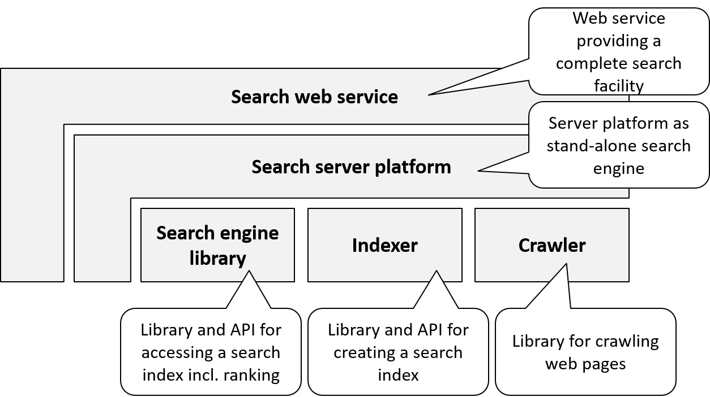

# Information Retrieval

*Information Retrieval* can be described by its input/output behavior as follows.

- *Input*: an information need, e.g., specified via a search text
- *Output*: a set of relevant documents from a (potentially very large) collection, e.g., text documents, images, audio files, videos, etc.

The basis for performing information retrieval is indexed metadata of those documents. 

The most prominent examples of information retrieval systems are *web search engines* like [Google](https://www.google.com), [Yahoo!](https://www.yahoo.com/), and [Yandex](https://www.yandex.com/). 

Information retrieval may be considered the simplest form of AI. In fact, the term "information retrieval" is even overstated insofar as simply data (documents) are retrieved - not information. Therefore, a more suitable term could be "document retrieval". 

However, information retrieval is of enormous end-user value. Web search engines are the major facilitators of the World Wide Web. Also, in many applications, the integration of an information retrieval component may considerably increase the user experience. Examples are full-text search and semantic AutoSuggest features. Furthermore, there are mature open source libraries for information retrieval that can easily be included in applications. 

Because of those reasons, I decided to dedicate a chapter of this book to information retrieval. Every AI application developer should be familiar with information retrieval. 

## Information Retrieval Services Map

Fig 4.1 shows the information retrieval services map. 

The basic way of employing information retrieval in an application is to include an indexer and a search engine library. An *indexer* is a library for indexing a collection of documents and for storing those indexes. The indexer is implemented in a programming language like Java and accessible via an API. Indexing is an offline-process, usually implemented as a batch. The *search engine library* can then be used online to access this index. It can be accessed via a query API. 

If the documents to be indexed are not available initially but have to be retrieved first, then a *crawler* may be used. A crawler is a library for visiting web pages in order to extract data. This data may then be indexed and searched for. Web search engines work like this.

In case, the application is implemented in a different programming language, a *search server platform* may be used. It allows starting a server process on an operating system which can then be accessed by applications via a programming language independent interface, e.g., HTTP / REST. Like the search engine library, documents must be indexed for the search server platform before it can be used for querying. 

Finally, an existing search engine can be included in an application as a web service - denoted as *search service* in Fig. 5.1. All prominent search engines like Google, Yahoo!, and Yandex offer web services.

## Information Retrieval Product Map

Fig. 5.2 shows the information retrieval product map; see the appendix for more details. 

[Apache Lucene](https://lucene.apache.org/) is *the* state-of-the-art open source search engine library and indexer. Lucene is implemented in Java and is used in numerous applications. Ports to other languages exist, e.g., PyLucene for Python.

[Apache Nutch](http://nutch.apache.org/) is a web crawler.

There are two most prominent search server platforms, both built on top of Lucene: [Apache Solr](https://lucene.apache.org/solr/) and [Elasticsearch](https://www.elastic.co/products/elasticsearch). Both are similar in functionality, are mature, and have been used in numerous applications. 

All prominent search engines like Google, Yahoo!, and Yandex offer web services to access the search, e.g., https://developer.yahoo.com/search-sdk/ 

More products and details can be found in the appendix.

## Tips and Tricks

Developers are spoiled for choice among the various options in the information retrieval services map. 
So what information retrieval service options are most suitable for a given situation?

Integrating a search service like Google is the natural choice if the application is to offer a general web search. 
In this case, the legal conditions of the search service APIs should be studied and compared carefully. Costs may incur. It should be evaluated whether the runtime performance is sufficient for the particular use case.

In the case of scenarios where documents to be retrieved are not available on the web, but are application-specific, the search server platforms or libraries must be used.
Search server platforms as well as libraries offer extremely high performance, also with very large data sets. For example, in one of my projects we use Apache Lucene and are able to search 10 million documents in less than 30 ms. 

When is a search server platform suitable? When should a developer use a library instead?

Apache Lucene as a library is easily included in Java applications. The API is well documented and a working prototype may be implemented within a few hours. This makes the library solution particularly attractive for Java applications.

If other programming languages are used for implementing the application, a search server platform must be used. E.g. for C#, [SolrNet](https://github.com/mausch/SolrNet) may be used to conveniently access a Solr server. 
Also, there are reasons for using a search server platform even when the application is implemented in Java. This is because search server platforms offer additional services, e.g. for system administrators. Those services include monitoring, clustering, etc. Therefore, the issues of administration and operation should also be taken into account before making a decision between search server platform and library. 

## Application Example: Semantic AutoSuggest Feature

A semantic AutoSuggest feature is a good example of how information retrieval may improve the user experience considerably with relatively little implementation effort.
The concept of AutoSuggest (a.k.a. autocomplete) is well-known from web search engines like Google. While the user is typing a search text, terms are suggested in a drop-down menu from which the user can choose.

Semantic AutoSuggest extends this feature by utilizing semantic information, e.g.,  term categories. 
See Fig. 5.3 for an example in an arts application (in German).

While the user is typing the letters "re" in the search box, several terms are suggested: 

- Artists ("Kuenstler") like Rembrandt
- Artworks ("Kunstwerk") like "Relief eponge bleu"
- Motives ("Hauptmotiv") like "Reiter"
- Associations like "Reflexion"
 
By selecting one of the suggested terms, the user also selects a semantic category (artist, artwork, motive, association, etc.). The search will then be refined accordingly using the search term *and* the semantic category. 

The semantic AutoSuggest feature was implemented using Apache Solr. An ngram index was created from the metadata about all paintings in a museum. The autocomplete widget of  the JavaScript library [JQuery UI](https://jqueryui.com/autocomplete/)  was used in the HTML client. From the client, the Solr server was invoked to query the terms.

The  implementation of the entire Semantic AutoSuggest feature involves less than 100 lines of code. 

## Quick Check

X> Answer the following questions.

1. What does information retrieval mean?
1. What are the main services of information retrieval tools?
1. Name state-of-the-art information retrieval tools and technologies.
2. When to use which technology?
