# Natural Language Processing

*Natural Language Processing (NLP)* is the AI area which deals with processing natural languages like English, German, etc.
Fig. 6.1 shows NLP in the AI landscape.

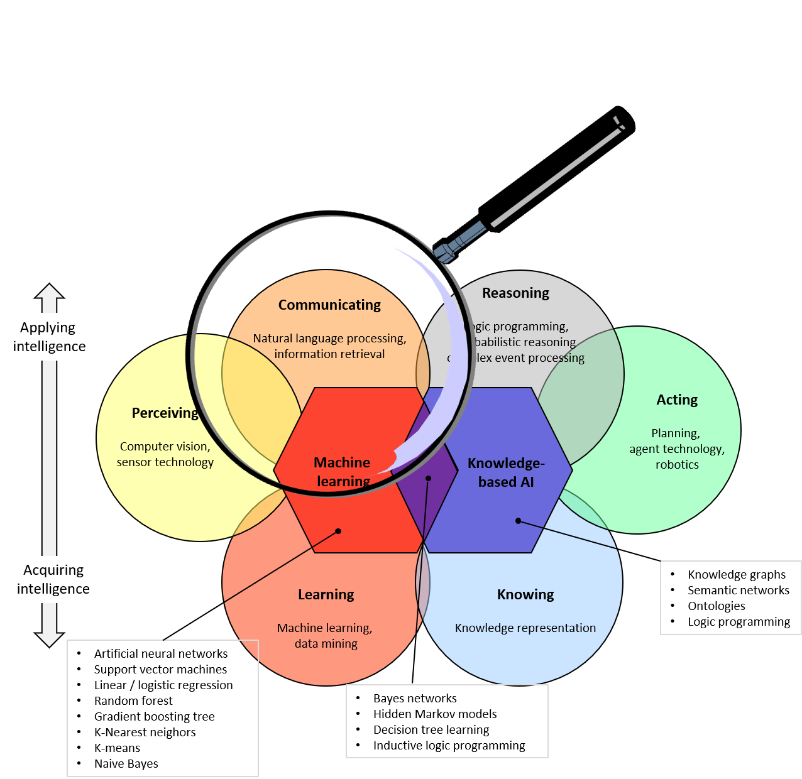

NLP can be assigned to the ability of "communicating". It is a broad area that covers many aspects. Examples are:

- Question answering and communicating using a chatbot
- Spell checking and grammar checking of written texts, e.g., as in word processors
- Classifying texts, e.g. according to the topic
- Understanding written text, e.g., the sentiment of Twitter tweets (positive, neutral, negative)
- Understanding speech, e.g., voice control of a navigation system
- Translating texts, e.g., between English and German
- Summarizing written texts, e.g., news
- Generating  texts, e.g., story telling
- Generating voice, e.g., routing information in a navigation system

Due to the diversity of NLP, different subareas are distinguished. There is no commonly agreed classification but often the following NLP subareas are mentioned:


- *Question Answering (QA)* generates natural language answers to natural language questions, in written or spoken form. 

- *Machine Translation* allows translating texts between different natural languages.

- *Text Generation* supports the generation of written or spoken texts. Text summaries and story telling are forms of text generation.

- *Information Retrieval (IR)* supports retrieving documents for a specific information need. As explained in the last chapter, the term "Document Retrieval" would be more suitable. Information Retrieval is usually considered a subarea of NLP.

- *Information Extraction (IE)* deals with the understanding of written and spoken text. This includes the analysis of texts and transformation into a knowledge representation that can be queried. Sentiment analysis is a simple form of information extraction.


## The Big Picture

Fig. 6.2 shows the big picture of NLP as seven levels of language understanding, adopted from (Harriehausen, 2015).

{width=75%}
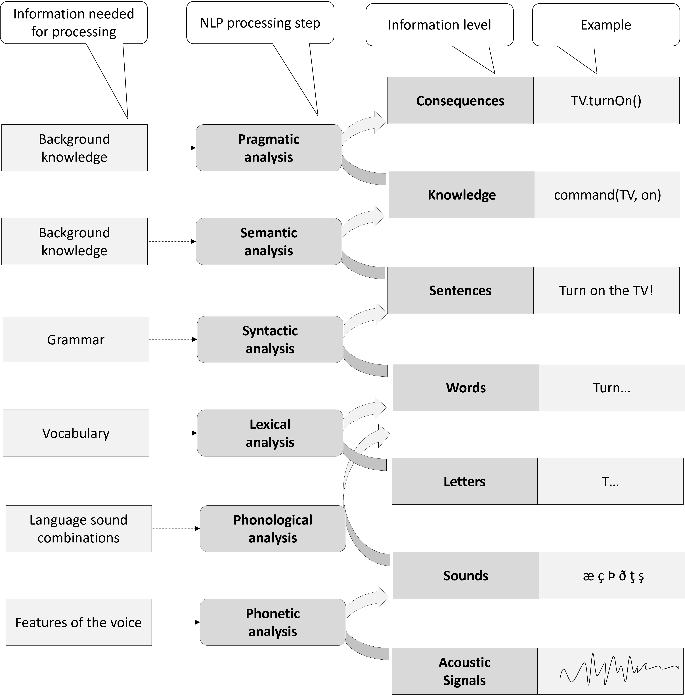

The figure shows information levels and NLP processing steps to raise the level of understanding. 
On the lowest level there are acoustic signals. *Phonetic analysis* uses features of the voice to extract sounds. *Phonological analysis* uses sound combinations of specific languages in order to extract letters. *Lexical analysis* may use dictionaries to extract individual words. *Syntactic analysis* (parsing) uses grammar in order to extract sentences and their structure (parse tree). *Semantic analysis* uses background knowledge to represent the knowledge in a text. Finally, *pragmatic analysis* may draw conclusions and consequences for actions.

In most AI applications, only some NLP processing steps are relevant. When dealing with written texts, then phonetic and phonological analysis are not necessary. Also, semantic and pragmatic analysis may be simple or even irrelevant, depending on the application use case.


## From Characters to Sentences: The Building Blocks of NLP

In this section I will present some basic building blocks of NLP approaches: from individual to  structured sentences.

### Tokenization

*Tokenization* is the step of grouping characters into words. This step seems primitive: splitting strinbs by blank characters seems to be enough. However, tokenization is a little more complicated. 
Consider the following example sentence: 

    My dog also likes eating sausage. 

Following the primitive tokenization approach, the last word identified would be `sausage.`. However, in fact, the last word is `sausage` and the period `'.'` is a separate token. So, the correct tokenization result is as follows (Fig. 6.3).


### Sentence splitting

*Sentence splitting* identifies whole sentences. Sentences are terminated by periods (full stops). However, simply splitting texts by periods is not enough. Consider the following sample sentence.

    Interest rates raised by 0.2 percent.

Obviously, the point in `0.2` is part of a floating point number and does not terminate the sentence. Other cases to be considered are abbreviations like `e.g.`, ellipsis (`...`), etc.

### Stemming, Part-of-speech (PoS) Tagging

*Stemming* means reducing a word to its root word. E.g., `eat` is the root word of `eating`. *Part of speech (PoS)* is the grammatical category of a word. E.g., `eating` is the gerund or the present participle of the verb `to eat`. *PoS Tagging* is the step of identifying the PoS of a word. 

Fig. 6.4 shows the PoS tagging result of the sentence `My dog also likes eating sausage.` 


In this figure, the [Penn Treebank tag set](http://www.clips.ua.ac.be/pages/mbsp-tags) is used. E.g., Verb, gerund or present participle is marked as `VBG`. The Penn Treebank tag set is a de-facto standard used by many PoS tagging tools.  


### Parsing

*Parsing* is the step of analyzing the grammar of a sentence. The result is the sentence structure, usually denoted as a tree. Fig. 6.5 shows the parsing result for the sentence `My dog also likes eating sausage.`

{width=75%}
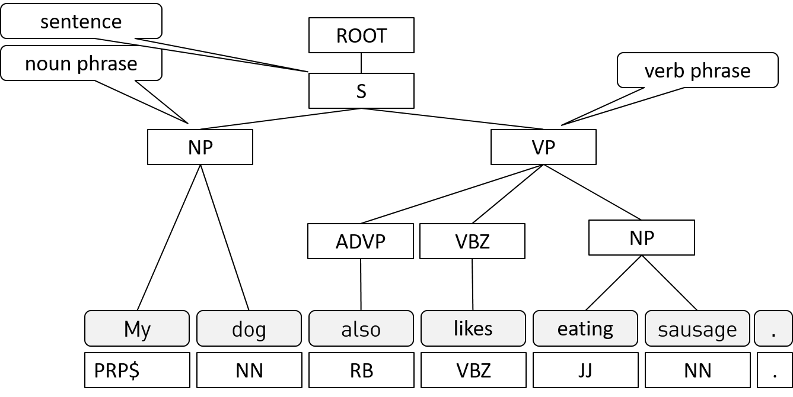

Again, the Penn Treebank tag set is used. E.g., `NP` stands for noun phrase and `VP` for verb phrase. 

Parsing of most natural language sentences is highly ambiguous. As humans, we rarely notice this ambiguity. Our brain combines the syntactic analysis and the semantic analysis and chooses the "obvious" meaning, i.e., the most likely variant. However, we also sometimes stumble on ambiguities in  the language. Many jokes play with misunderstandings based on ambiguities. [For example](http://www.ijokes.eu/index.php/joke/category/misunderstanding?page=2):

"I want to be a millionaire. Just like my dad!"
"Wow, your dad's a millionaire?"
"No, but he always wanted to be."

Did you notice the ambiguity?

If you technically parse natural language sentences you may be surprised of how many different interpretations of the same sentence are valid. Consider the following example sentence:

    I saw the man on the hill with a telescope.

Fig. 6.6, adopted from [AllThingsLinguistic](http://allthingslinguistic.com/post/52411342274/how-many-meanings-can-you-get-for-the-sentence-i), shows five different, valid interpretations of this sentence.


X> As an exercise, you may construct a parse tree for each interpretation of the sentence.

Early NLP parsers were rule-based. They mechanically applied grammar rules to sentences. They had enormous difficulties with the multiple alternative parse trees, as well as with grammatically incorrect sentences. Most modern NLP parsers are statistics-based. They produce the most likely parse result according to statistics and can also deal with grammatically incorrect sentences, as we humans do. Modern Large Language Models (LLMs - see below) do not explicitly use NLP parsers but use an attention mechanism to learn structure (like grammar rules) from large numbers of texts. 

### Coding Example: spaCy

[spaCy ](https://spacy.io)is a free, open-source library for advanced NLP in Python. spaCy is designed specifically for production use and helps building applications that process large volumes of text. It can be used to build information extraction or natural language understanding systems, or to pre-process text for deep learning.

Features include tokenization, POS tagging, dependency parsing, lemmatization, sentence boundary detection, named entity recognition and entity linking, similarity, text classification, and rule-based matching. 

spaCy provides a variety of linguistic annotations to give insights into a text's grammatical structure. This includes the word types, like the parts of speech, and how the words are related to each other. 

See Fig. 6.7 for an example of parsing a sentence from the [spaCy web site](https://spacy.io/usage/visualizers)


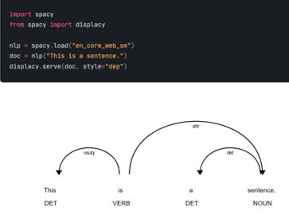

spaCy parsing can be acomplished with a few lines of Phython code. First, you need to `load `a language, here `en_core_web_sm`. then, you pass a text string to the language. The result is a spaCy `Doc `which contains structured information about the text, e.g., the dependency graph of the parsed sentence which can be displayed using `displacy`.  

Language processing in spaCy is organized in pipelines. Apart from pre-trained pipelines for many languages, you can also configure custom pipelines. See a [screenshot ](https://spacy.io/usage/processing-pipelines) from the spaCy web site in Fig. 6.8.

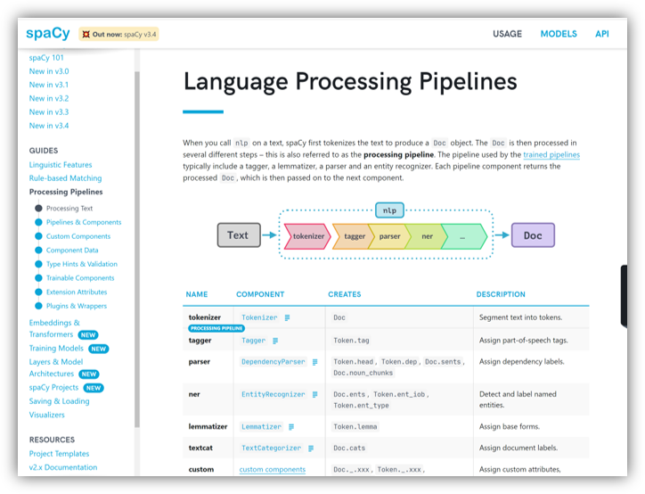

The input to a language pipeline is a text string, the output is a spaCy `Doc`. A pipeline can be configured using NLP building blocks like tokenizer, tagger, parser, named entity recognition, lemmatizer etc.  


## Simple Approach: Bag-of-words Model

The *bag-of-words (BoW) model*  is a simple NLP approach which delivers surprisingly good results in certain application scenarios like text classification and sentiment analysis. 
In the BoW, a text is represented as the *bag (multiset)* of its words, disregarding grammar and even word order but only keeping the multiplicity of the words.

Consider the following example text.

    John likes to watch movies. Mary likes movies too.

The bag of words, represented in JSON, is:

    BoW = {"John":1,"likes":2,"to":1,"watch":1,"movies":2,"Mary":1,"too":1}; 

The word `John` appears once in the text, the word `likes` twice etc. 

### Machine Learning with Bags of Words

In the simplest form, vectors resulting of bags of words can be used in supervised ML approaches as described in Chapter 2. Consider the ML task of classification with texts t1, ... tn and classes A, B, C. Then the data set for ML training consists of each distinct word in all texts as features (attributes as classification input) and the classes as labels (classification output). See Fig. 6.9 with the example text above as t1.

{width=75%}
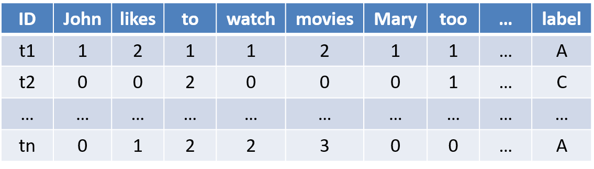

Now, any ML approach suitable for classification can be used, e.g. Artificial Neural Networks, Decision Trees, Support Vector Machines, k-nearest Neighbor etc. 

### tf-idf

As a rule of thumb, a term appearing often in a text is more important than a term appearing rarely. However, there are exceptions to this rule of thumb. Consider so-called *stop words* like "the", "a", "to" etc. which are most common in English texts but add little to the semantics of the text. In information retrieval, stop words are usually ignored.

How to deal with this in the BoW model which mainly deals with word counts? 

One approach is to remove stop words before computing the bag of words. This approach much depends on the selection of the right stop words.

There is another elegant, general approach which avoids fixed stop word lists: *term frequency - inverse document frequency (tf-idf)*. 
*Term frequency* is based on the count of a particular word in a concrete text as shown in the example above.
*Document frequency* considers the count of a particular word in an entire *corpus*, i.e., a large set of texts. 

tf-idf puts the term frequency in relation to the document frequency. So, a word like "to" which appears often in all texts but not more often in the text under consideration will not have a particularly high tf-idf and, therefore, will not be considered important. In contrast, a word like "movies" which occurs twice in the short text above but not particularly often in texts in general will have a high tf-idf and, therefore, will be considered important for this text. This matches the intuition.

There are various formulas for computing tf-idf in practical use, which are more meaningful than a simple quotient of the word counts. See e.g. the [Wikipedia entry on tf-idf](https://en.wikipedia.org/wiki/Tf%E2%80%93idf). NLP libraries conveniently provide implementations of tf-idf.

The ML classification performance can be improved by using the tf-idf values instead of the simple word counts in the training data.

### N-gram Model

The simple BoW model as explained above treats each individual word independently. The word order gets ignored completely. The *n-gram model* is a simple improvement which takes combinations of up to n successive words into  account. N is usually relatively small, e.g., 2 or 3. 

See Fig. 6.10. with an extension of the example in Fig. 6.9 to a 2-gram model.

{width=75%}
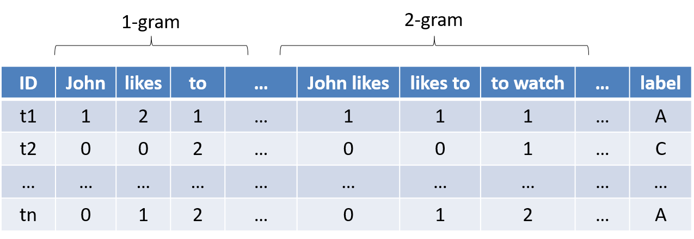

n-gram models can be combined with tf-idf by simply computing the tf-idf values for the n-grams.

The BoW model is  simple and relatively easy to implement. Despite its simplicity, it delivers good prediction performance for a number application use cases, particularly when combined with extensions like tf-idf or n-grams, and particularly with large training data sets. 

Obviously, the number of features (attributes) in the BoW model can get extremely large, particularly when using n-grams. Hundreds of thousands of features are possible.  Particularly with huge training data sets this can cause major performance problems in the ML training and prediction phases. 


## Word Embeddings

*Word embeddings* are a powerful NLP mechanism that alleviates two weeknesses of the BoW model: it avoids the sparsity of the vector representation while adding some sense of meaning.

Word embeddings are dense, continuous vector representations of words that capture semantic relationships based on context and usage. Unlike one-hot encoding, which treats each word as an isolated symbol, word embeddings place words in a high-dimensional space.
Words with similar meanings are positioned close to each other, and the distance and direction between vectors encode the degree of similarity.

See Fig. 6.11 for an example.

{width=50%}
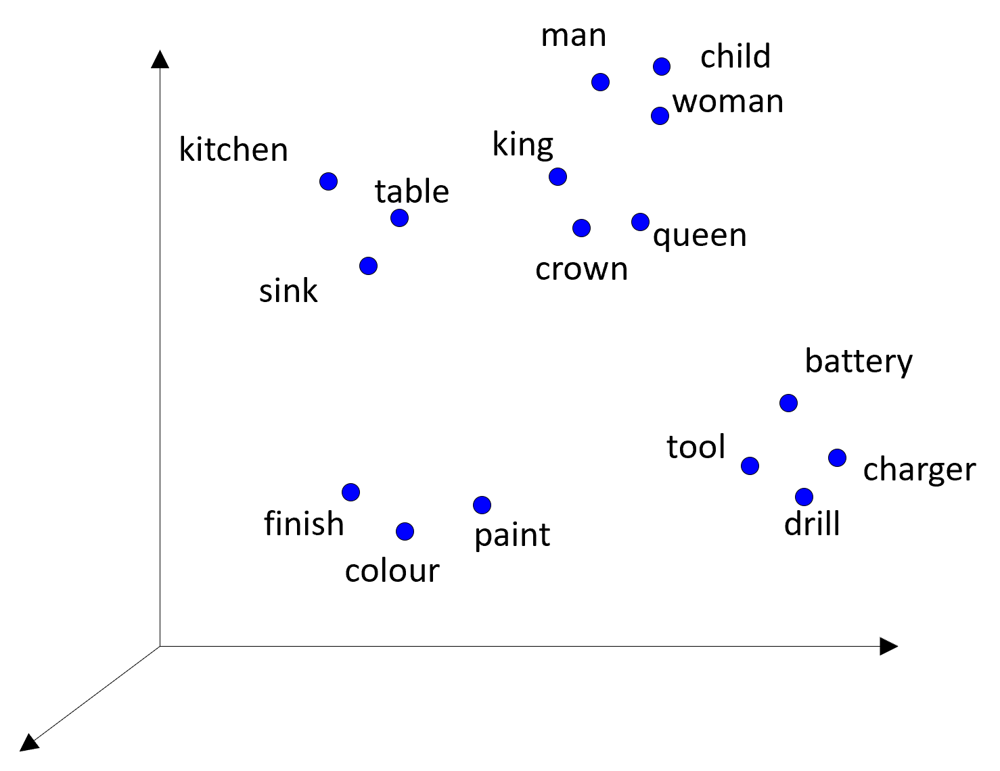

The example is highly simplified for illustration purposes. Actual word embeddings typically have hundreds of dimensions to capture more intricate relationships and nuances in meaning. However, in a diagram only 2 or 3 dimensions can be visualized. The dimensions have no explicit semantic meaning and have no names. Instead, they are mathematical dimensions like in PCA (Principal Component Analysis). In the example, terms that are closer together like colour/paint are closer in the multidimensional space whereas others like battery/charger are more distant.
Embeddings do not only contain nouns, but also verbs, adverbs, proper nouns, acronyms etc. 

Though dimensions are not named, the implicitly do encode linguistic nuance   - gender, tense, syntactic role, and more. One useful result is that you can use mathematical functions on word embeddings. 
For example, in a well-trained embedding space, the vector for *king* minus *man* plus *woman* yields a result astonishingly close to *queen*. 
See Fig. 6.12 

{width=50%}
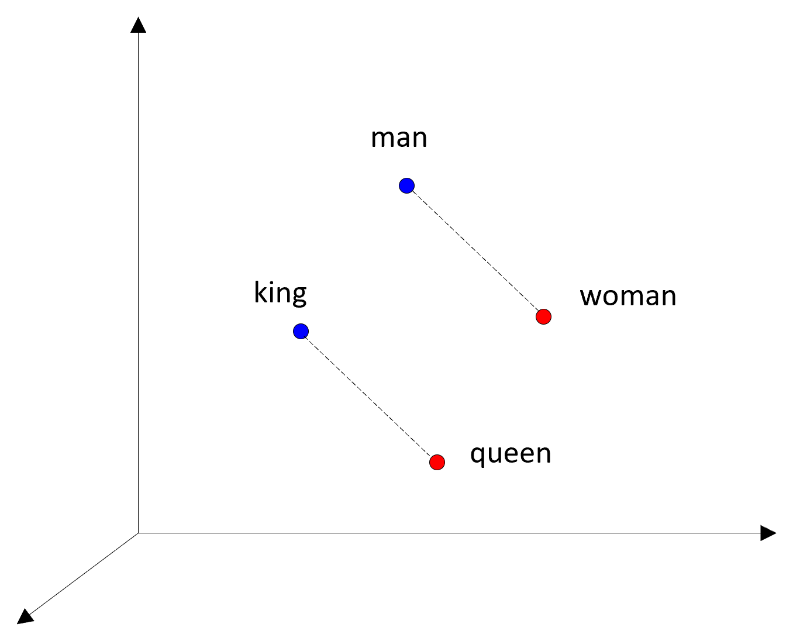

The following Python code example using the gensim library  demonstrates this. 

~~~~~~~~
from gensim.models import Word2Vec

# Sample corpus
sentences = [
    ["king", "queen", "man", "woman"],
    ["paris", "france", "berlin", "germany"],
    ["apple", "fruit", "carrot", "vegetable"]
]

# Train Word2Vec model
model = Word2Vec(sentences, vector_size=100, window=5, min_count=1, workers=4)

# Example: vector arithmetic
result = model.wv.most_similar(positive=["king", "woman"], negative=["man"])
print(result)  # Should return something close to 'queen'
~~~~~~~~


Multilingual word embeddings encode terms in different natural languages into the same vector space. See Fig. 6.13 for an illustration. Multilingual embeddings are most useful for machine translation tasks.

{width=50%}
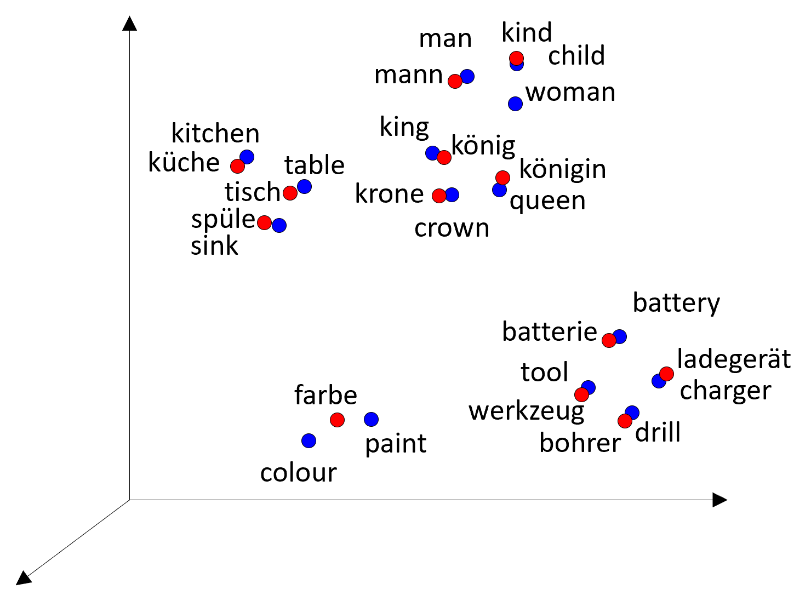

The process of creating word embeddings involves training a model on a large corpus of text (e.g., Wikipedia or Google News). The corpus is preprocessed by tokenizing the text into words, removing stop words and punctuation and performing other text-cleaning tasks.
Simpler embedding models like Word2Vec, GloVe, and FastText embed a word into exactly one vector. 

*Contextual embeddings* from models like BERT and GPT have pushed the boundaries further, allowing the meaning of a word to shift depending on its sentence-level context. This is important because the same word can have totally different meaning in different contexts (polysemy). See Fig. 6.14. with the example of the word "bank" which, depending on context, could mean a financial institution or a riverside.

{width=50%}
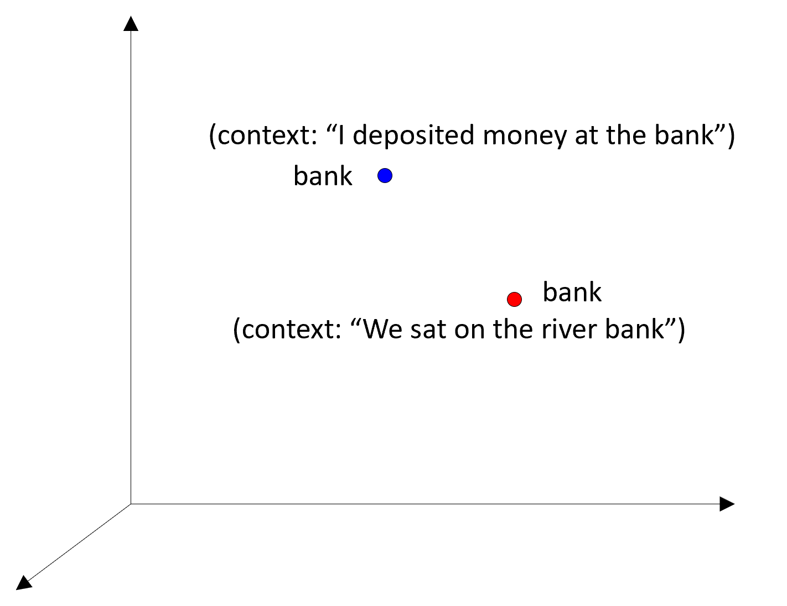

A sliding context window is applied to the text, and for each target word, the surrounding words within the window are considered as context words. The word embedding model is trained to predict a target word based on its context words or vice versa.


In NLP, word embeddings are the backbone of many tasks: sentiment analysis, machine translation, question answering, and beyond. They bridge the gap between raw text and understanding.


## Large Language Models (LLMs)


*Large Language Models (LLMs)* have revolutionized NLP by achieving state-of-the-art performance across a wide range of tasks — from machine translation and summarization to question answering and code generation.
LLMs are a class of deep learning models designed to understand, generate, and manipulate human language.  
LLMs are trained on massive corpora of text data, enabling them to learn statistical patterns, semantic relationships, and contextual nuances of language. Their scale — often measured in billions of parameters — allows them to generalize across domains and perform tasks with minimal fine-tuning.

### LLM Tasks

{width=75%}
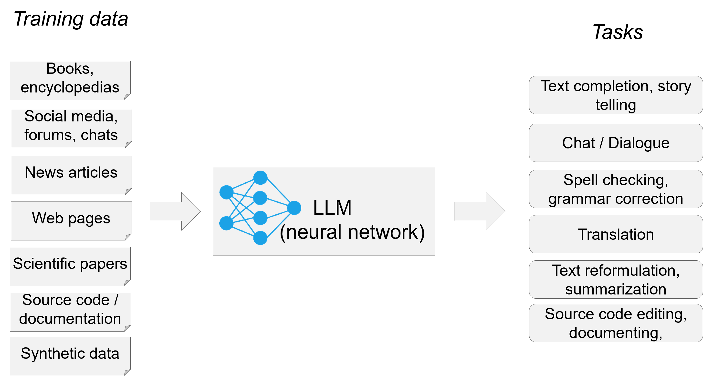

Fig. 6.15 gives an overview of tasks that can be performed with LLMs. Generally speaking, a LLM completes texts, e.g. answers to questions in a chat or a dialogue, or entire stories. It can be used for text reformulation or summarization, but also for spell checking and grammar correction. Also translating texts or generating texts in multiple natural languages is possible. One prominent use case is in software engineering where LLMs can be used for generating, refactoring or documenting source code. 

LLMs are neural networks and are trained on large volumes of textual data, e.g., books, encyclopedias, news articles, scientific papers, social media posts or web pages of any kind. Also source code from repositories or synthetic data generated from databases or ontologies are used for training special purposes. 


### Foundation: Likely word sequences

In simple terms, a LLM is a mathematical function that predicts most likely word sequences. For a given sequence of words it predicts the probability of all potential following words and picks the most likely one. See Fig. 6.16 for an illustrating example.

{width=80%}
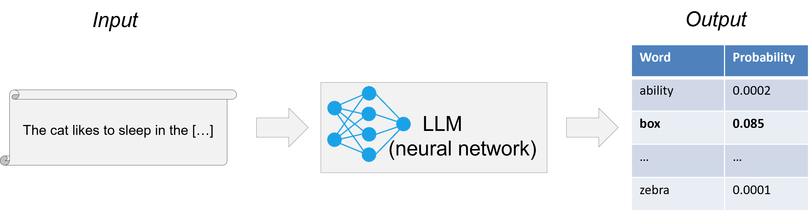

Here, the sentence  "The cat likes to sleep in the [...]" is given as input. The LLM assigns probabilities to all tokens in its vocabulary (e.g., 50,000 tokens, which equals the number of output neurons of the LLM) and picks the most likely one as succeeding word, e.g., "box".

This step can be repeated iteratively as seen in Fig. 6.17.

{width=80%}
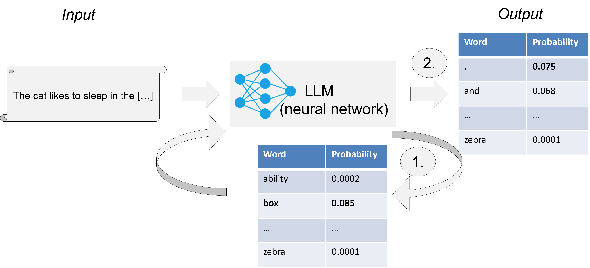

In this case, after the word "box" (1st step), the punctuation mark "." may be predicted in the second step of the iteration.


### LLM Architecture

The architecture of state-of-the-art LLMs is most sophisticated and varies for different LLM which have been developed and trained for differnt tasks. The following Fig. 6.18 shows components commonly used in LLMs.

{width=80%}
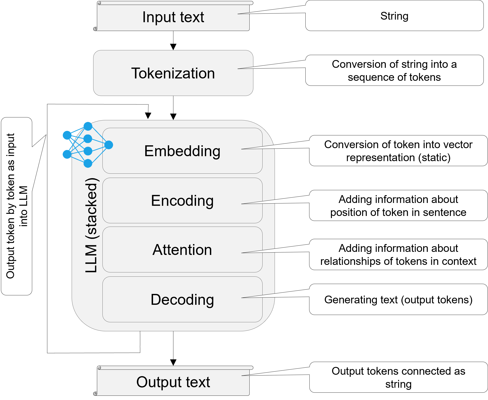

The input text (usually called "prompt") into an LLM is tokenized first, i.e., split into a set of tokens (words, subwords or punctuation characters). Then, a word embedding is computed as explained in the last section. Where the initial embedding is static, encoding adds information about the position of a token in a sentence, resulting in a contextual embedding. The attention mechanism is at the heart of LLMs and adds further contextual information, namely the relationship between tokens in a text (in the example above, the tokens "the" and "cat" strongly belong together, as well as "likes" and "sleep"). This is comparable to NLP parsing (which  assigns roles of tokens in a sentence, e.g., subject, predicate, object), but in contrast to NLP parsing it is not based on static grammar rules but dynamically learned during the training process.
Often, the attention layer is followed by a feed-forward neural network for refinement (not depicted in Fig. 6.18). 
LLMs stack multiple layers of attention and feed-forward blocks. Each layer refines the model’s understanding incrementally. In early layers, the model might learn basic grammar or word associations (e.g., “cat” and “dog” are both animals). Deeper layers handle abstract concepts, like logical reasoning or irony.

Finally, a decoder is used for generating output tokens. They are fed back into the embedding layer of the LLM and, in parallel, concatenated to the output text.


### Training Process

LLMs are trained on massive amounts of data. The following training phases can be distinguished (see Fig. 6.19).

{width=80%}
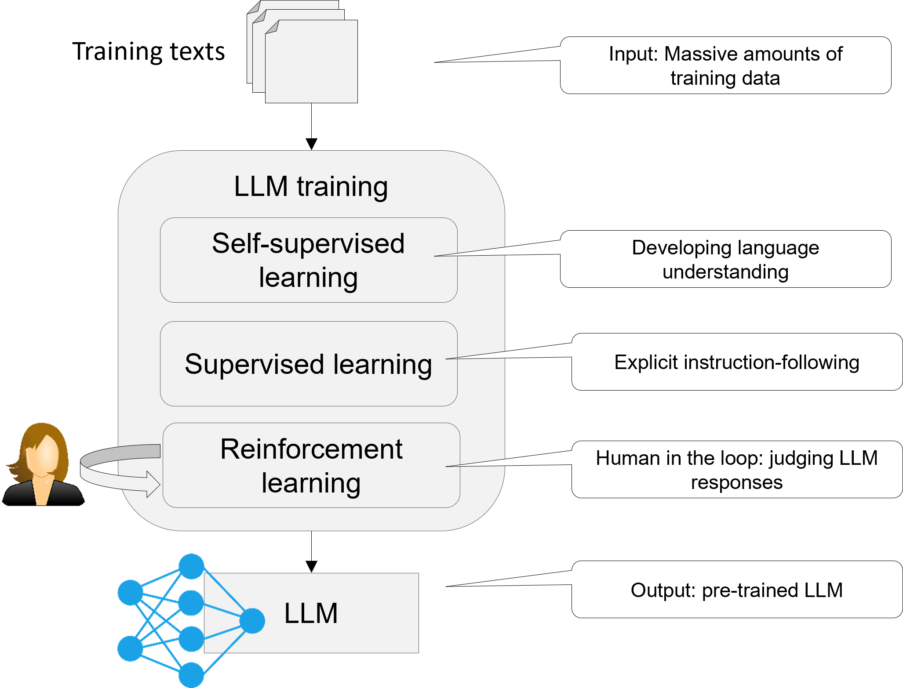

1. **Self-Supervised learning**: In the first training phase, the model is exposed to vast amounts of unstructured data. Its task is to predict missing elements—like words or phrases—within that data. Through this predictive exercise, the model gradually develops an "understanding" of language structure and the nuances of the domain it is trained on. This foundational stage focuses primarily on learning to anticipate and generate coherent text.
2. **Supervised learning**: Building on the groundwork laid by self-supervised learning, the second phase—supervised learning—introduces explicit instruction-following. Here, the model is trained using labeled examples to respond accurately to specific prompts. This stage is pivotal in shaping the model’s ability to interact meaningfully with users, interpret their requests, and deliver relevant, helpful responses. It transforms the model from a passive generator into an active conversational partner.
3. **Reinforcement learning**: The final phase tunes the model’s behavior by rewarding desirable outputs and penalizing undesirable ones. Unlike previous stages, it doesn’t rely on direct answers but instead evaluates the quality of the model’s responses. Human annotators assess outputs, identifying which ones are helpful, safe, or appropriate. These judgments are used to train a reward model, which guides the language model toward producing higher-quality, user-aligned responses. This phase is especially effective in minimizing harmful or offensive content and promoting thoughtful, accurate communication.


**Fine-tuning** is the process of continuing the training of a pre-trained LLM on a smaller, specialized dataset. The goal is to adapt the model’s general capabilities to a more specific use case, such as use-case-specific language (e.g., legal, medical, financial), task-specific behavior (e.g., summarization, sentiment analysis, code generation) or dialect adaptation. During fine-tuning, the model retains its broad understanding of language but becomes more precise and aligned with the desired output patterns.

Fine-tuning is not always necessary. It is best reserved for situations where specialized knowledge is required and you have high-quality labeled data. However, even in those situations, compute-intensive fine-tuning is not always necessary. The following lighter-weight options should be considered first. 


- **Prompt engineering**: Crafting better prompts to guide the model’s behavior, e.g., Providing examples within the prompt itself (few-shot prompting);
- **Retrieval-augmented generation (RAG)**: Supplying external documents at runtime to inform responses.

We explain those mechnaisms in the following sections.


## Prompt Engineering

Prompt engineering is the art and science of crafting effective inputs—called *prompts*—to guide the behavior of LLMs. Since LLMs generate outputs based on the patterns they’ve learned during training, the way a prompt is phrased can dramatically influence the relevance, accuracy, and tone of the response.

Rather than modifying the model itself, prompt engineering leverages the model’s existing capabilities by strategically designing the input text. This makes it a powerful tool for adapting general-purpose models to specific tasks without additional training.

Consider the following best practices for prompt engineering. 

| Principle | Description | Example |
|----------|-------------|---------|
| **Be Explicit** | Clearly state the task and desired format. | “Summarize the following article in bullet points.” |
| **Use Role-Playing** | Assign the model a persona or role to shape tone and expertise. | “You are a legal assistant. Explain this contract clause.” |
| **Provide Examples** | Use few-shot prompting by including input-output pairs. | “Translate: ‘Hallo’ → ‘Hello’” |
| **Set Constraints** | Limit length, style, or content to control output. | “Write a tweet under 280 characters about climate change.” |
| **Chain Prompts** | Break complex tasks into smaller steps or use intermediate prompts. | First: “Extract key facts.” Then: “Write a summary based on those facts.” |
| **Iterate and Refine** | Test multiple versions of a prompt with different LLMs to improve results. | Try variations like “Explain like I’m five” vs. “Explain to a graduate student.” |
| **Avoid Ambiguity** | Vague prompts lead to unpredictable outputs. | Instead of “Tell me about dogs,” use “List three health benefits of owning a dog.” |


## Retrieval-Augmented Generation (RAG)

One common problem of LLMs is called *hallucinations*. As explained above, LLMs do not explicitly represented knowledge (are not part of knowledge-based AI), but just generate likely word sequences. Since they are trained with enormous corpuses of texts, answers to questions in the domain of the training texts are often surprisingly good. However, since there is no explicitly represented knowledge, there is also no awareness of *not* knowing something. The LLM will always generate most likely word sequences, no matter whether or not it has been trained on the subject of the user question. In addition, re-training an LLM is extremely costly and is performed in larger time periods, months or years. The direct result of this is that recent events are not reflected, e.g., if you ask about your favorite football club's match last weekend, or about a recent election. In this case, the LLM will hallucinate some answer - just a likely word sequence.

*Retrieval-Augmented Generation (RAG)* is a commonly used technique to alleviate those problems. It is also most advantageous when an LLM-cased chatbot shall be used in the context of a closed information source, e.g., intranet company data. 
RAG is a hybrid architecture that combines the strengths of information retrieval (IR) and generative models (LLMs) to produce more accurate, context-aware, and factually grounded outputs. 
RAG systems dynamically retrieve relevant information from external sources—such as document databases, knowledge bases, or the web—and use that information to guide or enrich the generation process. All current LLM-based chatbots like ChatGPT or Gemini use RAG.


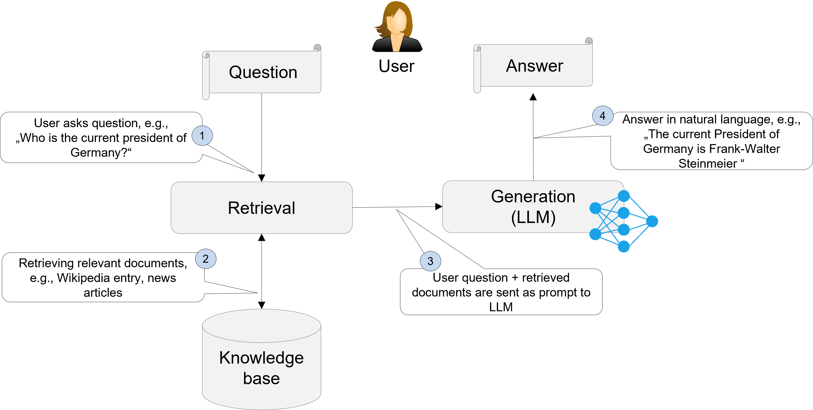

See Fig. 6.20 for an overview of the RAG architecture.
Let us consider the example of a (recent) election. A user of a LLM-based chatbot may ask the question "Who is the current president of Germany?" (see Step 1 in the figure). The LLM may have been trained long before the election and therefore cannot answer correctly. The user question is first sent to an IR knowledge base (which could, e.g., be the Google search index - Step 2). It may contain Wikipedia entries about Germany, news articles, federal websites etc. The retrieval result is a set of documents or document chunks that match the question. In a third step, the user question together with the retrieved document chunks (maybe together with additional information, e.g., the chat history) are sent as a prompt to the LLM. The LLM then generates an answer in natural language which includes the retrieved information. 

When implementing RAG in a setting with closed information source, e.g., a chatbot for intranet company data, often a *vector store* is used as technology for the retrieval component. See Fig. 6.21 for an overview. 


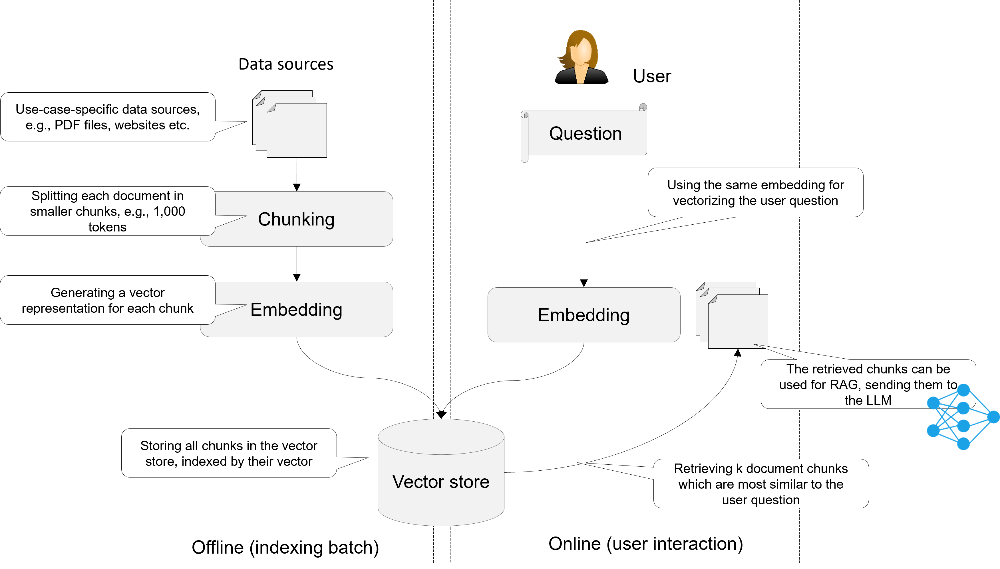

In an offline batch process, the data sources (e.g., PDF files, websites etc.) need to be indexed. In a first step, large documents are split into smaller chunks, e.g, with 1,000 tokens each. In a second step, all chunks of all documents are converted into a vector representation, using a word embedding. The document chunks together with metadata are stored in the vector store, indexed by their vector representations.
This offline indexing batch needs to be performed on a regular basis, e.g., daily.

In the online RAG-based chatbot application, the same embedding model is used to generate a vector representation of a new user question. The vector store allows a similarity search, returning the k most similar document chunks compared to the user query. The retrieved chunks can now be used for RAG, as explained in Fig 6.20.


## Services and Product Maps

### NLP Services Map

Fig. 6.22 shows the NLP services map.

{width=75%}
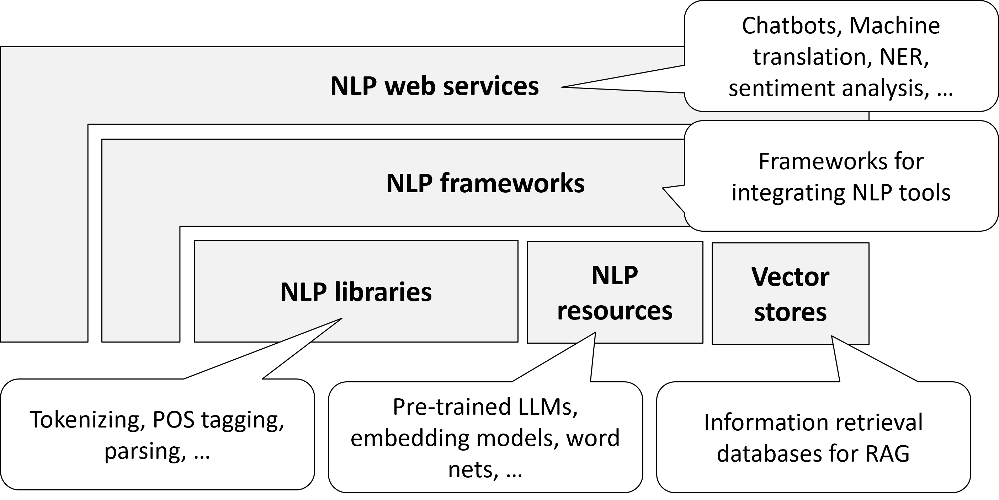

When developing an AI application with NLP facilities, you very rarely build basic NLP features from scratch. *NLP libraries* with powerful and well-established implementations for BoW model, tf-idf, n-gram, tokenization, sentence splitting, PoS tagging, parsing etc. exist and can  be integrated into your application. Additionally, *language resources* like dictionaries may be used. 

When building complex custom NLP applications, the use of an NLP framework is recommended. They usually follow a pipeline approach allowing to plug in NLP features.  

For a number of NLP tasks, entire solutions may be integrated into an AI application as a web service. Examples are translation services, voice-to-text transformation services, named entity recognition, sentiment analysis etc.
Including an NLP web service is, of course, the easiest and least effort solution. However, you should check licenses, performance, privacy and availability issues involved. 

### NLP Product Map

Fig. 6.23 shows the NLP product map.

{width=75%}
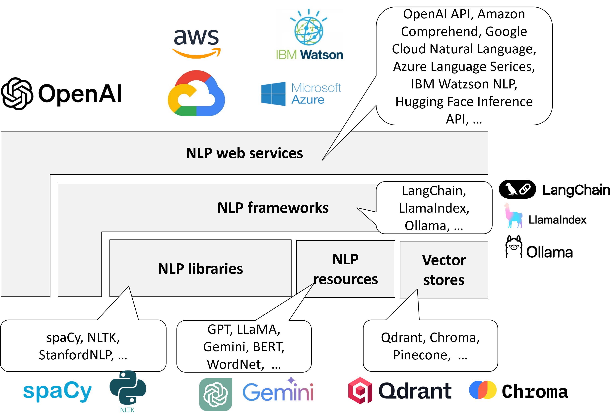

spacCy and NLTK are the predominant NLP libraries, both in Phython. They do not only offer NLP features like sentence splitting, tokenizing, parsing etc., but the also provide easy-to-use pipelines for stacking NLP features. 
General-purpose ML libraries like 
[TensorFlow](https://www.tensorflow.org/), 
[scikit-learn](http://scikit-learn.org/) and 
[MLlib](http://spark.apache.org/mllib/), 
offer functionality for the BoW model, tf-idf and n-grams. 

The most prominent NLP language resource for the English language is [WordNet](https://wordnet.princeton.edu/).

There are also numerous NLP web services from various providers, e.g., 
[Amazon Alexa Voice service](https://developer.amazon.com/de/alexa-voice-service),
[Google Cloud Speech API](https://cloud.google.com/speech),
[Google Translate API](https://cloud.google.com/translate),
[IBM Watson NLP](https://cloud.ibm.com/catalog/services/natural-language-understanding), and
[MS Azure Speech Services](https://azure.microsoft.com/de-de/services/cognitive-services/speech).


I will briefly introduce one prominent example for each NLP service category in the next sections, namely  WordNet (NLP resource),  spaCy (NLP library and pipeline framework), and Dandelion API (NLP web service).

More NLP products and details can be found in the appendix.


### NLP Web Service: Named Entity Recognition with Dandelion API

There are numerous NLP services for completely different NLP tasks. As an example, I pick *Named Entity Recognition (NER)*. NER is a subtask of information extraction, locating and classifying elements in a text as persons, organizations, locations, etc.

[Dandelion API](https://dandelion.eu) is a web service for semantic texts analytics, including NER. See a screenshot of an example in Fig. 6.24. 

{width=65%}


In this example, the following text is analyzed:

    The Mona Lisa is a 16th century oil painting created by Leonardo. 
    It's held at the Louvre in Paris.

Dandelion detected the language English and the following named entities:

1. Work [Mona Lisa](http://dbpedia.org/resource/Mona_Lisa) with respective DBpedia link 
2. Concept [Oil painting](http://dbpedia.org/resource/Oil_painting)
3. Person [Leonardo da Vinci](http://dbpedia.org/resource/Leonardo_da_Vinci)
4. Place [Louvre](http://dbpedia.org/resource/Louvre)
5. Place [Paris](http://dbpedia.org/resource/Paris)

The Dbpedia links allow retrieving additional information about the named entities, e.g., the birth date and death date of Leonardo da Vinci. The Dandelion API provides a JSON file containing all this information including confidence scores for each named entity detected.

Dandelion can be configured to provide higher precision or more tags (higher recall). When favoring more tags, then the following additional named entity is identified:

Concept [Tudor period](http://dbpedia.org/resource/Tudor_period)

This is a wrong identification. Although Leonardo da Vinci lived during the Tudor period, this period applies to England and not to Italy. This shows that NER, like all AI approaches, may produce erroneous results - just like humans who can misunderstand words in texts.


### NLP Web Service: OpenAI API

The *OpenAI API* provides access to powerful language models like GPT-4o, enabling developers to access those LLMs as web services. It supports tasks such as 
Text generation and summarization, question answering and reasoning, code generation and debugging, etc. 
The API is accessible via RESTful endpoints and SDKs (e.g., Python, Node.js), making it easy to integrate into web apps, mobile platforms, and enterprise systems.

Key Concepts are:

- **Model Selection**: Choose from models like `gpt-4o`, `gpt-3.5-turbo`, or `dall-e`.
- **Prompting**: Send structured messages to guide the model’s output.
- **Authentication**: Use a secure API key to access the service.
- **Rate Limits & Pricing**: Pay-as-you-go model with usage tiers.

Consider the following simple Python example for chat completion. 


```python
import openai
import os

# Load your API key securely
openai.api_key = os.getenv("OPENAI_API_KEY")

# Send a prompt to the model
response = openai.ChatCompletion.create(
    model="gpt-3.5-turbo",
    messages=[
        {"role": "system", "content": "You are a helpful assistant."},
        {"role": "user", "content": "Explain the concept of tokenization in NLP."}
    ]
)

# Print the model's reply
print(response['choices'][0]['message']['content'])
```


### NLP Framework for LLM Integration: Ollama


*Ollama* is an integration platform that lets you run LLMs on your own machine.  It is designed for developers, researchers, and privacy-conscious users who want the power of models like LLaMA, Mistral, or Gemma without relying on external servers.

One of its key innovations is the use of Modelfiles, which bundle everything needed to run a model — weights, configuration, and even custom prompts — into a single, portable package. This makes it easy to customize and deploy models for specific tasks.

Ollama supports a command-line interface (CLI) and a Python API, making it ideal for rapid prototyping. It is cross-platform, open-source, and currently free to use, with optional enterprise features on the horizon.


Consider the following simple Python example for generating text using Ollama.

```python
import ollama

# Create a client instance
client = ollama.Client()

# Generate text using a model (e.g., llama2)
response = client.generate(
    model="llama2",
    prompt="Tell me a short story about a robot and a cat."
)

print(response.text)
```


### NLP Pipelining Framework: LlamaIndex

*LlamaIndex* is a  framework designed to connect LLMs with  custom data. Like many NLP framewoks it is based on the pipeline architectural pattern: individual NLP tasks can be configured in a pipeline and are executed sequentially. LlamaIndex is most suitable for building RAG applications. See Fig. 6.25 for an overview from llamaindex.ai.


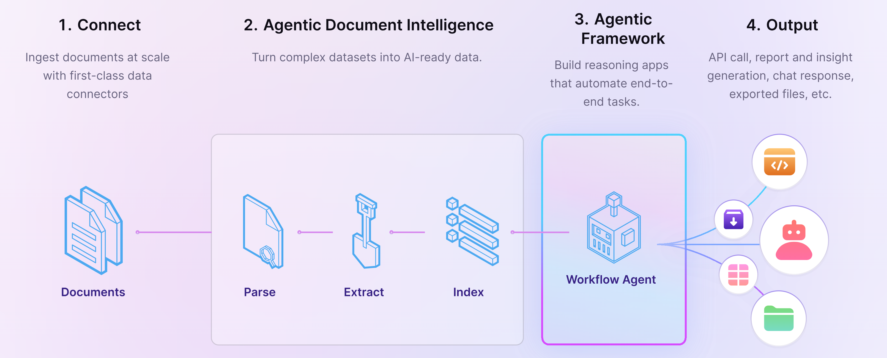


LlamaIndex provides connectors for various document types like PDF, HTML etc. Documents can be pre-processed using NLP tools including parsing, extracting information and indexing in a vector store. Then, all kinds of LLM-based text generation can be performed, including workflow agents. Finally, results can be published over various channels, e.g. chat responses, files, but also APIs. 

LlamaIndex integrates with vector stores like Pinecone, Weaviate, Qdrant. It is ideal for building RAG-based chatbots, semantic search, and document Q&A systems.Consider the following Python example for building a simple RAG system. 


```python
from llama_index import VectorStoreIndex, SimpleDirectoryReader

# Load your documents (e.g., from a folder)
documents = SimpleDirectoryReader("data").load_data()

# Create an index from the documents
index = VectorStoreIndex.from_documents(documents)

# Create a query engine
query_engine = index.as_query_engine()

# Ask a question
response = query_engine.query("What is the main topic of the document?")
print(response)
```

This will return a natural language answer based on the content of the provided documents, powered by an LLM under the hood.


### NLP Resources: LLM LLaMA

The *LLaMA (Large Language Model Meta AI)* family, developed by Meta AI, represents a significant milestone in the evolution of open LLMs. First introduced in 2023, LLaMA models have rapidly progressed through multiple generations, culminating in the release of LLaMA 4 in 2025. These models range in size from 1 billion to over 2 trillion parameters, and are designed to be efficient, scalable, and adaptable across a wide range of tasks—from natural language understanding to code generation and multimodal reasoning. Unlike many proprietary models, LLaMA emphasizes accessibility and community-driven innovation, offering source-available licenses and instruction-tuned variants that support fine-tuning for specialized applications. 
LLaMA LLMs can easily be integrated in local NLP applications using integration frameworks like Ollama. 


### Knowledge-Based NLP Resources: WordNet

Word embeddings and LLMs are all ML-based NLP resources. They work extremely well for many tasks but still suffer from problems that all ML-based approaches have: they make errors, such as hallucinations. 
Traditionally, knowledge-based resources have long been used in NLP and they can still be useful today. Human-curated NLP knowledge graphs are especially useful in domains requiring precision, interpretability, or controlled vocabulary. The most prominent example for a knowledge-based NLP resource is WordNet.
[WordNet](https://wordnet.princeton.edu) is a state-of-the-art lexical database for the English language. It lists over 150,000 English words: nouns, verbs, adjectives and adverbs. For each word, different meanings ("senses") are distinguished. For example, 7 different noun senses and one verb sense of the word "dog" are listed, including the animal as well as minced meat (as in "hot dog"). 

Fig. 6.26 shows a screenshot of the [WordNet online search](http://wordnetweb.princeton.edu/perl/webwn?s=dog).

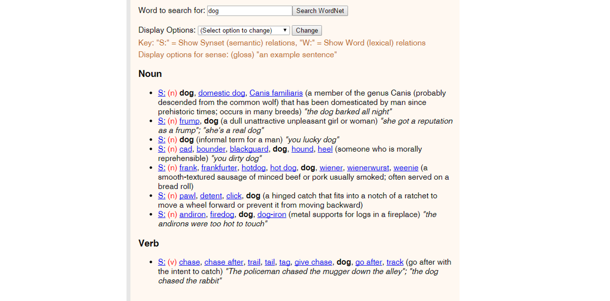

For each word sense,  a description and different relationships are specified.

- Synonyms, e.g., "Canis familiaris" and "Domestic" dog for the "animal" sense of the word "dog"
- Hypernyms (broader terms), e.g., "mammal" and "animal"
- Hyponyms (narrower terms), e.g., "Puppy", "Hunting dog", "Poodle", etc.

See Fig. 6.27.

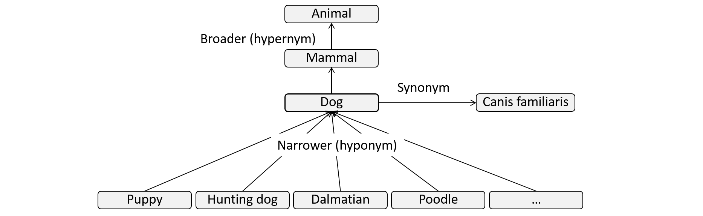

WordNet is open source under a BSD license. 
It can be used in AI applications in various forms. 
A set of "standoff files" can be downloaded and can be used in applications of any programming language. The WordNet database can be downloaded as a binary for Windows, Unix, and Linux. It can be integrated into applications of any programming language using operating system calls. Finally, the online version of WordNet can be integrated via HTTP. 

Which integration type is recommended? As usual, integrating the online service is the least-effort approach. If a permanent Internet connection is guaranteed and the performance is sufficient, then this is recommended. Working with the raw files offers the most flexibility but requires considerable implementation effort. In most cases, working with the locally installed WordNet database is the solution of choice: good performance, no dependency on the remote system and relatively small implementation overhead. 


## Quick Check

X> Answer the following questions.

1. Name and explain different areas of NLP.
2. Explain the levels of language understanding.
3. What is tokenization, sentence splitting, PoS tagging, and parsing?    
4. Explain the bag-of-words model, tf-idf and the n-gram model. 
5. Explain word embeddings
6. Explain the architecture of LLMs. How are they trained?
7. Give best practices for prompt engineering
8. Explain RAG
9. What do language resources offer to NLP? Give examples.
10. What do NLP libraries and frameworks offer? Give examples.
11. What do NLP web services offer? Give examples.
