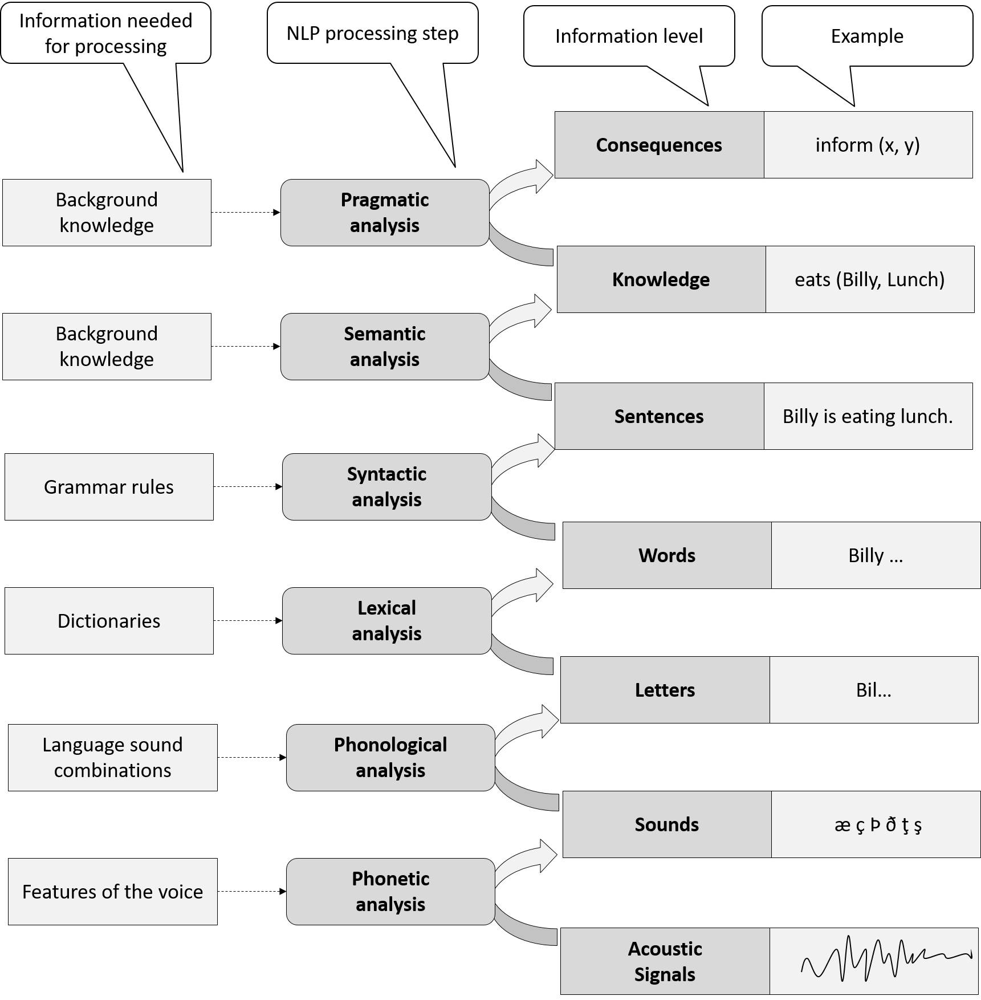
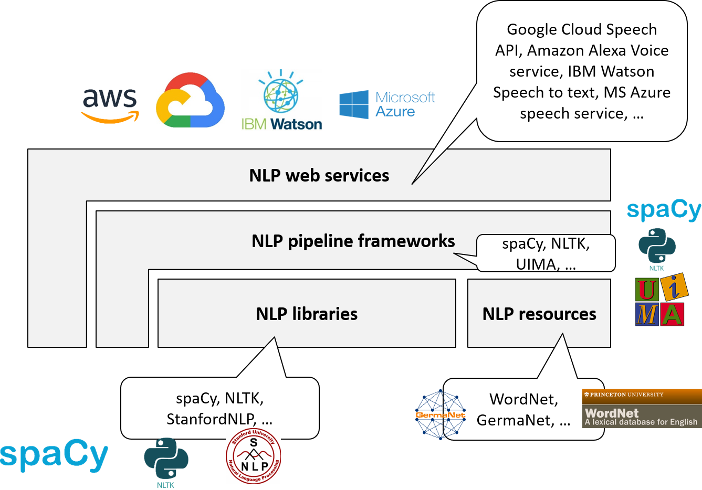

# Natural Language Processing

*Natural Language Processing (NLP)* is the AI area which deals with processing natural languages like English, German, etc.
Fig. 6.1 shows NLP in the AI landscape.

NLP can be assigned to the ability of "communicating". It is a broad area that covers many aspects. Examples are:

- Spell checking and grammar checking of written texts, e.g., as in word processors
- Classifying texts, e.g. according to the topic
- Understanding written text, e.g., the sentiment of Twitter tweets (positive, neutral, negative)
- Understanding speech, e.g., voice control of a navigation system
- Translating texts, e.g., between English and German
- Answering natural language questions, e.g., in a specific domain like medicine
- Summarizing written texts, e.g., news
- Generating  texts, e.g., story telling
- Generating voice, e.g., routing information in a navigation system

Due to the diversity of NLP, different subareas are distinguished. There is no commonly agreed classification but often the following NLP subareas are mentioned:

- *Information Retrieval (IR)* supports retrieving documents for a specific information need. As explained in the last chapter, the term "Document Retrieval" would be more suitable. Information Retrieval is usually considered a subarea of NLP.
- *Information Extraction (IE)* deals with the understanding of written and spoken text. This includes the analysis of texts and transformation into a knowledge representation that can be queried. Sentiment analysis is a simple form of information extraction.

- *Question Answering (QA)* generates natural language answers to natural language questions, in written or spoken form. 
- *Machine Translation* allows translating texts between different natural languages.
- *Text Generation* supports the generation of written or spoken texts. Text summaries and story telling are forms of text generation.

## The Big Picture

Fig. 6.2 shows the big picture of NLP as seven levels of language understanding, adopted from (Harriehausen, 2015).

{width=75%}

The figure shows information levels and NLP processing steps to raise the level of understanding. 
On the lowest level there are acoustic signals. *Phonetic analysis* uses features of the voice to extract sounds. *Phonological analysis* uses sound combinations of specific languages in order to extract letters. *Lexical analysis* may use dictionaries to extract individual words. *Syntactic analysis* (parsing) uses grammar rules in order to extract sentences and their structure (parse tree). *Semantic analysis* uses background knowledge to represent the knowledge in a text. Finally, *pragmatic analysis* may draw conclusions and consequences for actions.

In most AI applications, only some NLP processing steps are relevant. When dealing with written texts, then phonetic and phonological analysis are not necessary. Also, semantic and pragmatic analysis may be simple or even irrelevant, depending on the application use case.

In this chapter, I focus on lexical, syntactic and semantic analysis which is used in most NLP applications. I first explain a simple approach, namely the bag-of-words model. 
I then explain individual processing steps for lexical and syntactic analysis (from letters to sentences) that may lead to a deeper semantic analysis.

## Simple Approach: Bag-of-words Model

The *bag-of-words (BoW) model*  is a simple NLP approach which delivers surprisingly good results in certain application scenarios like text classification and sentiment analysis. 
In the BoW, a text is represented as the *bag (multiset)* of its words, disregarding grammar and even word order but only keeping the multiplicity of the words.

Consider the following example text.

	John likes to watch movies. Mary likes movies too.

The bag of words, represented in JSON, is:

	BoW = {"John":1,"likes":2,"to":1,"watch":1,"movies":2,"Mary":1,"too":1}; 

The word `John` appears once in the text, the word `likes` twice etc. 

### Machine Learning with Bags of Words

In the simplest form, vectors resulting of bags of words can be used in supervised ML approaches as described in Chapter 2. Consider the ML task of classification with texts t1, ... tn and classes A, B, C. Then the data set for ML training consists of each distinct word in all texts as features (attributes as classification input) and the classes as labels (classification output). See Fig. 6.3 with the example text above as t1.

{width=75%}

Now, any ML approach suitable for classification can be used, e.g. Artificial Neural Networks, Decision Trees, Support Vector Machines, k-nearest Neighbor etc. 

### tf-idf

As a rule of thumb, a term appearing often in a text is more important than a term appearing rarely. However, there are exceptions to this rule of thumb. Consider so-called *stop words* like "the", "a", "to" etc. which are most common in English texts but add little to the semantics of the text. In information retrieval, stop words are usually ignored.

How to deal with this in the BoW model which mainly deals with word counts? 

One approach is to remove stop words before computing the bag of words. This approach much depends on the selection of the right stop words.

There is another elegant, general approach which avoids fixed stop word lists: *term frequency - inverse document frequency (tf-idf)*. 
*Term frequency* is based on the count of a particular word in a concrete text as shown in the example above.
*Document frequency* considers the count of a particular word in an entire *corpus*, i.e., a large set of texts. 

tf-idf puts the term frequency in relation to the document frequency. So, a word like "to" which appears often in all texts but not more often in the text under consideration will not have a particularly high tf-idf and, therefore, will not be considered important. In contrast, a word like "movies" which occurs twice in the short text above but not particularly often in texts in general will have a high tf-idf and, therefore, will be considered important for this text. This matches the intuition.

There are various formulas for computing tf-idf in practical use, which are more meaningful than a simple quotient of the word counts. See e.g. the [Wikipedia entry on tf-idf](https://en.wikipedia.org/wiki/Tf%E2%80%93idf). NLP libraries conveniently provide implementations of tf-idf.

The ML classification performance can be improved by using the tf-idf values instead of the simple word counts in the training data.

### N-gram Model

The simple BoW model as explained above treats each individual word independently. The word order gets ignored completely. The *n-gram model* is a simple improvement which takes combinations of up to n successive words into  account. N is usually relatively small, e.g., 2 or 3. 

See Fig. 6.4. with an extension of the example in Fig. 6.3 to a 2-gram model.

{width=75%}

n-gram models can be combined with tf-idf by simply computing the tf-idf values for the n-grams.

The BoW model is  simple and relatively easy to implement. Despite its simplicity, it delivers good prediction performance for many application use cases, particularly when combined with extensions like tf-idf or n-grams, and particularly with large training data sets. 

Obviously, the number of features (attributes) in the BoW model can get extremely large, particularly when using n-grams. Hundreds of thousands of features are possible.  Particularly with huge training data sets this can cause major performance problems in the ML training and prediction phases. Feature selection mechanisms from unsupervised ML may be used to reduce the number of features and, hence, alleviate those performance problems. 

## Deeper Semantic Analysis: From Letters to Sentences

The bags-of-words model is a simple approach, based on counting words. This is most different from the way humans understand texts. Despite its simplicity it delivers surprisingly good results for simple NLP tasks like text classification. However, it is obvious that complex NLP tasks like question answering require a deeper semantic analysis of texts than simply counting words. 

In this section I will present some approaches: from letters to sentences.

### Tokenization

*Tokenization* is the step of grouping letters into words. This step seems primitive: looking for blank characters seems to be enough. However, tokenization is a little more complicated. 
Consider the following example sentence: 

	My dog also likes eating sausage. 

Following the primitive tokenization approach, the last word identified would be `sausage.`. However, in fact, the last word is `sausage` and the period `'.'` is a separate token. So, the correct tokenization result is as follows (Fig. 6.5).

### Sentence splitting

*Sentence splitting* identifies whole sentences. Sentences are terminated by periods (full stops). However, simply looking for the next period is not enough. Consider the following sample sentence.

	Interest rates raised by 0.2 percent.

Obviously, the point in `0.2` is part of a floating point number and does not terminate the sentence. Other cases to be considered are abbreviations like `e.g.`, ellipsis (`...`), etc.

### Stemming, Part-of-speech (PoS) Tagging

*Stemming* means reducing a word to its root word. E.g., `eat` is the root word of `eating`. *Part of speech (PoS)* is the grammatical category of a word. E.g., `eating` is the gerund or the present participle of the verb `to eat`. *PoS Tagging* is the step of identifying the PoS of a word. 

Fig. 6.6 shows the PoS tagging result of the sentence `My dog also likes eating sausage.` 

In this figure, the [Penn Treebank tag set](http://www.clips.ua.ac.be/pages/mbsp-tags) is used. E.g., Verb, gerund or present participle is marked as `VBG`. The Penn Treebank tag set is a de-facto standard used by many PoS tagging tools.  

Note: Tokenization and stemming are often pre-processing steps before applying a BoW model. They may improve prediction performance and, at the same time, reduce the number of features.

### Parsing

*Parsing* is the step of analyzing the grammar of a sentence. The result is the sentence structure, usually denoted as a tree. Fig. 6.7 shows the parsing result for the sentence `My dog also likes eating sausage.`

{width=75%}

Again, the Penn Treebank tag set is used. E.g., `NP` stands for noun phrase and `VP` for verb phrase. 

Parsing of most natural language sentences is highly ambiguous. As humans, we rarely notice this ambiguity. Our brain combines the syntactic analysis and the semantic analysis and chooses the "obvious" meaning, i.e., the most likely variant. However, we also sometimes stumble on ambiguities in  the language. Many jokes play with misunderstandings based on ambiguities. [For example](http://www.ijokes.eu/index.php/joke/category/misunderstanding?page=2):

"I want to be a millionaire. Just like my dad!"
"Wow, your dad's a millionaire?"
"No, but he always wanted to be."

If you technically parse natural language sentences you may be surprised of how many different interpretations of the same sentence are valid. Consider the following example sentence:

	I saw the man on the hill with a telescope.

Fig. 6.8, adopted from [AllThingsLinguistic](http://allthingslinguistic.com/post/52411342274/how-many-meanings-can-you-get-for-the-sentence-i), shows five different, valid interpretations of this sentence.

X> As an exercise, you may construct a parse tree for each interpretation of the sentence.

Early NLP parsers were rule-based. They mechanically applied grammar rules to sentences. They had enormous difficulties with the multiple alternative parse trees, as well as with grammatically incorrect sentences. Most modern NLP parsers are statistics-based. They produce the most likely parse result according to statistics and can also deal with grammatically incorrect sentences, as we humans do. 

## Services and Product Maps

### NLP Services Map

Fig. 6.9 shows the NLP services map.

{width=75%}

When developing an AI application with NLP facilities, you very rarely build basic NLP *building blocks* from scratch. Class libraries with powerful and well-established building blocks for BoW model, tf-idf, n-gram, tokenization, sentence splitting, PoS tagging, parsing etc. exist and can  be integrated into your application. Additionally, *language resources* like dictionaries may be used. 

When building complex custom NLP applications, the use of an NLP framework is recommended. They usually follow a pipeline approach allowing to plug in off-the-shelf NLP building blocks. NLP frameworks are powerful and highly customizable. However, they require a certain level of expertise, both on NLP concepts as described above as well as framework-specifics.

For a number of NLP tasks, entire solutions may be integrated into an AI application as a web service. Examples are translation services, voice-to-text transformation services, named entity recognition, sentiment analysis etc.
Including an NLP web service is, of course, the easiest and least effort solution. However, you should check licenses, performance, privacy and availability issues involved. 

### NLP Product Map

Fig. 6.10 shows the NLP product map.

{width=75%}

[Apache UIMA](https://uima.apache.org/) and [GATE](https://gate.ac.uk/) are the most widely used NLP frameworks. While GATE allows experimenting with NLP using a graphical desktop application, UIMA is more suitable for software developers offering plug-ins for IDEs like Eclipse. 

There are numerous NLP building blocks, e.g. from the [Stanford University NLP group](http://nlp.stanford.edu/software/). Many of them can be plugged into UMIA and GATE. However, sometimes wrappers are needed like from [uimaFIT](https://uima.apache.org/uimafit.html) and [DKPro](https://www.ukp.tu-darmstadt.de/research/current-projects/dkpro/).
ML libraries like 
[TensorFlow](https://www.tensorflow.org/), 
[scikit-learn](http://scikit-learn.org/) and 
[MLlib](http://spark.apache.org/mllib/), 
offer functionality for the BoW model, tf-idf and n-grams. 

The most prominent NLP language resource for the English language is [WordNet](https://wordnet.princeton.edu/).

There are also numerous NLP web services from various providers, e.g., 
[Amazon Alexa Voice service](https://developer.amazon.com/de/alexa-voice-service),
[Google Cloud Speech API](https://cloud.google.com/speech),
[Google Translate API](https://cloud.google.com/translate),
[IBM Watson NLP](https://cloud.ibm.com/catalog/services/natural-language-understanding), and
[MS Azure Speech Services](https://azure.microsoft.com/de-de/services/cognitive-services/speech).

## Examples

I will briefly introduce one prominent example for each NLP service category in the next sections, namely  WordNet (NLP resource),  Stanford Parser (NLP building block), UIMA (NLP framework), and Dandelion API (NLP web service).

More NLP products and details can be found in the appendix.

### NLP Resources: WordNet

[WordNet](https://wordnet.princeton.edu) is a state-of-the-art lexical database for the English language. It lists over 150,000 English words: nouns, verbs, adjectives and adverbs. For each word, different meanings ("senses") are distinguished. For example, 7 different noun senses and one verb sense of the word "dog" are listed, including the animal as well as minced meat (as in "hot dog"). 

Fig. 6.11 shows a screenshot of the [WordNet online search](http://wordnetweb.princeton.edu/perl/webwn?s=dog).

For each word sense,  a description and different relationships are specified.

- Synonyms, e.g., "Canis familiaris" and "Domestic" dog for the "animal" sense of the word "dog"
- Hypernyms (broader terms), e.g., "mammal" and "animal"
- Hyponyms (narrower terms), e.g., "Puppy", "Hunting dog", "Poodle", etc.

See Fig. 6.12.

WordNet is open source under a BSD license. 
It can be used in AI applications in various forms. 
A set of "standoff files" can be downloaded and can be used in applications of any programming language. The WordNet database can be downloaded as a binary for Windows, Unix, and Linux. It can be integrated into applications of any programming language using operating system calls. Finally, the online version of WordNet can be integrated via HTTP. 

Which integration type is recommended? As usual, integrating the online service is the least-effort approach. If a permanent Internet connection is guaranteed and the performance is sufficient, then this is recommended. Working with the raw files offers the most flexibility but requires considerable implementation effort. In most cases, working with the locally installed WordNet database is the solution of choice: good performance, no dependency on the remote system and relatively small implementation overhead. 

### NLP Building blocks: Stanford Parser

The [Stanford Parser](http://nlp.stanford.edu/software/lex-parser.shtml) is a state-of-the-art statistical NLP parser. It supports different natural languages, namely English, French, Spanish, German, and Chinese. It is implemented in Java and is published open source under the GNU General Public License. 

See Fig. 6.13 for a screenshot of the [online parser](http://nlp.stanford.edu:8080/parser). 

The sample sentence `My dog also likes eating sausage.` is parsed. 
The  PoS tagging and parsing results are displayed. 
There are two representations of the parsing result: a syntax tree representation and a typed dependency representation. The typed dependencies representation is usually easier to understand by people without linguistic expertise who want to extract textual relations from a text. 

The Stanford parser can be integrated into Java applications as a JAR file. To integrate it into applications implemented in other programming languages, it can be invoked on the operating system level. Alternatively, extensions or ports exist for a number of programming languages, including PHP, Python, Ruby, and C#. Finally, the online parser can be invoked via HTTP.

### NLP Frameworks: Apache UIMA

[Apache UIMA (Unstructured Information Management Architecture)](https://uima.apache.org/) is a powerful, mature NLP framework. It is used in many corporate applications, e.g. in IBM Watson. 

UIMA allows NLP components to be integrated into a pipeline. Components implement NLP processing steps, e.g., tokenization, sentence splitting, PoS tagging, parsing, semantic analysis etc. 
Each component  implements interfaces defined by the framework and provides self-describing metadata via XML descriptor files. The framework manages these components and the data flow between them. 
Components are written in Java or C++. The framework is  also available in both programming languages. 
Third party components like the Stanford parser can be plugged into UIMA as well. For this, wrappers are needed as offered by [uimaFIT](https://uima.apache.org/uimafit.html) and [DKPro](https://www.ukp.tu-darmstadt.de/research/current-projects/dkpro/).

See Fig. 6.14.

{width=75%}

UIMA is open source under the Apache license. The interfaces are approved as an [OASIS](https://www.oasis-open.org/committees/uima) standard. 

### NLP Services: Named Entity Recognition with Dandelion API

There are numerous NLP services for completely different NLP tasks. As an example, I pick *Named Entity Recognition (NER)*. NER is a sub task of information extraction, locating and classifying elements in a text as persons, organizations, locations, etc.

[Dandelion API](https://dandelion.eu) is a web service for semantic texts analytics, including NER. See a screenshot of an example in Fig. 6.15. 

{width=65%}

In this example, the following text is analyzed:

	The Mona Lisa is a 16th century oil painting created by Leonardo. It's held at the Louvre in Paris.

Dandelion detected the language English and the following named entities:

1. Work [Mona Lisa](http://dbpedia.org/resource/Mona_Lisa) with respective DBpedia link 
2. Concept [Oil painting](http://dbpedia.org/resource/Oil_painting)
3. Person [Leonardo da Vinci](http://dbpedia.org/resource/Leonardo_da_Vinci)
4. Place [Louvre](http://dbpedia.org/resource/Louvre)
5. Place [Paris](http://dbpedia.org/resource/Paris)

The Dbpedia links allow retrieving additional information about the named entities, e.g., the birth date and death date of Leonardo da Vinci. The Dandelion API provides a JSON file containing all this information including including confidence scores for each named entity detected.

Dandelion can be configured to provide higher precision or more tags (higher recall). When favoring more tags, then the following additional named entity is identified:

Concept [Tudor period](http://dbpedia.org/resource/Tudor_period)

This is a wrong identification. Although Leonardo da Vinci lived during the Tudor period, this period applies to England and not to Italy. This shows that NER, like all AI approaches, may produce erroneous results; just like humans who can misunderstand words in texts.

## Quick Check

X> Answer the following questions.

1. Name and explain different areas of NLP.
1. Explain the levels of language understanding.
2. Explain the bag-of-words model, tf-idf and the n-gram model. 
1. What is tokenization, sentence splitting, PoS tagging, and parsing?	
1. What do language resources offer to NLP? Give examples.
1. What do NLP frameworks offer? Give example.
1. What do NLP web services offer? Give examples.

