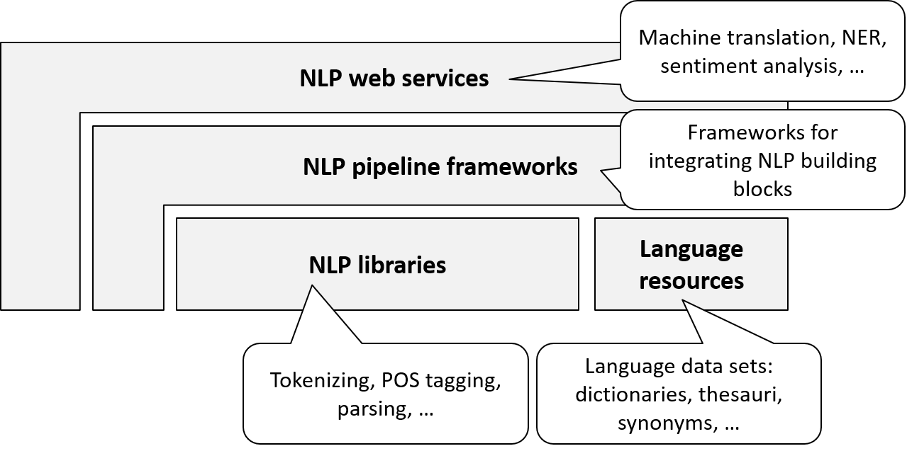

# Natural Language Processing

Natural Language Processing (NLP) is a broad area that covers many aspects of dealing with natural languages like English. Examples are:

- Spell checking and grammar checking of written texts, e.g., as in word processors
- Understanding written text, e.g., the sentiment of Twitter tweets
- Understanding speech, e.g., voice control of a navigation system
- Translating texts, e.g., between English and German
- Answering natural language questions, e.g., in a specific domain like medicine
- Summarizing written texts, e.g., news
- Generating  texts, e.g., story telling
- Generating voice, e.g., routing information in a navigation system

Due to the diversity of NLP, different subareas are distinguished. There is no commonly agreed classification but often the following NLP subareas are mentioned:

- *Information Extraction (IE)* deals with the understanding of written and spoken text. This includes the analysis of texts and transformation into a knowledge representation that can be queried. Sentiment analysis is a simple form of information extraction.
- *Information Retrieval (IR)* supports retrieving documents for a specific information need. As explained in the last chapter, the term "Document Retrieval" would be more suitable. Information Retrieval is usually considered a subarea of NLP.
- *Question Answering (QA)* generates natural language answers to natural language questions, in written or spoken form. 
- *Machine Translation* allows translating texts between different natural languages.
- *Text Generation* supports the generation of written or spoken texts. Text summaries and story telling are forms of text generation.

## The Big Picture

Fig. 5.1 shows the big picture of NLP as seven levels of language understanding according to (Harriehausen, 2015).

The figure shows information levels and NLP processing steps to raise the level of understanding. 
On the lowest level there are acoustic signals. *Phonetic analysis* uses features of the voice to extract sounds. *Phonological analysis* uses sound combinations of specific languages in order to extract letters. *Lexical analysis* may use dictionaries to extract individual words. *Syntactic analysis* (parsing) uses grammar rules in order to extract sentences and their structure (parse tree). *Semantic analysis* uses background knowledge to represent the knowledge in a text. Finally, *pragmatic analysis* may draw conclusions and consequences for action.

## From Letters to Sentences

In most AI applications, only some NLP processing steps are relevant. When dealing with written texts, then phonetic and phonological analysis are not necessary. Also, semantic and pragmatic analysis may be simple or even irrelevant, depending on the application use case.

In this section, I explain the individual processing steps for lexical and syntactic analysis (from letters to sentences) that are relevant in many NLP applications.

### Tokenization

*Tokenization* is the step of grouping letters into words. This step seems primitive: looking for blank characters seems enough. However, tokenization is a little more complicated. 
Consider the following example sentence: 

"My dog also likes eating sausage." 

Following the primitive tokenization approach, the last word identified would be "sausage.". However, in fact, the last word is "sausage" and the period "." is a separate token. So, the correct tokenization result is as follows (Fig. 5.2).

### Sentence splitting

*Sentence splitting* identifies whole sentences. Sentences are terminated by periods (full stops). However, simply looking for the next period is not enough. Consider the following sample sentence.

"Interest rates raised by 0.2 percent."

Obviously, the period in "0.2" is part of a floating point number and does not terminate the sentence. Other cases to be considered are abbreviations like "e.g.", ellipsis ("..."), etc.

### Stemming, Part-of-speech (PoS) Tagging

*Stemming* means reducing a word to its root word. E.g., "eat" is the root word of "eating". *Part of speech (PoS)* is the grammatical category of a word. E.g., "eating" is the gerund or the present participle of the verb "to eat". *PoS Tagging* is the step of identifying the PoS of a word. 

Fig. 5.3 shows the PoS tagging result of the sentence "My dog also likes eating sausage." 

In this figure, the [Penn Treebank tag set](http://www.clips.ua.ac.be/pages/mbsp-tags) is used. E.g., Verb, gerund or present participle" is marked as "VBG". The Penn Treebank tag set is a de-facto standard used by many PoS tagging tools.  

### Parsing

Parsing is the step of analyzing the grammar of a sentence. The result is the sentence structure, usually denoted as a tree. Fig. 5.4 shows the parsing result for the sentence "My dog also likes eating sausage.".

Again, the the Penn Treebank tag set is used. E.g., "NP" stands for "noun phrase" and "VP" for "verb phrase". 

Parsing of most natural language sentences is highly ambiguous. As humans, we rarely notice this ambiguity. Our brain combines the syntactic analysis and the semantic analysis and chooses the "obvious" meaning, i.e., the most likely variant. However, we also sometimes stumble on ambiguities in  the language. Many jokes play with misunderstandings based on ambiguities. [For example](http://www.ijokes.eu/index.php/joke/category/misunderstanding?page=2):

"I want to be a millionaire. Just like my dad!"
"Wow, your dad's a millionaire?"
"No, but he always wanted to be."

If you technically parse natural language sentences you may be surprised of how many different interpretations of the same sentence are valid. Consider the following example sentence:
"I saw the man on the hill with a telescope."

Fig. 5.5 from [allthingslinguistic.com](http://allthingslinguistic.com/post/52411342274/how-many-meanings-can-you-get-for-the-sentence-i) shows five different, valid interpretations of this sentence.

X> As an exercise, you may construct a parse tree for each interpretation of the sentence.

Early NLP parsers were rule-based. They mechanically applied grammar rules to sentences. They had enormous difficulties with the multiple alternative parse trees, as well as with grammatically incorrect sentences. Most modern NLP parsers are statistics-based. They produce the most likely parse result according to statistics and can also deal with grammatically incorrect sentences, as we humans do. 

## NLP Services Map

Fig. 5.6 shows the NLP services map.

When developing an AI application with NLP facilities, you very rarely build basic NLP *building blocks* from scratch. Class libraries with powerful and well-established building blocks for tokenization, sentence splitting, PoS tagging, parsing etc. exist and can  be integrated into your application. Additionally, *language resources* like dictionaries may be used. 

When building complex custom NLP applications, the use of an NLP framework is recommended. They usually follow a pipelining approach allowing to plug in off-the-shelf NLP building blocks. NLP frameworks are powerful and highly customizable. However, they require a certain level of expertise, both on NLP concepts as described above as well as framework-specifics.

For a number of NLP tasks, entire solutions may be integrated into an AI application as a web service. Examples are translation services, voice-to-text transformation services, named entity recognition, sentiment analysis etc.
Including an NLP service is, of course, the easiest and least effort solution. However, you should check licenses, performance and availability issues involved. 

## NLP Product Map

Fig. 5.7 shows the NLP product map; see the appendix for more details.

[Apache UIMA](https://uima.apache.org/) and [GATE](https://gate.ac.uk/) are the most widely used NLP frameworks. While GATE allows experimenting with NLP using a graphical desktop application, UIMA is more suitable for software developers offering plug-ins for IDEs like Eclipse. 

There are numerous NLP building blocks, e.g. from the [Stanford University NLP group](http://nlp.stanford.edu/software/). Many of them can be plugged into UMIA and GATE. However, sometimes wrappers are needed like from [uimaFIT](https://uima.apache.org/uimafit.html) and [DKPro](https://www.ukp.tu-darmstadt.de/research/current-projects/dkpro/).

The most prominent NLP language resource for the English language is [WordNet](https://wordnet.princeton.edu/).

There are also numerous NLP services from various providers, e.g., [Google Translate](https://cloud.google.com/translate/docs), and [NERD](http://nerd.eurecom.fr/).

I will briefly introduce one prominent example for each NLP service category in the next sections, namely  WordNet,  Stanford Parser, UIMA, and NERD.

More products and details can be found in the appendix.

### NLP Resources: WordNet

[WordNet](https://wordnet.princeton.edu/) is a state-of-the-art lexical database for the English language. It lists over 150,000 English words: nouns, verbs, adjectives and adverbs. For each word, different meanings ("senses") are distinguished. For example, 7 different noun senses and one verb sense of the word "dog" are listed, including the animal as well as minced meat (as in "hot dog"). 

Fig. 5.8 shows a screenshot of the [WordNet online search](http://wordnetweb.princeton.edu/perl/webwn?s=dog).

For each word sense,  a description and different relationships are specified.

- Synonyms, e.g., "Canis familiaris" and "Domestic" dog for the "animal" sense of the word "dog"
- Hypernyms (broader terms), e.g., "mammal" and "animal"
- Hyponyms (narrower terms), e.g., "Puppy", "Hunting dog", "Poodle", etc.

See Fig. 5.9.

WordNet is open source under a BSD license. 
It can be used in AI applications in various forms. 
A set of "standoff files" can be downloaded and can be used in applications of any programming language. The WordNet database can be downloaded as a binary for Windows, Unix, and Linux. It can be integrated into applications of any programming language using operating system calls. Finally, the online version of WordNet can be integrated via HTTP. 

Which integration type is recommended? As usual, integrating the online service is the least-effort approach. If a permanent Internet connection is guaranteed and the performance is sufficient, then this is recommended. Working with the raw files offers the most flexibility but requires considerable implementation effort. In most cases, working with the locally installed WordNet database is the solution of choice: good performance, no dependency on the remote system and relatively small implementation overhead. 

### NLP Building blocks: Stanford Parser

The [Stanford Parser](http://nlp.stanford.edu/software/lex-parser.shtml) is a state-of-the-art statistical NLP parser. It supports different natural languages, namely English, French, Spanish, German, and Chinese. It is implemented in Java and is published open source under the GNU General Public License. 

See Fig. 5.10 for a screenshot of the [online parser](http://nlp.stanford.edu:8080/parser/). 

The sample sentence "My dog also likes eating sausage." is parsed. 
The  PoS tagging and parsing results are displayed. 
There are two representations of the parsing result: a syntax tree representation and a typed dependency representation. The typed dependencies representation is usually easier to understand by people without linguistic expertise who want to extract textual relations from a text. 

The Stanford parser can be integrated into Java applications as a JAR file. To integrate it into applications implemented in other programming languages, it can be invoked on the operating system level. Alternatively, extensions or ports exist for a number of programming languages, including PHP, Python, Ruby, and C#. Finally, the online parser can be invoked via HTTP.

### NLP Frameworks: Apache UIMA

[Apache UIMA (Unstructured Information Management Architecture)](https://uima.apache.org/) is a powerful, mature NLP framework. It is used in many corporate applications, e.g. in IBM Watson. 

UIMA allows NLP components to be integrated into a pipeline. Components implement NLP processing steps, e.g., tokenization, sentence splitting, PoS tagging, parsing, semantic analysis etc. 
Each component  implements interfaces defined by the framework and provides self-describing metadata via XML descriptor files. The framework manages these components and the data flow between them. 
Components are written in Java or C++. The framework is  also available in both programming languages. 
Third party components like the Stanford parser can be plugged into UIMA as well. For this, wrappers are needed as offered by [uimaFIT](https://uima.apache.org/uimafit.html) and [DKPro](https://www.ukp.tu-darmstadt.de/research/current-projects/dkpro/).

See Fig. 5.11.

UIMA is open source under the Apache license. The interfaces are approved as an [OASIS](https://www.oasis-open.org/) standard. 

### NLP Services: NERD

There are numerous NLP services for completely different NLP tasks. As an example, I pick *Named Entity Recognition (NER)*. NER is a subtask of information extraction, locating and classifying elements in a text as persons, organizations, locations, etc.

[NERD (Named Entity Recognition and Disambiguation)](http://nerd.eurecom.fr/)  is a meta-NER tool, unifying more than 10 different NER tools including
[AlchemyAPI](http://www.alchemyapi.com/),
[DBpedia Spotlight](http://spotlight.dbpedia.org/),
[Wikimeta](http://www.programmableweb.com/api/wikimeta), and
[Yahoo! Content Analysis](http://developer.yahoo.com/search/content/V2/contentAnalysis.html). 
The input to NERD is a natural language text. The output is a set of annotations for named entities identified. The annotations include a category, the URI of an ontology instance, and a confidence value. 

See a screenshot of NERD web interface in Fig. 5.12. 

In this example, the description of the DBpedia entry for Michelangelo's sculpture [David](http://dbpedia.org/page/David_(Michelangelo)) is used as the input text to NERD.
The screenshot shows the text; Named entities that were identified are marked in different colors according to their category. 

NERD returns a JSON result that contains information as follows.

                 [
                  {
                    idEntity: 120,
                    label: "Michelangelo",
                    startChar: 126,
                    endChar: 138,
                    nerdType: "http://nerd.eurecom.fr/ontology#Person",
                    uri: "http://dbpedia.org/resource/Michelangelo",
                    confidence: 0.0582796,
                    ...
                    },
                   ...
                  ]
                 
The word "Michelangelo" was correctly identified as the Italian sculptor, painter, and architect. Using the DBpedia URL  `http://dbpedia.org/resource/Michelangelo`, the AI application can extract additional information about Michelangelo like his birth date, birth place, artistic movements, artworks created, influenced artists etc. 

Of course, an NER tool may classify words incorrectly; just like humans can misunderstand words in texts. For example, the first word of the text, "David", is considered as the common boy's name. However,  a competent reader would have noticed that, instead, the specific sculpture is referred to. Hence, `http://dbpedia.org/resource/David_(Michelangelo)` would have been the correct reference to the named entity. 

NERD can be accessed as a web service, just like the various individual NER tools involved. The licenses and fees have to be checked individually.

## Quick Check

X> Answer the following questions.

1. Name and explain different areas of NLP.
1. Explain the levels of language understanding.
1. What is tokenization, sentence splitting, PoS tagging, and parsing?	
1. What do language resources offer to NLP? Give examples.
1. What do NLP frameworks offer? Give example.
1. What do NLP services offer? Give examples.

