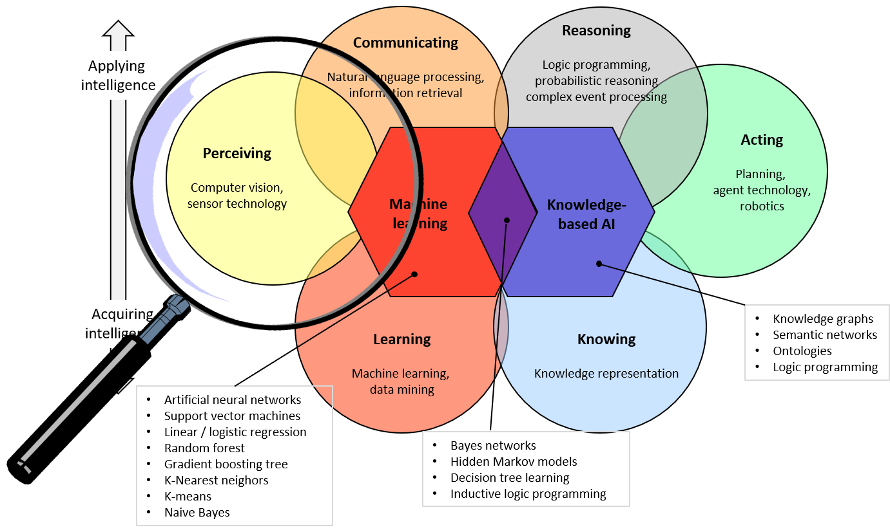
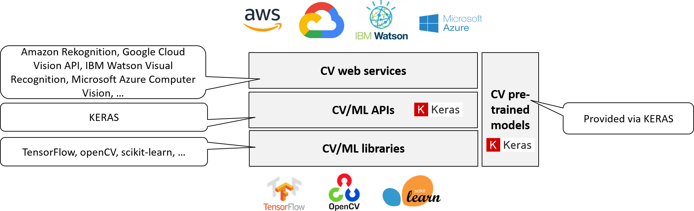
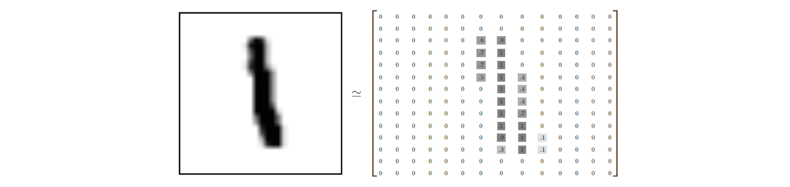

# Computer Vision

*Computer vision (CV)* is a wide field of AI. It is all about processing images: still images and moving images (videos) / analyzing and generating. Relevant questions are:

- How to retrieve and classify images and videos, e.g., which photos depict certain people?
- What is depicted in an image / which situation takes place in a video, e.g., is there a danger of a vehicle collision?
- How to generate images / videos from an internal representation, e.g., in a computer game?

Fig 7.1. shows computer vision in the AI landscape.

Computer vision can be assigned to the ability of "perceiving".
In the following section, I will briefly introduce prominent computer vision applications.

## Computer Vision Applications

### Optical Character Recognition (OCR)

Optical Character Recognition (OCR) is the extraction of text from images of typed, handwritten or printed text. 

See Fig. 7.2. for the reconstruction of the text from the Wikipedia article on Michelangelo from a screenshot using [FreeOCR](http://www.freeocr.net).

Use cases include the following ones. 

- Scanning addresses on letters
- Automatic number plate recognition
- Evaluating manually filled-out forms, e.g. in polls or surveys
- Data entry for business information systems, e.g. from invoices, bank statements and receipts etc.
- Checking documents, e.g. passports, drivers licenses, etc. 
- Archiving and retrieving text documents for which only scans are available, e.g. Google Books
- Converting handwriting in real-time (pen computing)

### Face Recognition

Face recognition is the detection of human faces in images or videos, as well as the identification of the respective persons. 

See Fig. 7.3.

Use cases include the following ones. 

- Identifying friends and family members in a private photo collection
- Face detection in cameras to focus and measure exposure on the face of the person being photographed
- Biometrical identification of people, e.g., for airport security
- Retrieving photos of prominent people from the Web

### Image Processing

Image processing is the wide area of post-processing digital images, particularly photos, for several reasons. Examples are:

- Changing color, brightness, contrast, smoothing, noise reduction, etc.
- Retouching, e.g., removing red eyes
- Slicing, i.e., dividing an image into different sections to be used individually
- Image restoration; see Fig. 7.4.

### Medical Applications

Computer vision has numerous uses cases in medicine. Examples are:

- Generating images from examination procedures like [PET](Positron_Emission_Tomography)/[CT](Computed_Tomography), [MRI](Magnetic_Resonance_Imaging), ultrasound images (2D and 3D) for inspection by doctors
- Detecting anomalies in PET/CT, MRI, ultrasound images etc. automatically.

See Fig. 7.5.

### Industrial and Agricultural Applications

Computer vision is increasingly used for automating processes in industry and agriculture. Examples are:

- Quality management in manufacturing processes
- Robot control in manufacturing processes
- Sorting fruits in agriculture

See Fig. 7.6.

### Automotive Applications

Computer vision applications are, today, state-of-the-art in modern cars. Examples are:

- Parking aid and automatic parking
- Collision warning
- Road sign detection
- Autonomous driving

See Fig. 7.7.

### Military, Aviation and Aerospace Applications

Also in military and aviation and aerospace industries, computer vision is applied. Examples are:

- Collision detection
- Drone and missile navigation
- Detection of enemy soldiers or vehicles
- Autonomous vehicles (see Fig. 7.8)

### Computer Games and Cinema

Computer games are mostly visual. Also in modern cinema, computer vision is heavily used for special effects.
Examples are:

- Generation of moving images in computer games  
- Generation of images and scenes in animated movies  
- Motion capturing for digitizing videos taken from human actors; see Fig. 7.9.

## Computer Vision Tasks and Approaches

As computer vision is a wide field, there are many groups of tasks that may or may not be relevant in a concrete project. This is a simple grouping of computer vision tasks:

1. *Image acquisition*: Obtaining image data from light-sensitive cameras, ultra-sonic cameras, radars, range sensors, PET/CT/MRI/ultrasound devices, etc. The image data may be 2D or 3D / still images or sequences (video).
2. *Pre-processing*: Preparing the image data for further processing, e.g. by scaling, noise reduction, contrast enhancement, etc. Approaches include filtering and transformation algorithms.
3. *Feature extraction*: Identifying lines, edges, ridges, corners, texture, etc. in images. In use are specific algorithms, e.g., for edge detection. 
4. Segmentation: Identifying image regions of particular interest, e.g. faces in photos. Machine learning approaches are used.
5. *High-level processing*: Application-specific image processing, e.g., classification, image recognition, scene analysis, etc. Machine learning approaches as well as other AI approaches for decision making are used.
6. *Image Generation*: generating images (still or moving) from an internal representation (usually 3D). Specific rendering algorithms are used.

## Services and Product Maps

Fig. 7.10 shows the services map for computer vision.

{width=90%}

Like for machine learning, there are products available on the library level, the API level, and the web service level.

- *CV / ML libraries*: Implementations for image pre-processing and feature extraction as well as machine learning libraries.
- *CV / ML APIs*: APIs for interfacing with various ML libraries
- *CV web services*: Web services for image search, named entity recognition, etc.
- *CV pre-trained models*: Pre-trained ML models for transfer learning CV tasks. 

Fig. 7.11 shows the product map for computer vision. 

{width=90%}

[TensorFlow](https://www.tensorflow.org) and [OpenCV](http://opencv.org) are examples for CV / ML libraries.
[Keras](https://keras.io) is a Python ML library, interfacing to TensorFlow, CNTK, or Theano. KERAS is also an interface for loading various pre-trained models for CV.
Examples for CV web services are: [Autokeyword](http://autokeyword.me) and [clarifai](http://www.clarifai.com) for entity recognition, [tineye](https://www.tineye.com) and [Google image search](https://www.google.de) for image retrieval. The major vendors Google, Amazon, IBM and Microsoft offer web services for CV tasks.

More products and details can be found in the appendix.

## Examples

In this section I present a few CV technologies by example. 

### Example: OCR with Deep Learning using TensorFlow (Yalçın, 2018)

[TensorFlow](https://www.tensorflow.org/) is an open source Python library for machine learning. It was developed by members of Google's Machine Intelligence research organization. 

The simple OCR (Object Character Recognition) example is taken from the [online tutorial](https://towardsdatascience.com/image-classification-in-10-minutes-with-mnist-dataset-54c35b77a38d) (Yalçın, 2018). 
The task is to recognize digits from images where each image contains exactly one digit.
See Fig. 7.12.

#### MNIST

The images are taken from the [MNIST](http://yann.lecun.com/exdb/mnist) database of handwritten digits, available for learning computer vision techniques. 
Each image is 28 pixels by 28 pixels. Those pixels can be interpreted as an 28x28 array of numbers. See Fig. 7.13.

The array may be flattened as a vector of 28x28 = 784 numbers which will be used as input for machine learning. 55.000 training images are available, all categorized with the digit (0...9) they represent. 
See Fig. 7.14.
The categories are *one-hot encoded*. This means that there are 10 columns in the training data set, one for each digit. If, e.g., the image depicts the digit 5 then in the column for digit 5 there will be an entry 1 and in all other columns there will be an entry 0. 

{width=50%}

#### Deep Learning

Deep learning has become the de-facto standard for image processing and is used and explained in this tutorial. 
See Fig. 7.15 for a typical deep learning network topology for image processing.

{width=75%}

The input layer of the deep neural network are neurons representing each pixel value of the images to be classified: 784 values in the MNIST example. The output of the network are neurons representing each class, i.e., one neuron for each digit 0...9.
Between input layer and output layer there are several *convolutional layers, pooling layers* and *fully connected layers*. Each output of one layer is input to the next layer.  This type of deep neural network is also called *convolutional neural network (CNN)*.

Convolutional layers are used to extract features from the images, e.g., edges. The idea is to use a small pixel filter (light blue 3x3 matrix in Fig. 7.16) which is successively compared with the pixels of the image (blue 5x5 matrix in Fig. 7.16). The comparison is performed simply by computing the dot product: the higher the dot product, the better the match. 
The comparison is performed step by step, eg.,  with a one pixel shift at each step. The result is a smaller matrix than the original pixel matrix (yellow 3x3 matrix in Fig. 7.16). The resulting matrix preserves the relationship between different parts of an image while decreasing the complexity. 

{width=60%}

It is common to insert a pooling layer after each convolutional layer. A pooling layer further decreases complexity by considering parts of a matrix (differently colored 2x2 matrices in Fig. 7.17) and computing a simple aggregation like the maximum of numbers in this part (*max pooling*). The resulting matrix is smaller, e.g., 2x2 in Fig. 7.17.

{width=40%}

After successions of convolutional layers and pooling layers for reducing complexity while focusing on relevant features, a set of fully connected layers are used for classification. As the name suggests, in fully-connected layers, each neuron of one layer is connected with all neurons of the next layer. See Fig. 7.18. 

{width=40%}

#### Keras and TensorFlow

I will now explain parts of the Keras and TensorFlow code from (Yalçın, 2018).
Keras and Tensorflow allow importing and downloading the MNIST dataset directly from their API.

    import tensorflow as tf
    (x_train, y_train), (x_test, y_test) = tf.keras.datasets.mnist.load_data()

It is important to access the shape of the dataset to channel it to the convolutional layers. This is done using the `shape` attribute of `numpy` arrays.

    x_train.shape

The result is  `(55000, 28, 28)`. `55000` represents the number of images in the train dataset and `(28, 28)` represents the size of the image: 28 x 28 pixels.

To be able to use the dataset in Keras, the data must be normalized  as it is always required in neural networks. This can be achieved by dividing the RGB codes by 255. 
Furthermore, the data format required by the API must be met. Here, the three-dimensional arrays must be converted to four-dimensional arrays. 

    # Reshaping the array to 4-dims so that it can work with the Keras API
    x_train = x_train.reshape(x_train.shape[0], 28, 28, 1)
    x_test = x_test.reshape(x_test.shape[0], 28, 28, 1)
    input_shape = (28, 28, 1)    # Making sure that the values are float so that we can get decimal points after division
    x_train = x_train.astype('float32')
    x_test = x_test.astype('float32')    # Normalizing the RGB codes by dividing it to the max RGB value.
    x_train /= 255
    x_test /= 255

The architecture of the simple deep neural network has the following layers:

1. A convolutional layer
2. A max pooling layer
3. A flatten layer to convert 2D arrays to a 1D array. 
4. Two dense layers for classification
5. A dropout layer to avoid overfitting by randomly disregarding some of the neurons during training

The following code implements this architecture.

    # Creating a Sequential Model and adding the layers
    model = Sequential()
    model.add(Conv2D(28, kernel_size=(3,3), input_shape=input_shape))
    model.add(MaxPooling2D(pool_size=(2, 2)))
    model.add(Flatten()) # Flattening the 2D arrays for fully connected layers
    model.add(Dense(128, activation=tf.nn.relu))
    model.add(Dropout(0.2))
    model.add(Dense(10,activation=tf.nn.softmax))

The following code specifies an optimizer and loss function that uses a metric for training. 

    model.compile(optimizer='adam', 
                  loss='sparse_categorical_crossentropy', 
                  metrics=['accuracy'])

Now the model can be trained. The value `epochs` specifies how often all training data shall be used. 

    model.fit(x=x_train,y=y_train, epochs=10)

Finally, you may evaluate the trained model as follows.

    model.evaluate(x_test, y_test)

The result is an accuracy of 98.5% on the test dataset. This is quite a good result for such a simple model and only 10 epochs of training. If, however, an error of 0.1% is not tolerable, then the model can be optimized, e.g., by experimenting with  more epochs, different optimizers or loss functions, more layers, different hyperparameters etc. 

The trained model can now be used to predict the digit in an unknown image. 

    image_index = 4444
    plt.imshow(x_test[image_index].reshape(28, 28),cmap='Greys')
    pred = model.predict(x_test[image_index].reshape(1, img_rows, img_cols, 1))
    print(pred.argmax())

In this example, the digit `9` is returned which is, indeed the correct classification of the image with index `4444`. See  Fig. 7.19.

{width=20%}

Using a ML library like TensorFlow requires a considerably deeper understanding of the algorithms at hand than working with a ML IDE like RapidMiner. However, it allows optimizing an application more specifically.

### Example: Transfer Learning with Keras (Ananthram, 2018)

#### Transfer Learning

Training a deep neural network from scratch is possible for small projects. However, most applications require the training of very large neural networks and this takes huge amounts of processed data and computational power. Both are expensive.

This is where *transfer learning* comes into play. In transfer learning, the pre-trained weights of an already trained model (e.g., trained on millions of images belonging to thousands of classes, on several high power GPU’s for several days) are used for predicting new classes. The advantages are obvious: 

1. There is no need of an extremely large training dataset.
2. Not much computational power is required, as pre-trained weights are used and only  the weights of the last few layers have to be learned.

To understand how transfer learning works re-consider the architecture of a convolutional neural network in Fig. 7.15. Feature learning takes place in a succession of convolutional layers and pooling layers. 
E.g., the filters on the first few layers may learn to recognize colors and certain horizontal and vertical lines.
The next few layers may recognize trivial shapes using the lines and colors learned in the previous layers.
Then the next layers may recognize textures, then parts of objects like legs, eyes, noses etc.

The classification as such takes place in the few fully connected layers at the end. When classifying new things, e.g., individual dog breeds, then all the pre-trained features like colors, lines, textures etc. may be re-used and only classifying the dog breeds need to be trained. 
All this helps in making the training process much faster, requiring much less training data compared to training the neural network from scratch.

#### Keras and MobileNet

[MobileNet](https://keras.io/applications/#mobilenet) is a pre-trained model which gives reasonably good image classification accuracy while occupying relatively little  space (17 MB).
In this example, the ML library [Keras](https://keras.io) is used. Keras supports transfer learning by accessing several pre-trained models via the API.

Building the model requires the following steps:

1. Importing the pre-trained model and adding the dense layers
2. Loading training data 
3. Training the model.

I will explain those steps in the next sections.

#### Importing Pre-trained Model and Adding Layers

The following Python code imports MobileNet. 
Mobilenet's last layer consists of 1000 neurons, one for each class for which it was originally trained. Since we want to train the network for different classes, e.g., dog breeds, we have to discard the last layer. 
If the dog breed classifier is to identify 120 different breeds, then we need 120 neurons in the final layer. This can be done using the following code.

    base_model=MobileNet(weights='imagenet',include_top=False) #imports the mobilenet model and discards the last 1000 neuron layer.
    x=base_model.output
    x=GlobalAveragePooling2D()(x)
    x=Dense(1024,activation='relu')(x) #we add dense layers so that the model can learn more complex functions and classify for better results.
    x=Dense(1024,activation='relu')(x) #dense layer 2
    x=Dense(512,activation='relu')(x) #dense layer 3
    preds=Dense(120,activation='softmax')(x) #final layer with softmax activation

Next we make a model based on the architecture provided.

    model=Model(inputs=base_model.input,outputs=preds)

As we will be using the pre-trained weights, we have to set all the weights to be non-trainable. 

    for layer in model.layers:
        layer.trainable=False

#### Loading Training Data

The following code loads the training data, which must be in a particular format, from a folder.

    train_datagen=ImageDataGenerator(preprocessing_function=preprocess_input)     
    train_generator=train_datagen.flow_from_directory('path-to-the-main-data-folder',
                                                     target_size=(224,224),
                                                     color_mode='rgb',
                                                     batch_size=32,
                                                     class_mode='categorical',
                                                     shuffle=True)

#### Training the Model

The following code performs compiling and training of the model on the dataset. 

    model.compile(optimizer='Adam',loss='categorical_crossentropy',metrics=['accuracy'])
    step_size_train=train_generator.n//train_generator.batch_size
    model.fit_generator(generator=train_generator,
                       steps_per_epoch=step_size_train,
                       epochs=10)

The model can now be evaluated and used for predicting classes in new images. 

### Example: Named Entity Recognition with the Autokeyword.me Web Service

Web services for image tagging like [Autokeyword.me](http://autokeyword.me) allow classifying and tagging images of any kind. See Fig. 7.20.  

%% http://autokeyword.me/demo/tags.php?key=common&ftc=&qurl=http%3A%2F%2Fupload.wikimedia.org%2Fwikipedia%2Fcommons%2F8%2F82%2FJohn_Everett_Millais_-_Isabella.jpg 

In this example, the painting ["Isabella" by John Everett Millais (1829-1896)](https://upload.wikimedia.org/wikipedia/commons/8/82/John_Everett_Millais_-_Isabella.jpg)  is analyzed. Tagging results include concepts like woman and man as well as attributes like attractive and smiling. They are all provided with a degree of probability, indicated by a bar at the circles. For example, the category man is more probable than boy and, indeed, there are men but no single boy depicted in the painting. So, the category "boy" is a false positive. There are also false negatives, e.g., the dogs on the painting were not recognized.

Using an image tagging web service is easy and simply requires invoking an API. However, if the results are not suitable for an application use case, there is no way of optimizing the solution like when using a library or a framework.

## Quick Check

X> Answer the following questions.

1. Name applications of computer vision
2. What are the main tasks and approaches in computer vision?
3. Which libraries / frameworks / web services can be used for computer vision?
4. Explain deep learning. What are convolutional layers? What are pooling layers? What are dense layers?
5. Explain transfer learning
6. What are the advantages / disadvantages of using a web service compared to a library or framework?
