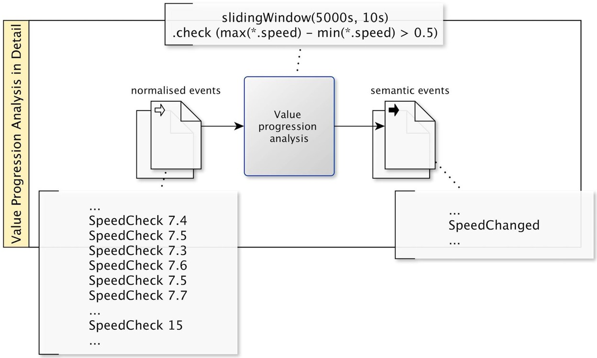

# Complex Event Processing

*Complex event processing (CEP)* allows processing streams of event data and deriving conclusions from them.

Fig. 8.1. shows CEP in the AI application landscape.

CEP can be assigned to the ability of "reasoning". 

Examples of CEP applications are:

1. Detecting fraud based on payment transaction data
2. Making selling / buying decision based on stock market feeds
1. Switching active traffic signs based on traffic data
1. Making purchase recommendations based on click stream analysis in webshops

All those applications have in common that complex decisions (e.g., fraud alert, selling / buying etc.) are made in real-time based on events (e.g., payment transactions, stock market feeds etc.). 

## Foundations

What is an *event* in this context?
An event is something notable that happens.
What is notable entirely depends on the application use case. 
Examples are:

1. A financial transaction
1. An airplane landing
1. A sensor outputs a reading
1. A change of state in a database
1. A key stroke performed by a user of a web app
1. A historic event, e.g., the French Revolution

An event takes place in the real world.
An *event object* is a data record that represents an event.

Examples are:

1. A Purchase order record
1. A stock tick message
1. A record with an RFID sensor reading

An *event type (a.k.a. event class)* specifies the common structure of related event objects, i.e., their attributes and data types, e.g., `PurchasingEvent` with attributes `timestamp`, `buyer`, `product` and `price`.

In CEP literature, often the term "event" is also used for event objects and event types. From the context it is usually clear whether the real-world event is meant, the concrete data record or its type.

A *CEP engine* allows specifying *CEP rules* in a *CEP rule language* and executing them. CEP rules specify patterns that can match events in an *event stream*. *Message brokers* are platforms to manage streams of messages, in particular event objects. 

Fig. 8.2. illustrates the difference between data access in database management systems (DBMS) and CEP engines.

{width=60%}

A DBMS stores persistent data. A query, e.g., formulated in SQL, executes instantaneously and returns a query result based on the current state of the persistent data.
In contrast, the data source for CEP is a flowing stream of events. CEP rules are persistent, with the CEP engine constantly trying to match CEP rules with the events. Whenever a CEP rule matches, a higher (complex) event is being generated which may trigger certain actions. 

## Application Example: Fault Detection in the Smart Factory

I will explain CEP with the application example of one of my research projects: fault detection in the smart factory (Beez et al., 2018).  
The use case is visual quality inspection in glass production. A glass inspection machine consists of cameras and lights as well as servers with inspection software. 
An error may occur in every component of the setup, including the interconnections, and on both the software level and the hardware level. Errors in the inspection machine may lead to uninspected glass or glass of unknown quality and thus impact the plant yield.
Common inspection machine errors are camera failures, network errors, lighting issues, or incorrect configuration of external system parameters. 
Often, hints for these kinds of problems can be found provided that the distributed log information the system generates at runtime is considered as a whole. 

Hereafter, I describe some typical CEP rules in this application context. We assume log messages from various components of the inspection machine to to be normalized to a common event format and provided by a message broker. Parts of CEP rules are presented in pseudo code, oriented at CEP languages like for Apache Flink. 

### Filtering

*Filtering* is a simple form of CEP; see Fig. 8.3. 

{width=65%}

Assuming that events have types like `GlassBreakBegin`, `GlassBreakEnd`, `DefectSpan` etc., then the CEP rule `filter("GlassBreak*")` will filter all events of which type matches the regular expression `"GlassBreak*"`. In the example, events with type `GlassBreakBegin`, `GlassBreakEnd` are filtered which indicate a break in the glass being manufactured. 

### Pattern Matching

*Pattern matching* allows detecting patterns in successions of events. Consider the pattern shown in Fig. 8.4 being applied to the stream of events resulting form the filtering rule from Fig. 8.3.

{width=65%}

The condition `pattern("GlassBreakBegin".next("GlassBreakEnd")` in the CEP rule matches if a `GlassBreakBegin` event is immediately followed by a `GlassBreakEnd` event. In this case, a higher-level semantic event `GlassBreakDetected` can be generated and inserted into a queue of the message broker. 

### Value Progression Analysis

Fig. 8.5 shows a *value progression analysis*, analyzing the successive change of values in events. 

{width=65%}

Each `SpeedCheck` event delivers a snapshot of the speed of the conveyor belt. 
The condition `slindingWindow(5000s, 10s).check (max(*.speed) - min(*.speed > 0.5)` in the CEP rule uses a sliding window. A sliding window is a subset of the last events in a certain time period (here 500 seconds) on an event stream. The second parameter (`10s`) indicates how often the window is considered. Within this time frame, the speed values of all events are considered. 
If the difference in speed exceeds a threshold (here `0.5`), then a new event `SpeedChanged` is generated and inserted into a queue of the message broker. 
A speed change may affect defect detection and, therefore, is important semantic information. 

### Time Progression Analysis

Fig. 8.6 shows a *time progression analysis*, analyzing the timing of events. 

{width=65%}

Each component within the glass inspection machine regularly sends `Ping` events. If no `Ping` event occurs within half a minute, it is considered as a loss of signal. 
The condition `slidingWindow(30s, 10s).check(count("Ping")==0)` in the CEP rule uses a sliding window of 30 seconds, which is checked every 10 seconds. If no `Ping` event occurred within the time window, then a `SignalLost` event is generated.

 

### Semantic Enrichment

CEP rules using filters, pattern matching, value progression analysis and time progression analysis can be applied iteratively. This allows incremental semantic enrichment, from primitive low level events to high-level semantic events. See Fig. 8.7.

{width=65%}

Semantic events generated by CEP rules can be used as input for other CEP rules. For example, high conveyor belt speed typically implies a thinner glass layer. With the glass thickness, the properties of the defects change, and in the transition between different thicknesses many defects may occur. The semantic event `SpeedChanged` introduced above may then be used for generating a semantic `ThicknessChanged` event. 

## Services Map and Product Map

Fig. 8.8 shows the CEP services map. 

{width=75%}

Message brokers implement a message-oriented middleware, providing message queuing technology. The allow managing streams of event messages. They also provide consoles for administering message queues. 
CEP engines allow specifying CEP rules and executing them. They also allow monitoring CEP.  

Fig. 8.9 shows the CEP product map. 

{width=75%}

All major IT vendors provide message brokers and CEP engines. Also, there are several production-ready open source solutions. 
Examples of message brokers are Apache Kafka, IBM MQ, TIBCO, WebSphere Business Events, and WSO2 Stream Processor.
Examples of CEP engines are Apache Flink,  MS Azure Stream Analytics, Drools Fusion, Oracle Stream Analytics, and SAG Apama.

## Quick Check

X> Answer the following questions.

1. What is CEP?
1. What is an event, event object and event type?
2. What is a message broker?
2. What is a CEP engine? 
1. Explain the difference between data access in a DBMS versus a CEP engine?
2. Explain filter, pattern matching, value progression analysis and time progression analysis.
3. How can CEP be used for semantic enrichment?
1. Name prominent CEP products

