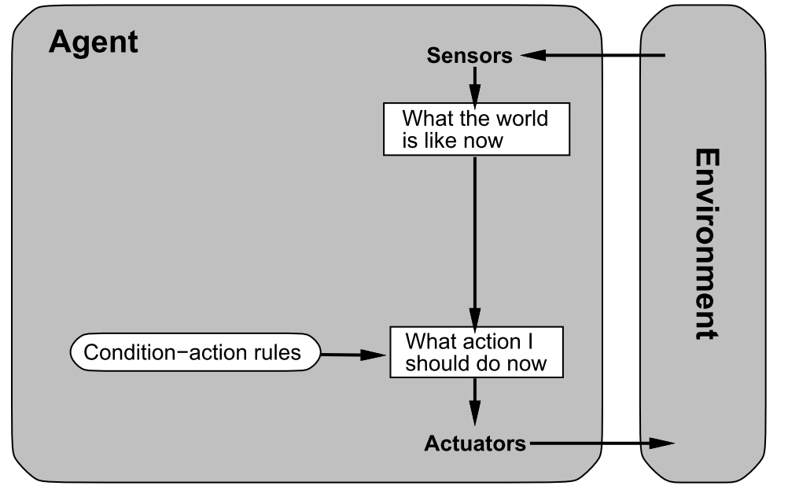

# Heading 1

## Heading 2

### Heading 3

#### Heading 4

##### Heading 5

###### Heading 6

####### Heading 7

######## Heading 8

text - one dash

text -- two dashes

Embedding LaTeX formulas does not work (yet): <!-- This is raw \LaTeX \[ {e}^{i\pi }+1=0 \] -->

%% comment; 

Auto-numbering figure captions does not work yet.

{width=75%}

[Link](http://sourceforge.net/projects/jadex/).

Footnote[^fn-id]. Leave an empty line!

[^fn-id]: Footnote text.

X> As an exercise, ...